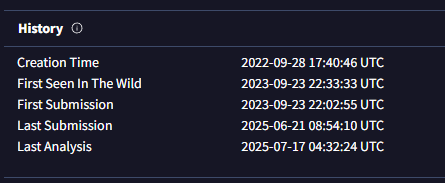
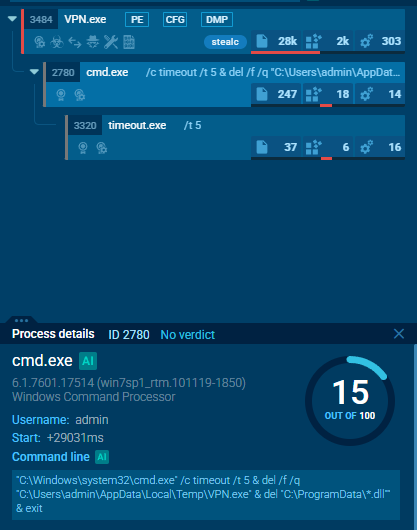

# Oski
## 목차

[Questions 1](#q1)

[Questions 2](#q2)

[Questions 3](#q3)

[Questions 4](#q4)

[Questions 5](#q5)

[Questions 6](#q6)

[Questions 7](#q7)

# Scenario
The accountant at the company received an email titled "Urgent New Order" from a client late in the afternoon. When he attempted to access the attached invoice, he discovered it contained false order information. Subsequently, the SIEM solution generated an alert regarding downloading a potentially malicious file. Upon initial investigation, it was found that the PPT file might be responsible for this download. Could you please conduct a detailed examination of this file?

# Questions

## Q1
Determining the creation time of the malware can provide insights into its origin. What was the time of malware creation?

### Answer
2022-09-28 17:40

### 분석
그냥 VirusTotal에 악성코드 해시값을 검색한 후, 존재하면 관련된 정보를 수집하는 문제인 것 같다.

VirusTotal



## Q2
Identifying the command and control (C2) server that the malware communicates with can help trace back to the attacker. Which C2 server does the malware in the PPT file communicate with?

### Answer
ht[t]p://171[.]22[.]28[.]221/5c06c05b7b34e8e6.php

### 분석
악성코드가 접촉하는 URL 정보를 확인할 수 있다.

VirusTotal


ANY.RUN


## Q3
Identifying the initial actions of the malware post-infection can provide insights into its primary objectives. What is the first library that the malware requests post-infection?

### Answer
sqlite3.dll

### 분석
POST 요청으로 C2 서버에 접속한 뒤 GET을 통해 sqlite3.dll 파일을 요청한 뒤 서버로부터 파일을 받아온다.


## Q4
By examining the provided Any.run report, what RC4 key is used by the malware to decrypt its base64-encoded string?

### Answer
5329514621441247975720749009

### 분석
RC4(Rivest Cipher 4)는 스트림 암호로 키스트림이라고 하는 비트의 의사난수 스트림을 생성한 후, 이를 평문과 결합하여 암호문을 생성한다.

악성코드는 탐지를 피하기 위해 RC4 를 이용하여 문자열이나 파일, 페이로드 등을 암호화하기도 한다.


해당 악성코드에서는 RC4가 C2 서버와의 통신 설정이나 추가 리소스 로딩 등의 기능을 실행하는데 사용하는 base64로 인코딩된 문자열을 복호화 하는데 사용된다고 한다.

## Q5
By examining the MITRE ATT&CK techniques displayed in the Any.run sandbox report, identify the main MITRE technique (not sub-techniques) the malware uses to steal the user’s password.

### Answer
T1555

### 분석
T1555는 Credentials from Password Stores로 공격자가 암호 저장 위치(폴더, 메모리 등)를 표적으로 삼아 자격 증명을 훔치는 것을 말하며 그 중 T1555.003은 웹 브라우저에서를 대상으로 한 공격을 의미한다.

https://attack.mitre.org/techniques/T1555/


## Q6
By examining the child processes displayed in the Any.run sandbox report, which directory does the malware target for the deletion of all DLL files?

### Answer
C:\ProgramData

### 분석
아래 명령을 통해 C:\ProgramData에 있는 모든 dll 파일을 삭제한다.

```
"C:\Windows\system32\cmd.exe" /c timeout /t 5 & del /f /q "C:\Users\admin\AppData\Local\Temp\VPN.exe" & del "C:\ProgramData\*.dll"" & exit
```


## Q7
Understanding the malware's behavior post-data exfiltration can give insights into its evasion techniques. By analyzing the child processes, after successfully exfiltrating the user's data, how many seconds does it take for the malware to self-delete?

### Answer
5

### 분석
자식 프로세스의 명령어를 보면 timeout /t 명령어를 통해 5초 후에 삭제하도록 한다.

```
"C:\Windows\system32\cmd.exe" /c timeout /t 5 & del /f /q "C:\Users\admin\AppData\Local\Temp\VPN.exe" & del "C:\ProgramData\*.dll"" & exit
```



# 마무리
스트림 암호에 대해 학습 및 정리해 볼 필요가 있다.