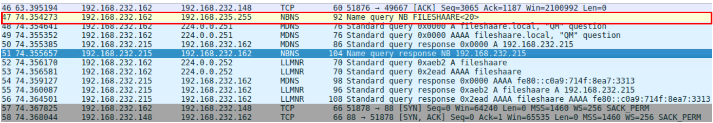
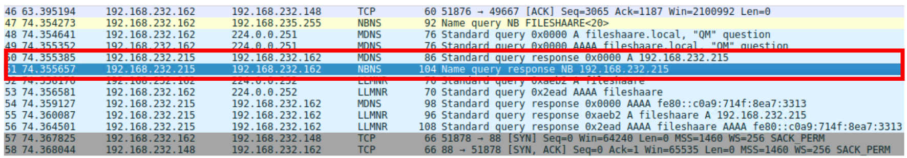
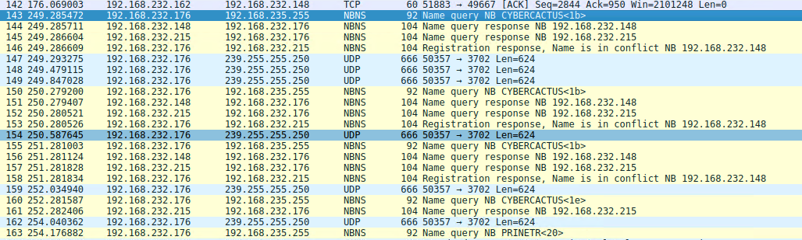
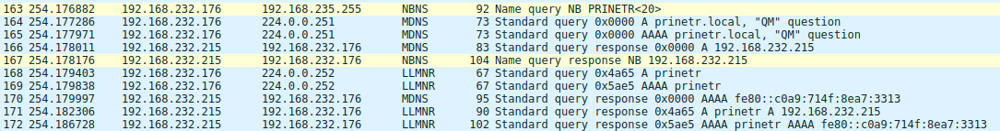
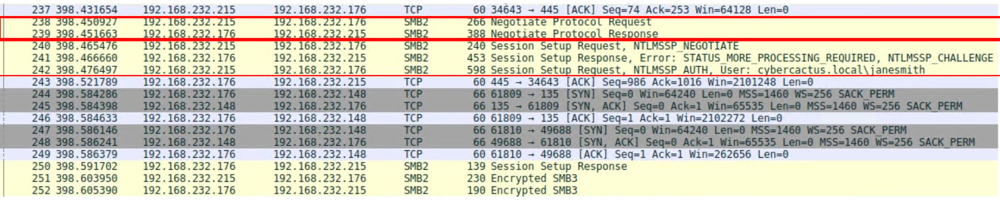
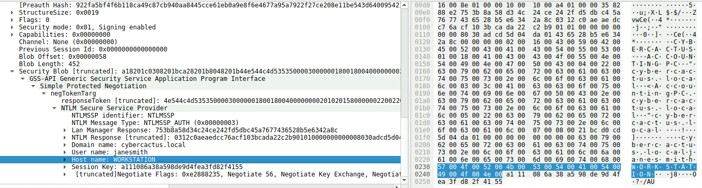
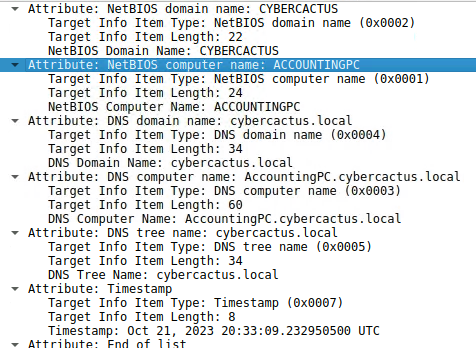

# PoisonedCredentials

## 목차

[Questions 1](#q1)

[Questions 2](#q2)

[Questions 3](#q3)

[Questions 4](#q4)

[Questions 5](#q5)

# Scenario
Your organization's security team has detected a surge in suspicious network activity. There are concerns that LLMNR (Link-Local Multicast Name Resolution) and NBT-NS (NetBIOS Name Service) poisoning attacks may be occurring within your network. These attacks are known for exploiting these protocols to intercept network traffic and potentially compromise user credentials. Your task is to investigate the network logs and examine captured network traffic.

귀사의 보안팀에서 의심스러운 네트워크 활동이 급증하는 것을 감지했습니다. 네트워크 내에서 LLMNR(Link-Local Multicast Name Resolution) 및 NBT-NS(NetBIOS Name Service) 포이즈닝 공격이 발생했을 가능성이 있습니다. 이러한 공격은 해당 프로토콜을 악용하여 네트워크 트래픽을 가로채고 사용자 자격 증명을 손상시키는 것으로 알려져 있습니다. 네트워크 로그를 조사하고 캡처된 네트워크 트래픽을 분석하는 것이 귀하의 임무입니다.

# 개념 정리
먼저 알아야 할 개념들을 확인해보자.

#### LLMNR (Link-Local Multicast Name Resolution)
DNS 서버 없이 로컬 네트워크 내에서 호스트 이름을 IP 주소로 변환하기 위한 네트워크 프로토콜로 UDP 5355 포트를 사용한다. (멀티캐스트 이용)

#### NBT-NS (NetBIOS Name Service)
LLMNR이 생기기 전까지 사용했던 네트워크 프로토콜로 목적은 LLMNR과 동일하며 포트는 UDP 137 포트를 사용한다. (브로드캐스트 이용)

이외에도 레거시 브로드캐스트 이름 변환 서비스로 mDNS도 존재한다.

#### 취약점
만약 두 프로토콜 모두 같은 망 내부(같은 서브넷)에 있는 호스트들에게 "OOO 이름을 가진 호스트 대답해주세요~" 라고 요청을 보내게 된다.

해당 프로토콜들은 호스트/사용자 인증을 요구하지 않는다.

만약 공격자가 해당 서브넷에 침투해있는 상태라면 해당 요청이 왔을 때 자신에게 사용자 인증 트래픽을 보내달라고 하고, 호스트는 아무런 의심 없이 공격자에게 인증 트래픽을 전송하게 된다.

수신 대기: 해당 공격은 "피해자의 실수/요청"에 의해 발생하는 공격으로 공격자는 LLMNR/NBT-NS 요청을 계속 기다린다. 

# Questions

## Q1
In the context of the incident described in the scenario, the attacker initiated their actions by taking advantage of benign network traffic from legitimate machines. Can you identify the specific mistyped query made by the machine with the IP address 192.168.232.162?

시나리오에 설명된 사건의 맥락에서, 공격자는 정상적인 컴퓨터에서 발생하는 무해한 네트워크 트래픽을 이용하여 공격을 시작했습니다. IP 주소 192.168.232.162를 사용하는 해당 컴퓨터에서 잘못 입력된 특정 쿼리를 식별할 수 있습니까?

### Answer
fileshaare

### 분석
패킷을 확인해보면 FILESHAARE 이름으로 피해자 PC인 192.168.232.162에서 날라온 쿼리를 확인할 수 있다.



## Q2
We are investigating a network security incident. To conduct a thorough investigation, We need to determine the IP address of the rogue machine. What is the IP address of the machine acting as the rogue entity?

네트워크 보안 사고를 조사하고 있습니다. 철저한 조사를 위해 악성 컴퓨터의 IP 주소를 확인해야 합니다. 악성 개체로 활동하는 컴퓨터의 IP 주소는 무엇입니까?

### Answer
192.168.232.215

### 분석
피해자 PC에서 날라온 쿼리가 해당 서브넷에 fileshaare.local 이름을 가진 호스트가 있는지 질문하게 되고 공격자로 추정되는 192.168.232.215가 응답하고 있다.



## Q3
As part of our investigation, identifying all affected machines is essential. What is the IP address of the second machine that received poisoned responses from the rogue machine?

조사의 일환으로, 영향을 받은 모든 컴퓨터를 식별하는 것이 필수적입니다. 악성 컴퓨터에서 감염된 응답을 받은 두 번째 컴퓨터의 IP 주소는 무엇입니까?

### Answer
192.168.232.176

### 분석
192.168.232.176 에서 CYBERCACTUS, PRINETR 이름으로 날라온 쿼리를 확인할 수 있다. PRINETR 쿼리에서 prinetr.local이라는 이름의 호스트를 찾는 MDNS 패킷이 확인됐다.



이후 공격자의 ip 192.168.232.215가 응답 한다.



와이어 샤크에서 아래 필터링을 활용하면 192.168.232.215 ip 주소를 가진 NetBIOS Name Service (NBNS) 를 필터링 할 수 있다.

``nbns.addr==192.168.232.215``

## Q4
We suspect that user accounts may have been compromised. To assess this, we must determine the username associated with the compromised account. What is the username of the account that the attacker compromised?

사용자 계정이 침해되었을 가능성이 있습니다. 이를 확인하려면 침해된 계정과 연결된 사용자 이름을 확인해야 합니다. 공격자가 침해한 계정의 사용자 이름은 무엇입니까?

### Answer
janesmith

### 분석
SMB 프로토콜의 동작을 확인할 수 있다.

SMB Protocol Negotiation, SMB Session Setup (유저 인증, NTLM) 작업이 순차적으로 이루어진다.



그리고 Session Setup Request 과정에서 해킹당한 사용자의 이름과, 접속 호스트 명을 확인할 수 있다.



와이어 샤크에서 아래 필터링을 활용하면 목적지 ip 주소가 192.168.232.215인 ip를 필터링 할 수 있다.

``ip.dst==192.168.232.215``

## Q5
As part of our investigation, we aim to understand the extent of the attacker's activities. What is the hostname of the machine that the attacker accessed via SMB?

조사의 일환으로 공격자의 활동 범위를 파악하는 것이 저희의 목표입니다. 공격자가 SMB를 통해 접속한 컴퓨터의 호스트 이름은 무엇입니까?

### Answer
AccountingPC

### 분석
SMB Session Setup Response 패킷에서 세부 정보를 확인하면 피해 Host name을 확인할 수 있다.

```
도메인 명: CYBERCACTUS
컴퓨터 명: ACCOUNTINGPC
DNS 도메인 명: cybercactus.local
DNS 컴퓨터 명: AccountingPC.cybercactus.local
DNS Tree 명: cybercactus.local
```



# 마무리
LLMNR/NBT-NS의 개념과 LLMNR / NBT-NS 포이즈닝 공격 그리고 SMB에 대해 이해할 수 있는 문제