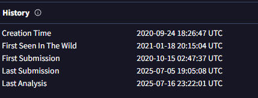

# Yellow RAT

## 목차

[Questions 1](#q1)

[Questions 2](#q2)

[Questions 3](#q3)

[Questions 4](#q4)

[Questions 5](#q5)

[Questions 6](#q6)

# Scenario
During a regular IT security check at GlobalTech Industries, abnormal network traffic was detected from multiple workstations. Upon initial investigation, it was discovered that certain employees' search queries were being redirected to unfamiliar websites. This discovery raised concerns and prompted a more thorough investigation. Your task is to investigate this incident and gather as much information as possible.

GlobalTech Industries에서 정기 IT 보안 점검을 진행하던 중 여러 워크스테이션에서 비정상적인 네트워크 트래픽이 감지되었습니다. 초기 조사 결과, 특정 직원들의 검색 쿼리가 낯선 웹사이트로 리디렉션되고 있는 것으로 확인되었습니다. 이 발견으로 인해 우려가 제기되었고, 더욱 철저한 조사가 시작되었습니다. 여러분의 임무는 이 사고를 조사하고 최대한 많은 정보를 수집하는 것입니다.

# Questions

## Q1
Understanding the adversary helps defend against attacks. What is the name of the malware family that causes abnormal network traffic?

적을 이해하면 공격 방어에 도움이 됩니다. 비정상적인 네트워크 트래픽을 유발하는 악성코드군의 이름은 무엇입니까?

### Answer
Yellow Cockatoo RAT

### 분석
VirusTotal, any.run 등에 악성코드 해시값을 검색한 후, 존재하면 관련된 정보를 수집하는 문제.

해시값: ``30E527E45F50D2BA82865C5679A6FA998EE0A1755361AB01673950810D071C85``

해당 해시값을 구글에 검색하거나 VirusTotal 커뮤니티 탭에 들어가면 악성코드의 이름을 찾을 수 있다.

## Q2
As part of our incident response, knowing common filenames the malware uses can help scan other workstations for potential infection. What is the common filename associated with the malware discovered on our workstations?

사고 대응의 일환으로, 맬웨어가 사용하는 일반적인 파일 이름을 아는 것은 다른 워크스테이션의 잠재적 감염 여부를 검사하는 데 도움이 될 수 있습니다. 저희 워크스테이션에서 발견된 맬웨어와 관련된 일반적인 파일 이름은 무엇입니까?

### Answer
111bc461-1ca8-43c6-97ed-911e0e69fdf8.dll

### 분석
VirusTotal에 해시값을 검색하면 해당 파일 혹은 악성코드가 어떤 이름으로 저장되어 있었는지 확인할 수 있다.

## Q3
Determining the compilation timestamp of malware can reveal insights into its development and deployment timeline. What is the compilation timestamp of the malware that infected our network?

악성코드의 컴파일 타임스탬프를 확인하면 개발 및 배포 타임라인에 대한 통찰력을 얻을 수 있습니다. 네트워크를 감염시킨 악성코드의 컴파일 타임스탬프는 무엇입니까?

### Answer
2020-09-24 18:26

### 분석
VirusTotal에서 해당 파일의 생성 시간을 확인할 수 있다.

## Q4
Understanding when the broader cybersecurity community first identified the malware could help determine how long the malware might have been in the environment before detection. When was the malware first submitted to VirusTotal?

더 광범위한 사이버 보안 커뮤니티가 해당 맬웨어를 처음 식별한 시점을 파악하면 해당 맬웨어가 탐지되기 전까지 얼마나 오랫동안 환경에 존재했는지 파악하는 데 도움이 될 수 있습니다. 해당 맬웨어가 VirusTotal에 처음 제출된 시점은 언제였습니까?

### Answer
2020-10-15 02:47

### 분석
Q3 과 동일한 지점을 보면 First Submission을 확인할 수 있다.

## Q5
To completely eradicate the threat from Industries' systems, we need to identify all components dropped by the malware. What is the name of the .dat file that the malware dropped in the AppData folder?

Industries 시스템의 위협을 완전히 근절하려면 맬웨어가 설치한 모든 구성 요소를 파악해야 합니다. 맬웨어가 AppData 폴더에 설치한 .dat 파일의 이름은 무엇입니까 ?

### Answer
solarmarker.dat

### 분석
해당 악성코드의 분석 보고서를 해시값 구글링을 통해 확인할 수 있다.

https://redcanary.com/blog/threat-intelligence/yellow-cockatoo/

해당 보고서를 보면 사용자 AppData 폴더에 설치하는 .dat 파일의 이름은 solarmarker.dat 이다.

## Q6
It is crucial to identify the C2 servers with which the malware communicates to block its communication and prevent further data exfiltration. What is the C2 server that the malware is communicating with?

악성코드가 통신하는 C2 서버를 파악하여 통신을 차단하고 추가적인 데이터 유출을 방지하는 것이 중요합니다. 악성코드가 통신하는 C2 서버는 어디인가요?

### Answer
https[:]//gogohid[.]com

### 분석
동일하게 redcanary에서 작성된 Yellow Cockatoo RAT 보고서를 보면 C2 서버의 주소는 아래와 같다.

``https://gogohid[.]com/gate?q=ENCODED_HOST_INFO``