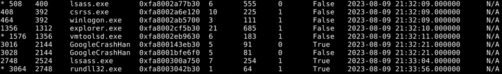
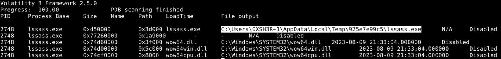
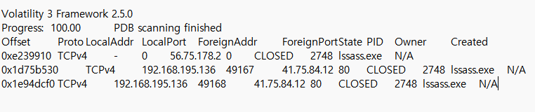
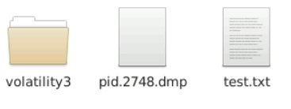
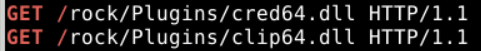
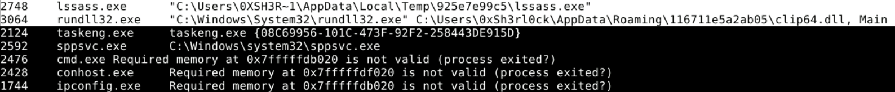
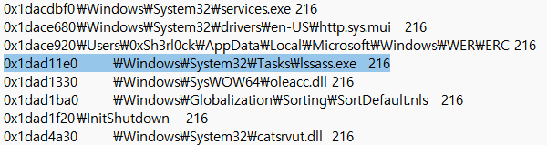

# Amadey

## 목차

[Questions 1](#q1)

[Questions 2](#q2)

[Questions 3](#q3)

[Questions 4](#q4)

[Questions 5](#q5)

[Questions 6](#q6)

[Questions 7](#q7)

# Scenario
An after-hours alert from the Endpoint Detection and Response (EDR) system flags suspicious activity on a Windows workstation. The flagged malware aligns with the Amadey Trojan Stealer. Your job is to analyze the presented memory dump and create a detailed report for actions taken by the malware.

EDR(Endpoint Detection and Response) 시스템의 근무 시간 외 경보가 Windows 워크스테이션에서 의심스러운 활동을 표시합니다. 표시된 악성코드는 Amadey Trojan Stealer와 일치합니다. 여러분의 임무는 제시된 메모리 덤프를 분석하고 악성코드가 수행한 작업에 대한 상세 보고서를 작성하는 것입니다.

# 개념 정리
Amadey Trojan Stealer

# Questions

## Q1
In the memory dump analysis, determining the root of the malicious activity is essential for comprehending the extent of the intrusion. What is the name of the parent process that triggered this malicious behavior?

메모리 덤프 분석에서 악성 활동의 근본 원인을 파악하는 것은 침입 범위를 파악하는 데 필수적입니다. 이 악성 동작을 유발한 부모 프로세스의 이름은 무엇입니까?

### Answer
lssass.exe

### 분석
Volatility3 을 이용해서 제공된 vmem 파일 메모리 포렌식을 진행한다.

pstree 명령어를 통해 메모리를 확인해봤다.

``python3 vol.py -f "../../Artifacts/Windows 7 x64-Snapshot4.vmem" windows.pstree``




확인해본 결과 윈도우에서 사용되는 정상적인 프로세스 lsass.exe 와 유사한 lssass.exe 이름을 가진 악성코드로 의심되는 프로세스가 확인됐다.

lsass.exe는 Local Security Authority Subsystem Service (LSASS) 로 사용자 로그인을 처리하고 자격 증명을 관리하는 프로세스다.

## Q2
Once the rogue process is identified, its exact location on the device can reveal more about its nature and source. Where is this process housed on the workstation?

악성 프로세스가 식별되면 장치에서 해당 프로세스의 정확한 위치를 파악하여 프로세스의 본질과 출처에 대해 더 자세히 알 수 있습니다. 이 프로세스는 워크스테이션의 어디에 위치합니까?

### Answer
C:\Users\0XSH3R~1\AppData\Local\Temp\925e7e99c5\lssass.exe

### 분석
아래 명령어를 통해 해당 프로세스의 DLL 리스트를 확인한다. 그럼 해당 프로세스의 파일 위치를 확인할 수 있다.

``ython3 vol.py -f "../../Artifacts/Windows 7 x64-Snapshot4.vmem" windows.dlllist --pid 2748``



혹은 cmdline 명령어를 이용해도 된다.

``python3 vol.py -f "../../Artifacts/Windows 7 x64-Snapshot4.vmem" windows.cmdline``

경로에 사용된 ~ 기호는 8.3 파일명으로 윈도우에서 긴 파일 이름을 짧게 줄여서 표현해야 할 때 물결표를 사용하게 된다. 공격자들은 탐지를 회피하기 위해 이 기호를 이용하기도 한다.

Temp 폴더는 일반 사용자도 읽고 쓰는게 자유로운 경우가 많기 때문에 공격자들의 관리자 권한을 우회하려는 목적으로 많이 사용된다.

## Q3
Persistent external communications suggest the malware's attempts to reach out C2C server. Can you identify the Command and Control (C2C) server IP that the process interacts with?

지속적인 외부 통신으로 미루어 보아 악성 프로그램이 C2C 서버에 접속하려는 것으로 보입니다. 해당 프로세스가 상호 작용하는 명령 및 제어(C2C) 서버의 IP 주소를 알 수 있을까요?

### Answer
41.75.84.12

### 분석
볼라틸리티 3로 네트워크 정보 스캔 진행

``python3 vol.py -f "../../Artifacts/Windows 7 x64-Snapshot4.vmem" windows.netscan``

PID가 2748인 내용만 필터링 해보면 41.75.84.12 ip주소로 접속을 시도한 것으로 보인다. 80 포트가 단서가 될 수 있는데 해당 포트는 http 통신이기 때문이다.



필터링할 때 grep 명령을 사용해주면 바로 필터링이 가능하다.

``python3 vol.py -f "../../Artifacts/Windows 7 x64-Snapshot4.vmem" windows.netscan | grep 2748``

## Q4
Following the malware link with the C2C, the malware is likely fetching additional tools or modules. How many distinct files is it trying to bring onto the compromised workstation?

C2C를 통해 악성코드 링크를 따라가면, 악성코드는 추가 도구나 모듈을 가져올 가능성이 높습니다. 감염된 워크스테이션으로 몇 개의 개별 파일을 가져오려고 합니까?

### Answer
2

### 분석
41.75.84.12 와의 네트워크 기록이 2개가 발생한 것을 봤을 때 파일도 2개를 받았을 것으로 보인다.

``python3 vol.py -f "../../Artifacts/Windows 7 x64-Snapshot4.vmem" windows.netscan``


라고 문제를 풀 땐 판단했으나 공식 wirte-up을 통해 다른 방식을 알게 되었다.

우선 메모리 덤프를 진행한다.

``python3 vol.py -f "../../Artifacts/Windows 7 x64-Snapshot4.vmem" windows.memmap --dump --pid 2748 ``

그럼 pid.2748.dmp 파일로 결과 파일이 생성된다.



이후 strings 명령어와 grep을 이용해 "GET /" 문자열을 필터링 한다.

``strings pid.2748.dmp | grep "GET /"``

해당 메모리에서 HTTP GET 요청을 찾아내는 방법이다. (파일을 가져오거나 외부 서버와 통신을 진행하려고 할때 주로 GET 요청을 사용한다.)



실행 결과 cred64.dll, clip64.dll 두 개의 값이 출력됐고, 2개의 파일이라는 것을 확인할 수 있다.

## Q5
Identifying the storage points of these additional components is critical for containment and cleanup. What is the full path of the file downloaded and used by the malware in its malicious activity?

이러한 추가 구성 요소의 저장 지점을 파악하는 것은 격리 및 정리에 매우 중요합니다. 악성코드가 악의적인 활동에 다운로드하여 사용하는 파일의 전체 경로는 무엇입니까?

### Answer
C:\Users\0xSh3rl0ck\AppData\Roaming\116711e5a2ab05\clip64.dll

### 분석
파일을 다운로드 받았으면 실행하게 될 테니 cmdline을 확인해봤다.

``python3 vol.py -f "../../Artifacts/Windows 7 x64-Snapshot4.vmem" windows.cmdline``

clip64.dll 파일을 lssass.exe 하위 프로세스 였던 rundll32.exe를 이용해 실행한다.



라고 나는 문제를 풀었으나 공식 write-up에서는 Q4의 메모리 덤프 방식을 이용해 나온 2개의 파일명을 이용해 filescan 을 진행했다.

``python3 vol.py -f "../../Artifacts/Windows 7 x64-Snapshot4.vmem" windows.filescan | grep -E "cred64|clip64"``

```
$ python3 vol.py -f "../../Artifacts/Windows 7 x64-Snapshot4.vmem" windows.filescan | grep -E "cred64|clip64"

0x1d971940 100.0\Users\0xSh3rl0ck\AppData\Roaming\116711e5a2ab05\clip64.dll	216
```

filscan 명령어와 함께 cred64와 clip64을 grep 해주면 해당 파일의 경로를 확인할 수 있다.

AppData 경로는 일반 사용자가 쓰기 권한을 갖고 있으면서 백신 검사에서 제외되는 경우가 많기 때문에 공격자는 해당 폴더에 악성 파일을 숨기는 경우가 많다.

## Q6
Once retrieved, the malware aims to activate its additional components. Which child process is initiated by the malware to execute these files?

악성코드가 검색되면 추가 구성 요소를 활성화하려고 합니다. 악성코드는 이러한 파일을 실행하기 위해 어떤 자식 프로세스를 시작합니까?

### Answer
rundll32.exe

### 분석
clip64.dll 파일을 lssass.exe 하위 프로세스 였던 rundll32.exe를 이용해 실행한다. (cmdline 명령어를 통해 확인 가능)


## Q7
Understanding the full range of Amadey's persistence mechanisms can help in an effective mitigation. Apart from the locations already spotlighted, where else might the malware be ensuring its consistent presence?

Amadey의 지속성 메커니즘을 전체적으로 이해하면 효과적인 완화 조치에 도움이 될 수 있습니다. 이미 언급된 위치 외에도 맬웨어가 지속적으로 존재하는 곳은 어디일까요?

### Answer
C:\Windows\System32\Tasks\lssass.exe

### 분석
filescan 명령어를 실행해봤다.

``ython3 vol.py -f "../../Artifacts/Windows 7 x64-Snapshot4.vmem" windows.filescan``

그리고 lssass.exe 를 검색해보니 Tasks 폴더에서 확인할 수 있었다.

동일한 기능을 grep을 이용하면 다음과 같다.

``python3 vol.py -f "../../Artifacts/Windows 7 x64-Snapshot4.vmem" windows.filescan | grep -E "lssass"``



컴퓨터 종료 후 다시 시작해도 실행될 수 있게 Tasks 리스트(스케줄러)에 악성코드를 추가한다. (persistence 유지)

# 마무리
grep 의 -E 옵션은 OR 연산이라고 보면 된다.