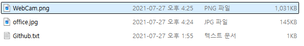
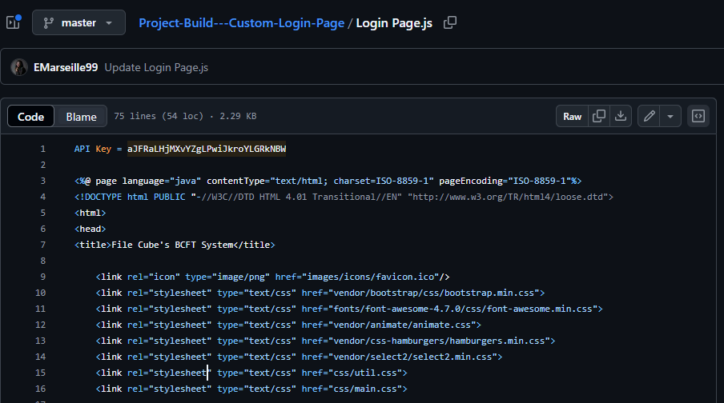
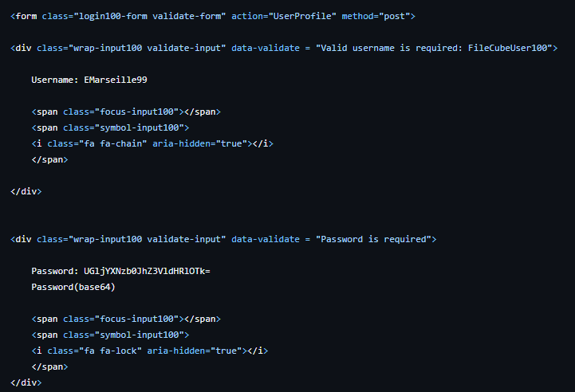
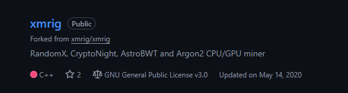
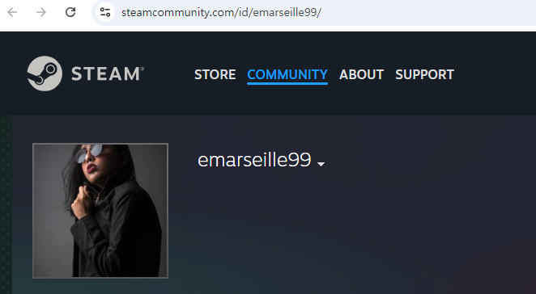
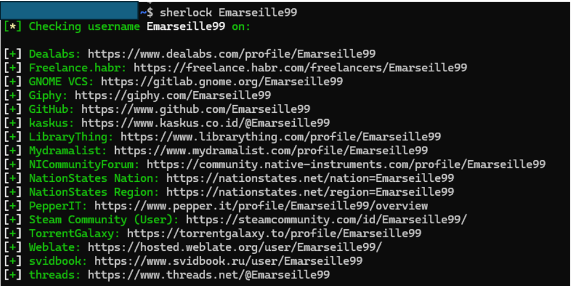
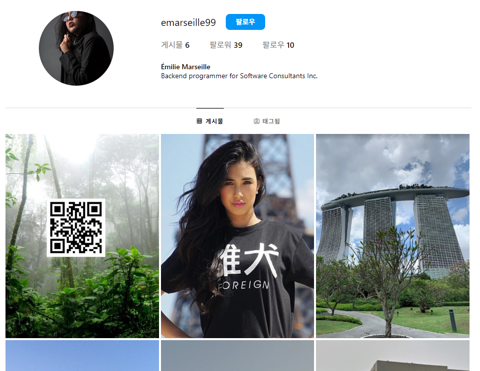
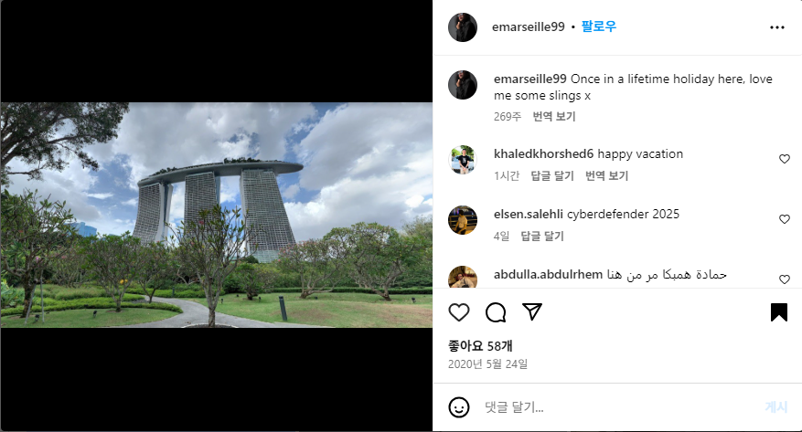
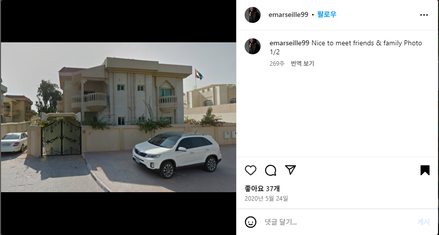
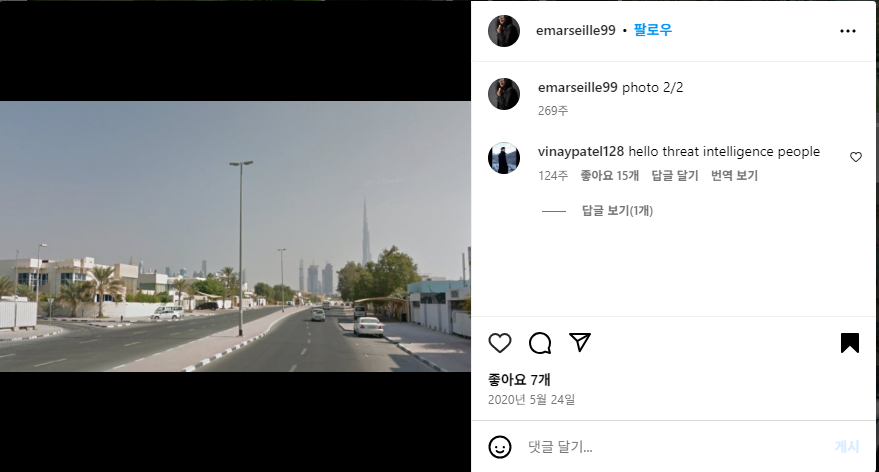

# Lespion

## 목차

[Questions 1](#q1)

[Questions 2](#q2)

[Questions 3](#q3)

[Questions 4](#q4)

[Questions 5](#q5)

[Questions 6](#q6)

[Questions 7](#q7)

[Questions 8](#q8)

[Questions 9](#q9)

# Scenario
You have been tasked by a client whose network was compromised and brought offline to investigate the incident and determine the attacker's identity.

Incident responders and digital forensic investigators are currently on the scene and have conducted a preliminary investigation. Their findings show that the attack originated from a single user account, probably, an insider. Investigate the incident, find the insider, and uncover the attack actions.

네트워크가 손상되어 오프라인이 된 고객으로부터 사고를 조사하고 공격자의 신원을 확인하라는 업무를 받았습니다.

사고 대응팀과 디지털 포렌식 조사관들이 현재 현장에 출동하여 예비 조사를 진행했습니다. 조사 결과, 공격은 단일 사용자 계정, 아마도 내부자로부터 시작된 것으로 나타났습니다. 사고를 조사하고 내부자를 찾아 공격 행위를 밝혀내십시오.

# 문제 파일
png 파일 2개와 github 주소 1개가 문제파일로 제공된다.

# Questions

## Q1
File -> Github.txt: What API key did the insider add to his GitHub repositories?

파일 -> Github.txt: 내부자가 자신의 GitHub 저장소에 어떤 API 키를 추가했나요?

### Answer
aJFRaLHjMXvYZgLPwiJkroYLGRkNBW

### 분석
제공된 github 주소에서 Project-Build---Custom-Login-Page 레포지토리의 Login Page.js 파일을 확인해보면 API key를 확인할 수 있다.

## Q2
File -> Github.txt: What plaintext password did the insider add to his GitHub repositories?

파일 -> Github.txt: 내부자가 자신의 GitHub 저장소에 추가한 일반 텍스트 비밀번호는 무엇입니까?

### Answer
PicassoBaguette99

### 분석
동일한 파일 Login Page.js 파일에서 base64로 인코딩 되어 있는 패스워드를 확인할 수 있다.

## Q3
File -> Github.txt: What cryptocurrency mining tool did the insider use?

파일 -> Github.txt: 내부자는 어떤 암호화폐 채굴 도구를 사용했나요?

### Answer
xmrig

### 분석
Fork 한 레포지토리 중 코인 채굴기(miner)인 XMRig 를 확인할 수 있었다.

## Q4
On which gaming website did the insider have an account?

내부자는 어떤 게임 웹사이트에 계정을 가지고 있었나요?

### Answer
steam

### 분석
구글에 github 닉네임을 검색하면 스팀 프로필 링크를 확인할 수 있다.

여기서 sherlock 이라는 오픈소스 도구를 사용하면 여러 웹사이트에서 검색하고자 하는 이름의 사용자 계정을 조회할 수 있다.

링크: https://github.com/sherlock-project/sherlock

현재 github 링크의 닉네임인 "EMarseille99"로 검색을 진행해봤으며 결과는 다음과 같다.

## Q5
What is the link to the insider Instagram profile?

내부자 인스타그램 프로필 링크는 무엇인가요?

### Answer
https://www.instagram.com/emarseille99/

### 분석
구글에 github 닉네임을 검색하면 인스타그램 계정도 확인할 수 있다.

혹은 인스타그램 도메인 뒤에 닉네임을 붙여보는 것도 OSINT 방법이 될 수 있다.

## Q6
Which country did the insider visit on her holiday?

내부자는 휴가 중에 어느 나라를 방문했나요?

### Answer
Singapore

### 분석
인스타 계정을 확인해보면 휴가 중 방문한 나라를 확인할 수 있다.

## Q7
Which city does the insider family live in?

내부자 가족은 어느 도시에 살고 있나요?

### Answer
Dubai

### 분석
가족을 방문했을 때 찍은 사진들은 아래와 같다.

첫 번째 사진에서 확인할 수 있는 국기를 통해 국가가 UAE 임을 확인했다.

두번째 사진을 이미지 검색 해보면 일단 롸업이 굉장히 많이 나온다 ㅎ... 

어쨋든 높게 솟아있는 건물을 통해 유사한 사진들을 발견했고, 해당 건물은 부르즈 할리파로 추정된다.

따라서 도시는 UAE의 두바이다.

## Q8
File -> office.jpg: You have been provided with a picture of the building in which the company has an office. Which city is the company located in?

파일 -> office.jpg: 회사 사무실이 있는 건물 사진을 보내드렸습니다. 회사는 어느 도시에 위치해 있나요?

### Answer
Birmingham

### 분석
구글 이미지 검색을 하면 역시나 롸업이 많이 나오고, 영국 버밍엄 뉴스트리트 역이라는 정보도 많이 나온다.

## Q9
File -> Webcam.png: With the intel, you have provided, our ground surveillance unit is now overlooking the person of interest suspected address. They saw them leaving their apartment and followed them to the airport. Their plane took off and landed in another country. Our intelligence team spotted the target with this IP camera. Which state is this camera in?

파일 -> 웹캠.png: 귀하께서 제공하신 정보를 바탕으로 저희 지상 감시팀이 용의자(주소가 의심되는 사람)를 감시하고 있습니다. 그들은 그들이 아파트에서 나오는 것을 보고 공항까지 추적했습니다. 그들의 비행기는 다른 나라에 이륙하여 착륙했습니다. 저희 정보팀은 이 IP 카메라로 대상을 포착했습니다. 이 카메라는 어느 주에 있습니까?

### Answer
Indiana

### 분석
구글 이미지 검색을 하면 University of Notre Dame (노터데임 대학교)임을 확인할 수 있다.

해당 대학교는 미국 인디애나 주 사우스 벤드에 위치하고 있다.

# 마무리
그냥 OSINT 문제였다.

sherlock 이라는 오픈소스 도구를 알게되어 의미있는 문제였다.