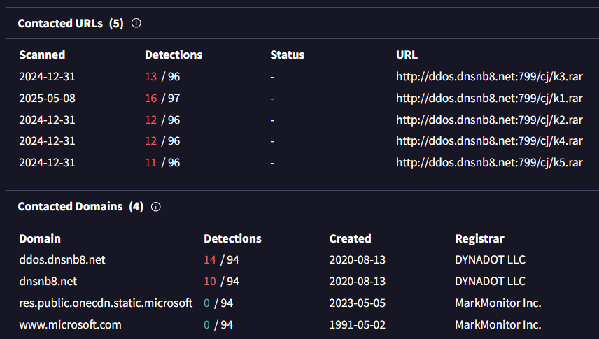

# Ramnit

## 목차

[Questions 1](#q1)

[Questions 2](#q2)

[Questions 3](#q3)

[Questions 4](#q4)

[Questions 5](#q5)

[Questions 6](#q6)

[Questions 7](#q7)

# Scenario
Our intrusion detection system has alerted us to suspicious behavior on a workstation, pointing to a likely malware intrusion. A memory dump of this system has been taken for analysis. Your task is to analyze this dump, trace the malware’s actions, and report key findings.

침입 탐지 시스템이 워크스테이션에서 의심스러운 동작을 감지하여 악성코드 침입 가능성을 경고했습니다. 분석을 위해 이 시스템의 메모리 덤프가 생성되었습니다. 여러분의 임무는 이 덤프를 분석하고 악성코드의 동작을 추적하여 주요 결과를 보고하는 것입니다.

# 문제 파일
메모리 덤프 파일이 주어진다.

# 개념 정리
Volatility3: 메모리 포렌식 도구

# Questions

## Q1
What is the name of the process responsible for the suspicious activity?

의심스러운 활동을 담당하는 프로세스의 이름은 무엇입니까?

### Answer
ChromeSetup.exe

### 분석
Volatility3를 이용하여 메모리 포렌식을 진행한다. pstree 명령어를 통해 실행중인 프로세스를 확인해본다.

explorer.exe 하위에 ChromeSetup.exe 라는 프로세스가 보이는데, 실제 크롬 설치 파일도 ChromeSetup.exe 라는 이름을 가지고 있지만 악성코드가 파일의 이름을 동일하게 했을 가능성도 있으니 조사해볼 필요가 있다.


dumfiles 명령어와 해당 프로세스의 PID를 이용해서 파일 덤프를 진행한다.

```
vol -o ./dump/ -f memory.dmp windows.dumpfiles --pid 4628
```

덤프가 완료됐다.


덤프된 파일의 해시값을 계산한 후 VirusTotal에 검색해봤다.

```
certutil -hashfile "file.0xca82b85325a0.0xca82b7e06c80.ImageSectionObject.ChromeSetup.exe.img" sha256

SHA256의 file.0xca82b85325a0.0xca82b7e06c80.ImageSectionObject.ChromeSetup.exe.img 해시:
1ac890f5fa78c857de42a112983357b0892537b73223d7ec1e1f43f8fc6b7496

CertUtil: -hashfile 명령이 성공적으로 완료되었습니다.
```

악성코드로 확인됐다.


## Q2
What is the exact path of the executable for the malicious process?

악성 프로세스의 실행 파일의 정확한 경로는 무엇입니까?

### Answer
C:\Users\alex\Downloads\ChromeSetup.exe

### 분석
pstree 결과의 가장 끝에 있는 값 Path를 확인해보면 된다.


## Q3
Identifying network connections is crucial for understanding the malware's communication strategy. What IP address did the malware attempt to connect to?

네트워크 연결을 파악하는 것은 악성코드의 통신 전략을 이해하는 데 매우 중요합니다. 악성코드는 어떤 IP 주소에 연결을 시도했습니까?

### Answer
58.64.204.181

### 분석
Volatility3에는 네트워크 정보를 획득할 수 있는 netstat, netscan 명령어가 있다. 그 중 netstat 명령어의 결과를 확인해봤다.

확인 결과 58.64.204.181 ip 주소와의 연결이 확인됐다.


## Q4
To determine the specific geographical origin of the attack, Which city is associated with the IP address the malware communicated with?

공격의 구체적인 지리적 기원을 파악하기 위해, 맬웨어가 통신한 IP 주소와 관련된 도시는 어디입니까?

### Answer
Hong Kong

### 분석
ip location 사이트를 이용해 ip 주소의 위치를 검색해본 결과 홍콩으로 확인됐다.


## Q5
Hashes serve as unique identifiers for files, assisting in the detection of similar threats across different machines. What is the SHA1 hash of the malware executable?

해시는 파일의 고유 식별자 역할을 하여 여러 컴퓨터에서 유사한 위협을 탐지하는 데 도움이 됩니다. 맬웨어 실행 파일의 SHA1 해시는 무엇입니까?

### Answer
280c9d36039f9432433893dee6126d72b9112ad2

### 분석
Q1 에서 파일 덤프를 진행한 후 해시값을 확인한 결과는 다음과 같았다.

`SHA256: 1ac890f5fa78c857de42a112983357b0892537b73223d7ec1e1f43f8fc6b7496`

해당 파일의 SHA1 값은 다음과 같다.

`SHA1:280c9d36039f9432433893dee6126d72b9112ad2`

## Q6
Examining the malware's development timeline can provide insights into its deployment. What is the compilation timestamp for the malware?

악성코드의 개발 타임라인을 살펴보면 배포에 대한 통찰력을 얻을 수 있습니다. 악성코드의 컴파일 타임스탬프는 무엇입니까?

### Answer
2019-12-01 08:36

### 분석
해당 파일의 생성 날짜는 2019-12-01 08:36:04 (UTC+0) 이다.


## Q7
Identifying the domains associated with this malware is crucial for blocking future malicious communications and detecting any ongoing interactions with those domains within our network. Can you provide the domain connected to the malware?

이 악성코드와 관련된 도메인을 파악하는 것은 향후 악성 통신을 차단하고 네트워크 내 해당 도메인과의 지속적인 상호작용을 감지하는 데 매우 중요합니다. 악성코드와 연결된 도메인을 알려주시겠습니까?

### Answer
dnsnb8.net

### 분석
악성코드의 도메인 정보는 VirusTotal에서 확인할 수 있다.

