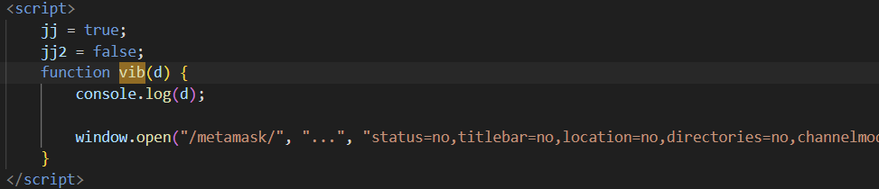

# GrabThePhisher

## 목차

[Questions 1](#q1)

[Questions 2](#q2)

[Questions 3](#q3)

[Questions 4](#q4)

[Questions 5](#q5)

[Questions 6](#q6)

[Questions 7](#q7)

[Questions 8](#q8)

[Questions 9](#q9)

[Questions 10](#q10)

[Questions 11](#q11)

[Questions 12](#q12)

# Scenario
A decentralized finance (DeFi) platform recently reported multiple user complaints about unauthorized fund withdrawals. A forensic review uncovered a phishing site impersonating the legitimate PancakeSwap exchange, luring victims into entering their wallet seed phrases. The phishing kit was hosted on a compromised server and exfiltrated credentials via a Telegram bot.

Your task is to conduct threat intelligence analysis on the phishing infrastructure, identify indicators of compromise (IoCs), and track the attacker’s online presence, including aliases and Telegram identifiers, to understand their tactics, techniques, and procedures (TTPs).

탈중앙화 금융(DeFi) 플랫폼에서 최근 무단 자금 인출에 대한 여러 사용자 불만이 접수되었습니다. 포렌식 검토 결과, 합법적인 PancakeSwap 거래소를 사칭하는 피싱 사이트가 발견되어 피해자들이 지갑 시드 구문을 입력하도록 유도했습니다. 이 피싱 키트는 손상된 서버에 호스팅되어 있었고, 텔레그램 봇을 통해 사용자 인증 정보가 유출되었습니다.

귀하의 임무는 피싱 인프라에 대한 위협 인텔리전스 분석을 수행하고, 침해 지표(IoC)를 식별하고, 별칭 및 텔레그램 식별자를 포함한 공격자의 온라인 활동을 추적하여 그들의 전술, 기법 및 절차(TTP)를 파악하는 것입니다.

# 문제 파일
피싱 사이트의 전체 리소스를 저장한 것으로 추정되는 pankewk 폴더가 제공된다. 악의적인 코드가 존재할 수 있으므로 가상머신 환경에서 혹은 네트워크를 끊은 상태로 진행한다.

# 개념 정리
메타 마스크: 암호화폐를 저장, 송금, 관리할 수 있는 지갑

텔레그램 봇: 텔레그램 내에서 사용자가 원하는 특정 작업을 수행하는 자동화된 프로그램
    - 링크: https://core.telegram.org/bots/api

curl 명령어: URL 구문을 사용하여 데이터를 전송하는 데 사용되는 명령줄 도구

# Questions

## Q1
Which wallet is used for asking the seed phrase?

시드 문구를 묻는 데 어떤 지갑을 사용합니까?

### Answers
metamask

### 분석
폴더를 확인해보면 metamask 라는 이름의 폴더를 확인할 수 있다.


해당 폴더가 어떻게 사용되는지 확인하기 위해 `pankewk/index.html` 파일을 확인해봤다. 

확인 결과 metamask 아이콘을 클릭하면 콘솔 로그에 1을 찍고 새창을 연 후 `pankewk/metamask/index.html` 을 불러오는 것 같다.


onclick과 vib 함수를 통해 알 수 있다.

**onclick**


**vib**


그럼 `pankewk/metamask/index.html` 파일을 확인해보자.

meatmask 지갑의 시드를 입력할 것을 유도하고 있다. (label 태그에 입력 유도)


## Q2
What is the file name that has the code for the phishing kit?

피싱 키트 코드가 들어 있는 파일 이름은 무엇입니까?

### Answer
metamask.php

### 분석
사용자가 지갑의 시드를 입력하고 버튼을 클릭하면 metamask.php 파일을 이용해 POST 전송이 진행된다.


metamask.php 의 내용을 확인해보자.


사용자가 입력한 데이터를 텔레그램 봇을 통해 정보를 수집하는 것으로 보인다.

## Q3
In which language was the kit written?

이 키트는 어떤 언어로 작성되었나요?

### Answer
php

### 분석
php로 작성된 코드다.

## Q4
What service does the kit use to retrieve the victim's machine information?

이 키트는 어떤 서비스를 사용하여 피해자의 기기 정보를 검색합니까?

### Answer
Sypex Geo

### 분석
php 코드 상단에 피해자의 기기 정보를 검색하는 코드가 존재한다.


```
$request = file_get_contents("http://api.sypexgeo.net/json/".$_SERVER['REMOTE_ADDR']); 
$array = json_decode($request);
$geo = $array->country->name_en;
$city = $array->city->name_en;
$date = date("m.d.Y"); //aaja
```

1. $_SERVER['REMOTE_ADDR] 을 이용해서 사이트에 접속한 사용자의 ip 주소를 확보한 후 "http://api.sypexgeo.net/json/" 문자열과 결합하여 file_get_contents를 통해 ip 관련된 정보들을 json 형식으로 반환받은 값을 $request 객체에 넣는다.
2. json 형식으로 받은 데이터를 json_decode 를 이용해 디코딩한다. (php 객체 형태로 저장됨)
3. geo 객체에는 $array의 country 속성의 name_en 속성을 저장한다.
4. city 객체에는 $array의 city 속성의 name_en 속성을 저장한다.
5. date 객체에서는 현재 날짜를 저장한다.

따라서 피해자의 기기 정보를 확보하는 코드라고 볼 수 있고, 그 과정에서 사용된 서비스는 Sypex Geo 라는 사이트다.

## Q5
How many seed phrases were already collected?

이미 몇 개의 시드 문구가 수집되었나요?

### Answer
3

### 분석
php 파일을 분석해보면 텔레그램 봇으로 정보를 수집하는 코드 밑에 로그 파일을 남기는 코드를 확인할 수 있다.


`$text = $_POST['data']."\n"`를 통해 클라이언트에서 넘어온 data 값이 $text 객체에 저장된다. 어떤 데이터가 넘어오는 건지는 파악을 하지 못했다. 하지만 가장 뒤에 개행 문자가 들어간다는 사실이 눈에 들어왔다.

```
@file_put_contents($_SERVER['DOCUMENT_ROOT'].'/log/'.'log.txt', $text, FILE_APPEND);
```

아래 줄을 보면 데이터가 /log/log.txt 파일에 FILE_APPEND를 통해 기존 내용을 삭제하지 않고 $text 개체의 내용을 이어 붙이고 있다.

pankewk/log/log.txt를 확인해보면 문자열이 3개의 개행으로 구분되어 있다.


따라서 이미 수집된 시드 문구의 개수는 3개로 추정할 수 있다.

write-up을 확인해보니 암호화폐 지갑의 시드 문구는 12개~24개의 단어로 구성되어 있다는 사실을 알았다

## Q6
Could you please provide the seed phrase associated with the most recent phishing incident?

가장 최근의 피싱 사건과 관련된 시드 문구를 제공해 주시겠습니까?

### Answer
father also recycle embody balance concert mechanic believe owner pair muffin hockey

### 분석
문자열은 FILE_APPEND를 통해 뒤로 계속 추가되고 있기 때문에 가장 최근 시드는 `father also recycle embody balance concert mechanic believe owner pair muffin hockey
`이다.


## Q7
Which medium was used for credential dumping?

자격 증명 덤핑에 사용된 매체는 무엇입니까?

### Answer
telegram

### 분석
위에서 분석했던 것 처럼 텔레그램 봇을 이용해 데이터를 가져간다.

## Q8
What is the token for accessing the channel?

채널에 접속하기 위한 토큰은 무엇인가요?

### Answer
5457463144:AAG8t4k7e2ew3tTi0IBShcWbSia0Irvxm10

### 분석
metamask.php 코드에서 확인할 수 있다.


## Q9
What is the Chat ID for the phisher's channel?

피싱 채널의 채팅 ID는 무엇입니까?

### Answer
5442785564

### 분석
metamask.php 코드에서 확인할 수 있다.


## Q10
What are the allies of the phish kit developer?

피싱 키트 개발자의 동맹은 누구인가요?

### Answer
j1j1b1s@m3r0

### 분석
metamask.php 코드의 주석 처리된 부분에서 확인할 수 있다.


```
 With love and respect to all the hustler out there,
 This is a small gift to my brothers,
 All the best with your luck,
 
 Regards, 
 j1j1b1s@m3r0
```

## Q11
What is the full name of the Phish Actor?

피싱 공격자의 풀 네임은?

### Answer
Marcus Aurelius

### 분석
우리는 공격자가 수집한 정보를 전송할 때 사용한 텔레그램 봇의 토큰과 ID 값을 알고 있다. 따라서 우리도 공격자 처럼 정보를 전송하거나 받아올 수 있다.

```
$id = "5442785564"; 
$token = "5457463144:AAG8t4k7e2ew3tTi0IBShcWbSia0Irvxm10"; 
```

Telegram 봇의 getChat API를 이용하면 채팅의 정보를 확인할 수 있다.

참고: https://stackoverflow.com/questions/67215674/telegram-bot-get-chat-informations-python

Telegram 봇에게 요청을 보내봤다.

```
https://api.telegram.org/bot5457463144:AAG8t4k7e2ew3tTi0IBShcWbSia0Irvxm10/getChat?chat_id=5442785564
```

잘 되지 않는다.
Telgram 봇은 


curl을 이용해 요청을 보내봤다.

```
curl -H "Content-Type: application/json" -d '{"chat_id":"5442785564"}' -X POST "https://api.telegram.org/bot5457463144:AAG8t4k7e2ew3tTi0IBShcWbSia0Irvxm10/getChat"

-----

curl "https://api.telegram.org/bot5457463144:AAG8t4k7e2ew3tTi0IBShcWbSia0Irvxm10/getChat?chat_id=5442785564" | jq
```

안된다.. 뭔가 토큰에 문제가 있는 것 같다.

```
{"ok":false,"error_code":401,"description":"Unauthorized"}
```

이런게 가능하다는 원리는 이해 했으니 그냥 write-up에 있는 답을 가져와서 인증했다.

결과는 이렇게 출력된다고 한다.


확인된 공격자의 이름은 `Marcus Aurelius`이다.

## Q12
What is the username of the Phish Actor?

피싱 공격자의 유저명은?

### Answer
pumpkinboii

### 분석
11번 문제 결과에서 답을 찾을 수 있다.

### 마무리
Telgram 봇을 이용한 정보 수집 기법이 인상 깊었다. 그리고 토큰과 id 값을 통해 공격자와 동일하게 해당 봇에 접근해 정보를 획득할 수 있다는 점도 학습할 수 있는 좋은 문제였다.