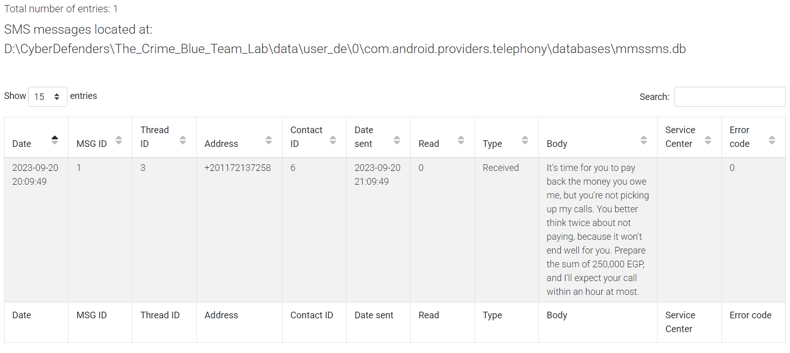
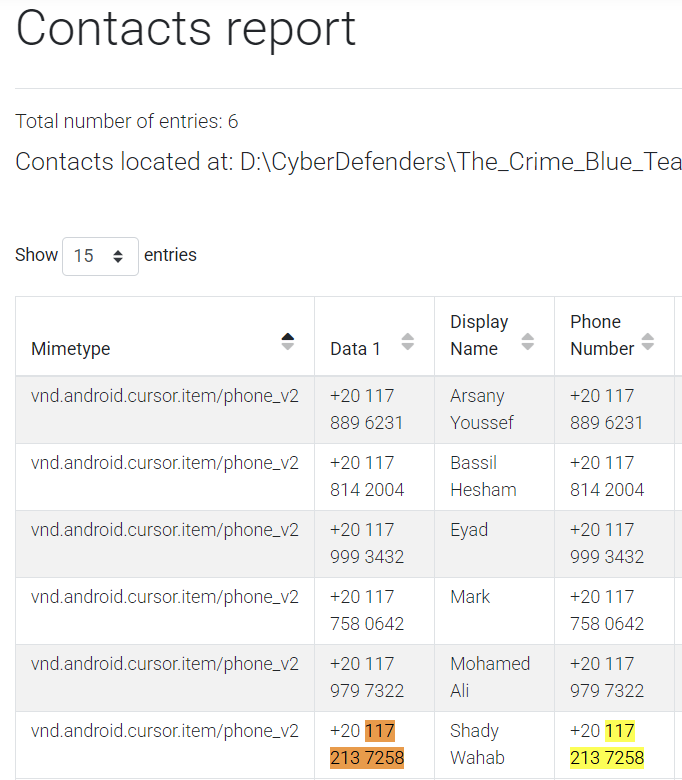
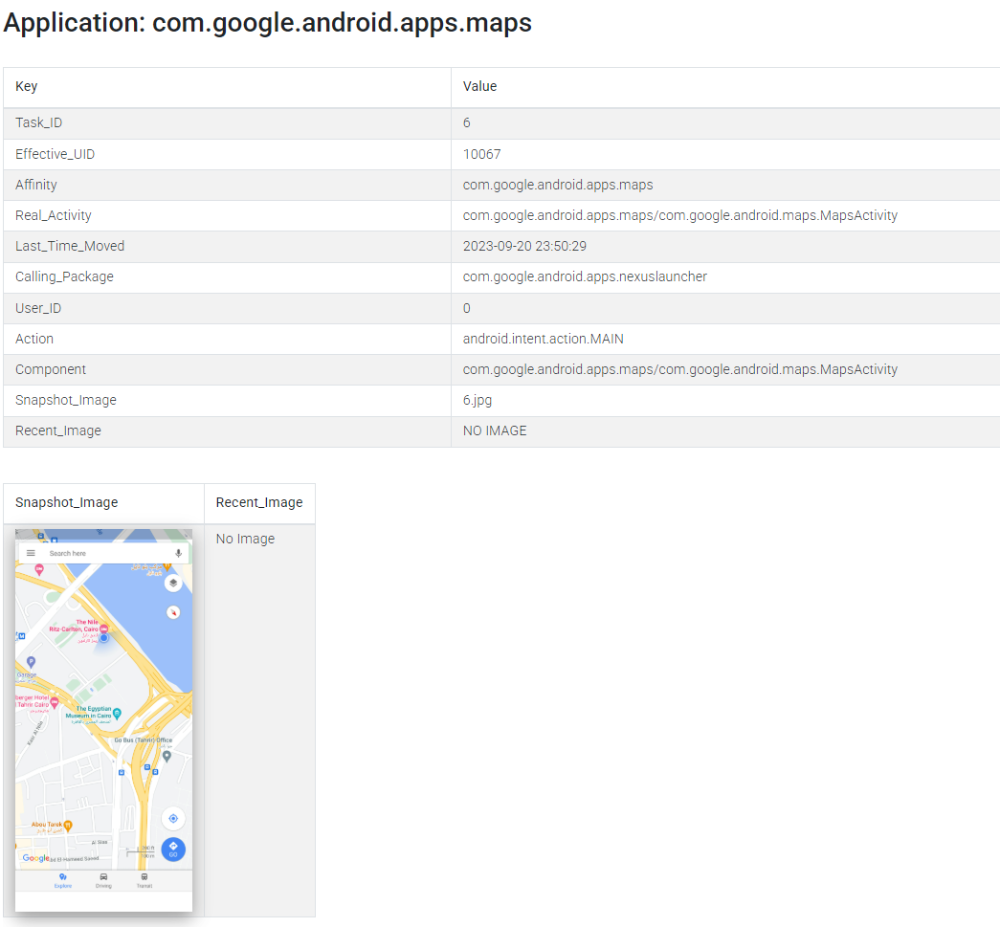
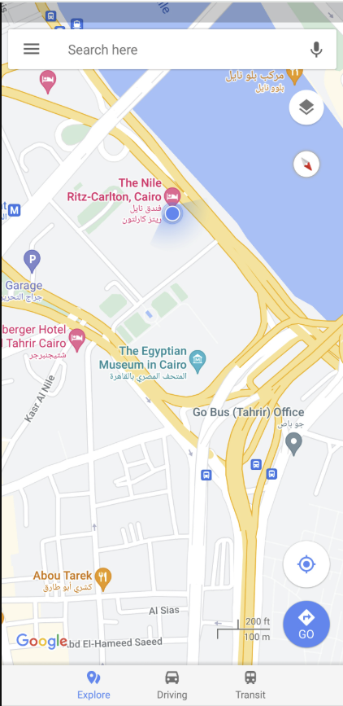
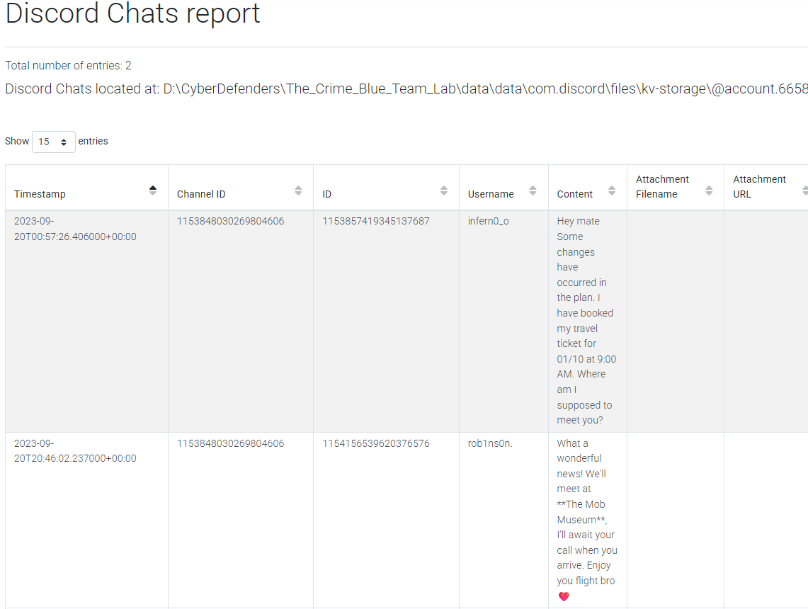

# The Crime

## 목차

[Questions 1](#q1)

[Questions 2](#q2)

[Questions 3](#q3)

[Questions 4](#q4)

[Questions 5](#q5)

# Scenario
We're currently in the midst of a murder investigation, and we've obtained the victim's phone as a key piece of evidence. After conducting interviews with witnesses and those in the victim's inner circle, your objective is to meticulously analyze the information we've gathered and diligently trace the evidence to piece together the sequence of events leading up to the incident.

현재 살인 사건을 수사 중이며, 핵심 증거로 피해자의 휴대전화를 확보했습니다. 목격자 및 피해자 측근들과의 면담을 진행한 후, 수집된 정보를 면밀히 분석하고 증거를 면밀히 추적하여 사건 발생까지의 일련의 과정을 조각조각 맞춰주시기 바랍니다.

# 문제 파일
휴대폰 내부 파일들이 주어진 것 같다.

ALEAPP 이라는 안드로이드 모바일 기기용 오픈소스 포렌식 도구를 활용하면 조금 더 쉽게 문제를 해결할 수 있다.

해당 도구는 다양한 아티팩트를 수집하여 보기 쉽게 정리해준다.

링크: https://github.com/abrignoni/ALEAPP

가이드: https://blog.cyber5w.com/a-guide-to-mobile-forensics-with-aleapp

# Questions

## Q1
Based on the accounts of the witnesses and individuals close to the victim, it has become clear that the victim was interested in trading. This has led him to invest all of his money and acquire debt. Can you identify the SHA256 of the trading application the victim primarily used on his phone?

목격자와 피해자 측근들의 진술을 바탕으로 볼 때, 피해자가 거래에 관심이 있었던 것으로 보입니다. 이로 인해 그는 전 재산을 투자하고 빚을 지게 되었습니다. 피해자가 휴대폰에서 주로 사용했던 거래 애플리케이션의 SHA256을 확인해 주시겠습니까?

### Answer
4f168a772350f283a1c49e78c1548d7c2c6c05106d8b9feb825fdc3466e9df3c

### 분석
현재 휴대폰에 설치되어 있는 앱 중 거래와 관련된 앱은 olymptrade 앱이다.

## Q2
According to the testimony of the victim's best friend, he said, "While we were together, my friend got several calls he avoided. He said he owed the caller a lot of money but couldn't repay now". How much does the victim owe this person?

피해자의 가장 친한 친구의 증언에 따르면, 그는 "우리가 함께 있는 동안 제 친구는 여러 번 전화를 받았는데, 그는 피했습니다. 그는 발신자에게 많은 돈을 갚을 수 없다고 말했습니다."라고 말했습니다. 피해자는 이 사람에게 얼마를 갚아야 할까요?

### Answer
250000

### 분석
SMS 기록을 보면 250,000 EGP 를 준비하라고 되어있다.



## Q3
What is the name of the person to whom the victim owes money?

피해자가 돈을 빚진 사람의 이름은 무엇입니까?

### Answer
Shady Wahab

### 분석
Q2의 문자 내역의 전화 번호를 연락처에서 확인해보면 shady Wahab 이라는 이름을 확인할 수 있다.



## Q4
Based on the statement from the victim's family, they said that on September 20, 2023, he departed from his residence without informing anyone of his destination. Where was the victim located at that moment?

피해자 유족의 진술에 따르면, 피해자는 2023년 9월 20일 아무에게도 행선지를 알리지 않고 자택을 떠났다고 합니다. 당시 피해자는 어디에 있었습니까?

### Answer
The Nile Ritz-Carlton

### 분석
Recent Activity_0 탭을 확인해보면 9월 20일에 찍힌 스크린샷으로 보이는 사진을 확인할 수 있다.



해당 사진을 보면 The Nile Ritz-Carlton 이라는 이집트 카이로의 호텔에 있었다고 추정할 수 있다.



## Q5
The detective continued his investigation by questioning the hotel lobby. She informed him that the victim had reserved the room for 10 days and had a flight scheduled thereafter. The investigator believes that the victim may have stored his ticket information on his phone. Look for where the victim intended to travel.

형사는 호텔 로비를 심문하며 수사를 이어갔습니다. 로비는 피해자가 10일 동안 객실을 예약했고 그 후 항공편을 예약했다고 형사에게 알려주었습니다. 수사관은 피해자가 항공권 정보를 휴대폰에 저장했을 가능성이 있다고 보고 있습니다. 피해자가 어디로 가려고 했는지 확인해 보세요.

### Answer
Las Vegas

### 분석
디스코드 채팅 로그를 보면 피해자로 추정되는 사람이 보낸 메세지를 확인할 수 있다.



```
Hey mate Some changes have occurred in the plan. I have booked my travel ticket for 01/10 at 9:00 AM. Where am I supposed to meet you?

안녕하세요, 계획에 몇 가지 변경 사항이 생겼습니다. 1월 10일 오전 9시 항공권을 예약했습니다. 어디서 만나면 될까요?
```

그러자 답변자는 The Mob Museum 에서 보자고 한다.

```
What a wonderful news! We'll meet at **The Mob Museum**, I'll await your call when you arrive. Enjoy you flight bro ❤️

정말 좋은 소식이에요! **몹 뮤지엄**에서 만나요. 도착하시면 연락 기다리겠습니다. 즐거운 비행 되세요, 형님 ❤️
```

Mob Museum은 미국 네바다주 라스베이거스에 있는 박물관이다.


## Q6
After examining the victim's Discord conversations, we discovered he had arranged to meet a friend at a specific location. Can you determine where this meeting was supposed to occur?

피해자의 디스코드 대화를 살펴본 결과, 피해자가 특정 장소에서 친구를 만나기로 약속한 것을 발견했습니다. 이 만남이 어디서 이루어졌는지 알 수 있을까요?

### Answer
The Mob Museum

### 분석
디스코드 채팅 로그를 보면 만남 장소를 확인할 수 있다.


# 마무리
ALEAPP 이라는 안드로이드 모바일 기기용 오픈소스 포렌식 도구를 알 수 있었다. 하지만 모바일 포렌식을 이것만으로 하기엔 휴대폰 별, 앱 별, 국가별 등 특징이 다 다르므로 한계가 존재하여 유료 프로그램을 쓰게 된다.