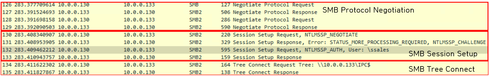
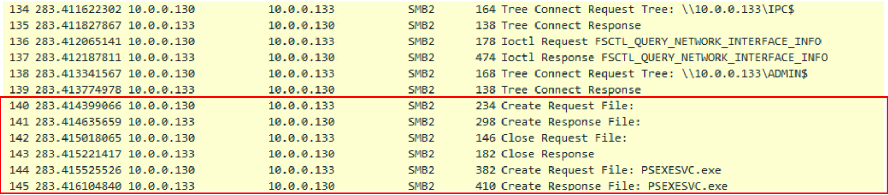

# PsExec Hunt

## 목차

[Questions 1](#q1)

[Questions 2](#q2)

[Questions 3](#q3)

[Questions 4](#q4)

[Questions 5](#q5)

[Questions 6](#q6)

[Questions 7](#q7)

# Scenario
An alert from the Intrusion Detection System (IDS) flagged suspicious lateral movement activity involving PsExec. This indicates potential unauthorized access and movement across the network. As a SOC Analyst, your task is to investigate the provided PCAP file to trace the attacker’s activities. Identify their entry point, the machines targeted, the extent of the breach, and any critical indicators that reveal their tactics and objectives within the compromised environment.

침입 탐지 시스템(IDS)의 경보에서 PsExec과 관련된 의심스러운 측면 이동 활동이 감지되었습니다. 이는 네트워크 전반에 걸쳐 무단 접근 및 이동 가능성이 있음을 나타냅니다. SOC 분석가의 임무는 제공된 PCAP 파일을 조사하여 공격자의 활동을 추적하는 것입니다. 공격자의 진입점, 대상 기기, 침해 범위, 그리고 침해된 환경 내에서 공격자의 전술과 목표를 드러내는 주요 지표를 파악해야 합니다.

# 문제 파일
pcapng 파일이 주어진다.

# 개념 정리
SMB (Server Message Block)
- 같은 네트워크 내의 다른 호스트의 파일이나 프린터 공유를 위한 프로토콜이다. 원래는 파일 공유를 위한 프로토콜이지만 공격자들은 래터럴 무브먼트 (Lateral Movement) 용도로 사용할 수 있다.

- 동작 순서
    - SMB Protocol Negotiation
        - 클라이언트가 SMB 프로토콜을 통한 통신을 요청하는 Negotiation Request를 전송한다. 서버는 이에 대한 Negotiate Protocal Response를 보낸다.
    - SMB Session Setup (유저 인증, NTLM)
        - 서버와 클라이언트는 NTLM 으로 유저 인증 작업을 시작한다.
    - SMB Tree Connect
        - 실제 경로(Path) 값을 입력해서 서버의 리소스를 요청한다.
        - 공유에 대한 액세스 권한이 부여되면 서버는 이 패킷의 공유에 해당하는 16비트 TID를 반환하고, 공유가 없거나 사용자가 공유에 액세스할 자격 증명이 부족한 경우 서버는 패킷에 오류 코드를 반환하고 공유에 대한 액세스를 거부한다.
    - 참고: https://learn.microsoft.com/ko-kr/windows/win32/fileio/microsoft-smb-protocol-packet-exchange-scenario

PsExec
- 원격으로 PC를 제어할 수 있는 프로그램으로 SMB를 이용한 원격 관리 프로그램

셸 (Shell)
- 사용자와 커널 사이에서 명령어를 입력받아 해석 후 전달하는 역할을 하는 프로그램. 셸을 획득하면 시스템을 제어할 수 있게 된다. (그렇다고 관리자 권한을 획득했다는 소리는 아니다. 그냥 해당 시스템에 접속했다고 보면 된다.)

Admin$
- 윈도우 운영체제에서 시스템 관리자가 원격으로 시스템에 접근하기 위해 사용하는 숨겨진 관리 공유 폴더. 일반적으로 공유 폴더 뒤에는 "$" 가 붙는다.

PsExec를 이용한 쉘 획득 방법
1. 인증: 제공된 자격 증명 또는 현재 자격 증명을 사용하여 SMB를 통해 연결 (SMB 인증 세션 생성은 IPC$ 공유폴더를 통해 진행)
2. 파일 드롭: 원격 컴퓨터의 ADMIN$ 공유에 PsExecSvc.exe를 복사
3. 서비스 생성: PsExecSvc라는 새로운 서비스를 설치하고 시작
4. 파이프 기반 통신: PsExec-<host>-<random>과 같은 명명된 파이프를 사용하여 통신 ($IPC)
5. 정리: 서비스 및 실행 가능한 작업 후 삭제

전제 조건
- 타겟 호스트의 Local Administrator 권한을 갖고 있는 계정/비밀번호
- 타겟 호스트가 SMB 서비스를 사용하고 있으며 방화벽으로 막아놓지 않는 경우
- File and Print Sharing 활성화, Simple File Sharing 비활성화 (디폴트)

참고: https://www.xn--hy1b43d247a.com/lateral-movement/smb-psexec

# Questions

## Q1
To effectively trace the attacker's activities within our network, can you identify the IP address of the machine from which the attacker initially gained access?

네트워크 내에서 공격자의 활동을 효과적으로 추적하려면 공격자가 처음 접근한 컴퓨터의 IP 주소를 식별할 수 있습니까?

### Answer
10.0.0.130

### 분석
패킷을 확인해보면 10.0.0.130 주소가 10.0.0.133 주소에게 SMB 프로토콜을 이용한 통신을 요청하고 SMB Protocol Negotiation, SMB Session Setup 과정을 거쳐 SMB Tree Connect 과정에서 10.0.0.130 주소가 10.0.0.133 주소의 IPC 공유 폴더에 접근할 것을 요청하고 있다.

## Q2
To fully understand the extent of the breach, can you determine the machine's hostname to which the attacker first pivoted?

침해의 정도를 완전히 이해하려면 공격자가 처음으로 피벗한(중심으로 잡은) 기계의 호스트 이름을 확인할 수 있습니까?
### Answer
SALES-PC

### 분석
SMB 프로토콜 간 인증 패킷들을 확인해보면 공격 대상으로 잡힌 호스트(혹은 서버) 정보를 확인할 수 있다.

그리고 SMB Session Setup 부분을 좀 더 자세히 들여다 보면 다음과 같다.

1. 10.0.0.130(클라이언트) → 10.0.0.133(서버)
    - Session Setup Request, NTLMSSP_NEGOTIATE
    - 서버와 인증 방법 협상
2. 10.0.0.133(서버) → 10.0.0.130(클라이언트)
    - Session Setup Response, Error: STATUS_MORE_PROCESSING_REQUIRED, NTLMSSP_CHALLENGE
    - 아직 인증이 끝나지 않았아서 추가 단계가 필요하며, 서버가 클라이언트에게 NTLM 인증을 위한 챌린지(난수)를 보냈다는 의미
3. 10.0.0.130(클라이언트) → 10.0.0.133(서버)
    - Session Setup Request, NTLMSSP_AUTH
    - 요청한 정보와 인증 응답을 보내겠다는 의미

따라서 서버의 정보는 2, 3번에 모두 들어가게 되고, 클라이언트의 정보는 서버가 요구하는 데이터를 보내는 과정인 3번에서 확인할 수 있다.

만약 3번 과정에서 클라이언트가 보낸 인증 값이 서버에서 검증되면 서버는 클라이언트에게 accept-completed 값을 보내준다. (SMB Session Setup 마지막 Response 값)

## Q3
Knowing the username of the account the attacker used for authentication will give us insights into the extent of the breach. What is the username utilized by the attacker for authentication?

공격자가 인증에 사용한 계정의 사용자 이름을 알면 침해의 정도를 파악할 수 있습니다. 공격자가 인증에 사용한 사용자 이름은 무엇입니까?

### Answer
ssales

### 분석
위에서 설명했던 3번 과정을 보자.

- 10.0.0.130(클라이언트) → 10.0.0.133(서버)
    - Session Setup Request, NTLMSSP_AUTH
    - 요청한 정보와 인증 응답을 보내겠다는 의미

따라서 공격에 사용된 사용자 이름을 확인할 수 있다.

공격에 사용된 사용자명은 ssales, PC 명은 HR-PC 로 확인됐다.

## Q4
After figuring out how the attacker moved within our network, we need to know what they did on the target machine. What's the name of the service executable the attacker set up on the target?

공격자가 네트워크 내에서 어떻게 이동했는지 파악한 후에는 대상 컴퓨터에서 어떤 작업을 했는지 알아야 합니다. 공격자가 대상 시스템에 설치한 서비스 실행 파일의 이름은 무엇입니까?

### Answer
PSEXESVC

### 분석
SMB Session Setup에서 클라이언트 인증이 끝났고, SMB Tree connect 부분을 보면 클라이언트 (공격자)는 서버에게 IPC$ 공유폴더 접근을 요청한다.

그럼 서버는 STATUS_SUCCESS로 응답한다.

그리고 다음으로 ADMIN$ 공유 폴더 접근을 요청하고, 서버는 동일하게 STATUS_SUCCESS로 응답하게 된다.

이후 클라이언트(공격자)는 서버에게 파일을 업로드 할 것을 요청하게 되는데, 그 파일명이 PSEXESVC.exe 이다.

## Q5
We need to know how the attacker installed the service on the compromised machine to understand the attacker's lateral movement tactics. This can help identify other affected systems. Which network share was used by PsExec to install the service on the target machine?

공격자의 수평 이동 전략(lateral movement)을 파악하려면 공격자가 감염된 시스템에 서비스를 어떻게 설치했는지 알아야 합니다. 이를 통해 영향을 받은 다른 시스템을 식별하는 데 도움이 될 수 있습니다. PsExec은 대상 시스템에 서비스를 설치하는 데 어떤 네트워크 공유를 사용했습니까?

### Answer
ADMIN$

### 분석
파일이 업로드 된 공유폴더는 ADMIN$ 폴더이다.

## Q6
We must identify the network share used to communicate between the two machines. Which network share did PsExec use for communication?

두 컴퓨터 간 통신에 사용된 네트워크 공유를 확인해야 합니다. PsExec은 어떤 네트워크 공유를 사용하여 통신했습니까?

### Answer
IPC$

### 분석
초반 확인했던 SMB Tree Connect 부분에서 $IPC 공유 폴더로의 최초 접근이 확인됐다. 

IPC$ 공유 폴더는 클라이언트가 서버에 접근하여 프로세스 간 통신을 가능하도록 한다. 그렇기 때문에 공격자는 우선 IPC$ 공유 폴더에 접근한 후 인증을 시도한 후 성공시 SMB 인증 세션을 생성한다.

이후 ADMIN$ 공유 폴더에 PsExec 파일을 복사한 후 서비스 등록을 진행해준다. 그럼 해당 서비스를 이용해서 공격자는 서버를 원격으로 접속할 수 있게 된다. (셸 획득, 통신 과정에서 $IPC는 명령을 실행하고 제어하기 위한 필수 통신 채널)

smb는 TCP 445번 포트로 통신을 하게 되는데 아래 사진을 보면 공격자 또한 TCP 445번 포트를 이용하여 파일 전송을 진행하고 있다.

## Q7
Now that we have a clearer picture of the attacker's activities on the compromised machine, it's important to identify any further lateral movement. What is the hostname of the second machine the attacker targeted to pivot within our network?

이제 침해된 컴퓨터에서 공격자의 활동을 더 명확하게 파악했으므로, 추가적인 측면 이동을 파악하는 것이 중요합니다. 공격자가 네트워크 내에서 피벗을 시도한 두 번째 컴퓨터의 호스트 이름은 무엇입니까?

### Answer
Marketing-PC

### 분석
위에서 봤던 SMB를 이용한 접근 방식이 동일하게 10.0.0.131 주소를 대상으로 진행되고 있다.

조금 더 자세히 살펴보면 jdoe 라는 계정명으로 인증에 실패했고, 이후 IEUser라는 계정명으로 인증에 성공했다.

# 마무리
참고할만한 사이트: https://401trg.github.io/pages/an-introduction-to-smb-for-network-security-analysts.html

$IPC, PsExec, RDC, named pip 등 각각의 개념이 조금씩 헷갈린다.

SMB 프로토콜도 꼭 정리해야 위 내용도 이해할 수 있을것으로 보인다.