# Red Stealer

## 목차

[Questions 1](#q1)

[Questions 2](#q2)

[Questions 3](#q3)

[Questions 4](#q4)

[Questions 5](#q5)

[Questions 6](#q6)

[Questions 7](#q7)

[Questions 8](#q8)

[Questions 9](#q9)

# Scenario
You are part of the Threat Intelligence team in the SOC (Security Operations Center). An executable file has been discovered on a colleague's computer, and it's suspected to be linked to a Command and Control (C2) server, indicating a potential malware infection.
Your task is to investigate this executable by analyzing its hash. The goal is to gather and analyze data beneficial to other SOC members, including the Incident Response team, to respond to this suspicious behavior efficiently.

당신은 SOC(보안 운영 센터)의 위협 인텔리전스 팀 소속입니다. 동료의 컴퓨터에서 실행 파일이 발견되었으며, 이 파일은 명령 및 제어(C2) 서버와 연결되어 있어 잠재적인 악성 코드 감염을 시사하는 것으로 의심됩니다.
당신의 임무는 이 실행 파일의 해시를 분석하여 조사하는 것입니다. 목표는 사고 대응팀을 포함한 다른 SOC 구성원에게 유용한 데이터를 수집하고 분석하여 이 의심스러운 행위에 효율적으로 대응하는 것입니다.

# 문제 파일
해시값이 주어진다.

File Hash (SHA-256): 248FCC901AFF4E4B4C48C91E4D78A939BF681C9A1BC24ADDC3551B32768F907B

# 개념 정리
RedLine Stealer
- 웹 브라우저 자동 로그인 기능에 저장된 계정, 신용카드 정보 등을 노리는 악성코드

# Questions

## Q1
Categorizing malware enables a quicker and clearer understanding of its unique behaviors and attack vectors. What category has Microsoft identified for that malware in VirusTotal?

맬웨어를 분류하면 맬웨어의 고유한 동작과 공격 경로를 더 빠르고 명확하게 파악할 수 있습니다. Microsoft는 VirusTotal에서 해당 맬웨어에 대해 어떤 범주를 확인했습니까?

### Answer
Trojan

### 분석
VirusTotal의 Detection 탭을 보면 Microsoft에서는 Trojan, 트로이목마 유형의 악성코드로 탐지하고 있다. (트로이목마: 정상적인 프로그램으로 위장한 악성코드)

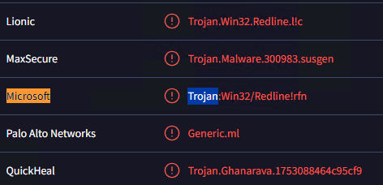

## Q2
Clearly identifying the name of the malware file improves communication among the SOC team. What is the file name associated with this malware?

Note: Don't include the file extension in the name.

악성코드 파일 이름을 명확하게 밝히면 SOC 팀 간의 소통이 원활해집니다. 이 악성코드와 관련된 파일 이름은 무엇입니까?

참고: 이름에 파일 확장자를 포함하지 마세요.

### Answer
WEXTRACT

### 분석
VirustTotal Details 탭에서 악성코드의 이름을 확인할 수 있다.

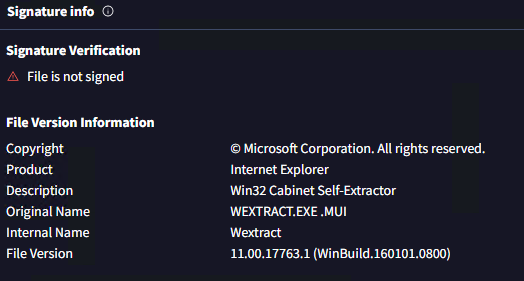

## Q3
Knowing the exact timestamp of when the malware was first observed can help prioritize response actions. Newly detected malware may require urgent containment and eradication compared to older, well-documented threats. What is the UTC timestamp of the malware's first submission to VirusTotal?

맬웨어가 처음 발견된 정확한 타임스탬프를 알면 대응 조치의 우선순위를 정하는 데 도움이 될 수 있습니다. 새로 탐지된 맬웨어는 오래되고 잘 문서화된 위협에 비해 긴급한 봉쇄 및 근절이 필요할 수 있습니다. 맬웨어가 VirusTotal에 처음 제출된 시점의 UTC 타임스탬프는 몇 시입니까?

### Answer
2023-10-06 04:41

### 분석
VirustTotal 첫 번째 제출은 2023-10-06 04:41에 진행됐다.

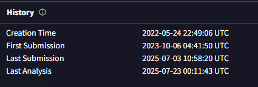

## Q4
Understanding the techniques used by malware helps in strategic security planning. What is the MITRE ATT&CK technique ID for the malware's data collection from the system before exfiltration?

악성코드가 사용하는 기법을 이해하면 전략적 보안 계획 수립에 도움이 됩니다. 악성코드가 시스템에서 데이터를 유출하기 전에 수집하는 MITRE ATT&CK 기법 ID는 무엇입니까?

### Answer
T1005

### 분석
수집과 관련된 MITRE ATT&CK 정보는 VirusTotal BEHAVIOR 탭에서 확인할 수 있다.

그 중에서도 문제에서 말하는 "데이터를 유출하기 전에 수집하는 MITRE ATT&CK 기법"의 ID는 T1005다.

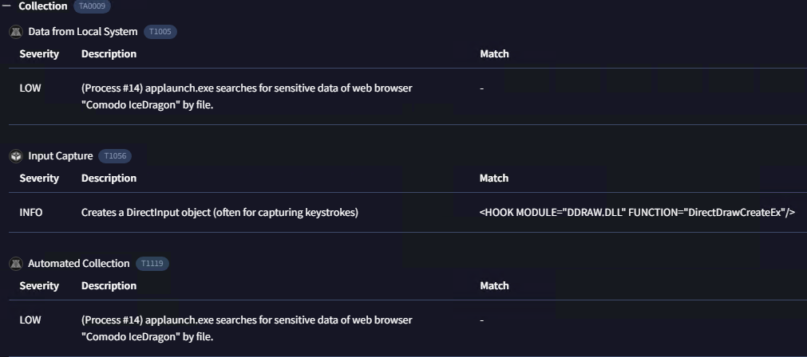

해당 악성코드에서 T1005 ID로 식별된 행위는 다음과 같다.

```
(Process #14) applaunch.exe searches for sensitive data of web browser "Comodo IceDragon" by file.

(프로세스 #14) applaunch.exe는 파일별로 웹 브라우저 "Comodo IceDragon"의 민감한 데이터를 검색합니다.
```

MITRE ATT&CK ID는 아래 링크에서 검색해볼 수 있다.

https://attack.mitre.org/

## Q5
Following execution, which social media-related domain names did the malware resolve via DNS queries?

실행 후, 맬웨어는 DNS 쿼리를 통해 어떤 소셜 미디어 관련 도메인 이름을 확인했습니까?

### Answer
facebook.com

### 분석
페이스북 도메인이 확인됐다.

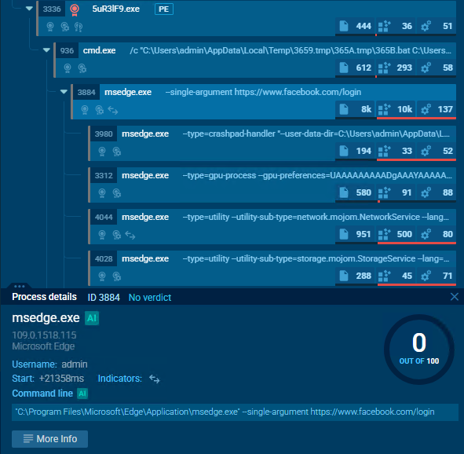

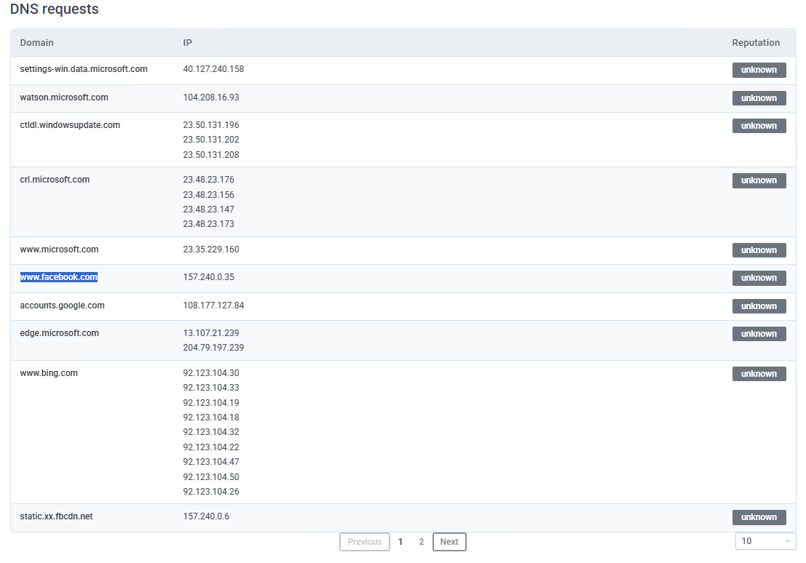

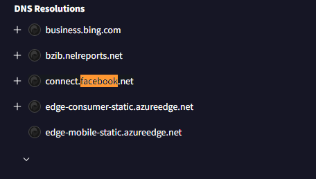


Write-up을 참고해보면 관련해서 이렇게 설명하고 있다.

악성코드가 네트워크 트래픽을 합법적인 트래픽과 혼합하여 널리 알려지고 신뢰받는 도메인의 평판을 활용하여 보안 시스템의 탐지를 피하려는 목적일 가능성이 있다. 

공격자들은 facebook.com과 같은 합법적인 도메인을 사용하는 경우가 많은데, 이러한 도메인은 사용자가 자주 접속하고 네트워크 트래픽에 포함되어도 의심을 받을 가능성이 낮기 때문이다. 또한, 합법적인 도메인을 사용하면 방화벽이나 침입 탐지 시스템 등 신뢰할 수 있는 도메인을 간과하거나 허용 목록에 추가할 수 있는 특정 보안 메커니즘을 우회할 수도 있다.

공격자가 주의를 끌지 않고 명령 및 제어(C2) 서버와 비밀 통신을 유지하거나 데이터를 유출하는 데 도움이 되며, 이는 사고 대응자와 보안 분석가의 업무를 복잡하게 만든다.

## Q6
Once the malicious IP addresses are identified, network security devices such as firewalls can be configured to block traffic to and from these addresses. Can you provide the IP address and destination port the malware communicates with?

악성 IP 주소가 식별되면 방화벽과 같은 네트워크 보안 장치를 구성하여 해당 주소로 오가는 트래픽을 차단할 수 있습니다. 악성 코드가 통신하는 IP 주소와 목적지 포트를 알려주시겠습니까?

### Answer
77.91.124.55:19071

### 분석
특정 프로세스에서 T1571 Non-Standard Port ID를 확인할 수 있었다. 

T1571
- 공격자가 네트워크 방화벽이나 보안 장비를 우회하기 위해 비표준 포트 (예: 53, 8080, 443이 아닌 다른 포트) 를 사용하여 C2 (Command and Control) 서버와 통신하는 것을 말한다.

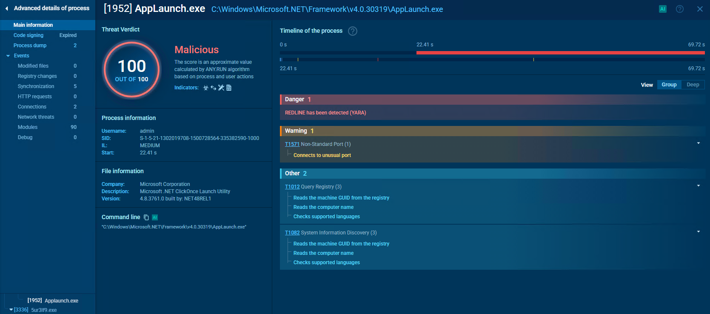

자세히 살펴보면 해당 통신에 사용된 ip 주소와 포트 번호를 확인할 수 있다.

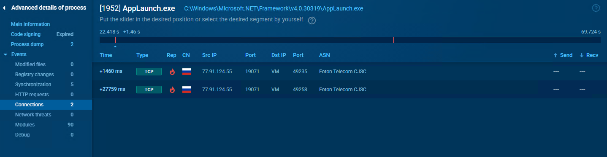

## Q7
YARA rules are designed to identify specific malware patterns and behaviors. Using MalwareBazaar, what's the name of the YARA rule created by "Varp0s" that detects the identified malware?

YARA 규칙은 특정 악성코드의 패턴과 동작을 식별하도록 설계되었습니다. MalwareBazaar를 사용할 때, "Varp0s"가 식별된 악성코드를 탐지하는 YARA 규칙의 이름은 무엇입니까?

## Answer
detect_Redline_Stealer

### 분석
MalwareBazaar에서 YARA Signature를 확인하면 	detect_Redline_Stealer 라는 Rule을 확인할 수 있다.

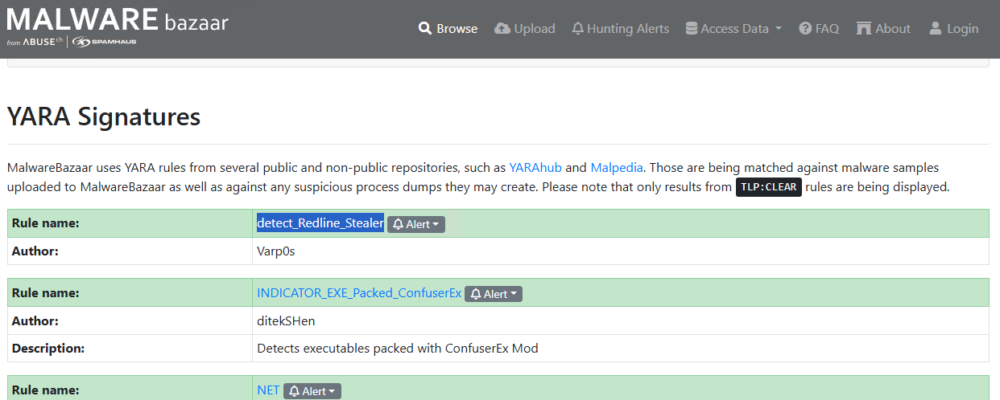

## Q8
Understanding which malware families are targeting the organization helps in strategic security planning for the future and prioritizing resources based on the threat. Can you provide the different malware alias associated with the malicious IP address according to ThreatFox?

조직을 대상으로 하는 멀웨어 제품군을 이해하면 미래에 대한 전략적 보안 계획을 세우고 위협에 따라 리소스의 우선순위를 정하는 데 도움이 됩니다. ThreatFox에 따라 악성 IP 주소와 관련된 다양한 멀웨어 별칭을 제공할 수 있습니까?

## Answer
RECORDSTEALER

### 분석
ThreatFox 사이트는 악성코드 관련 침해 지표(IOCs) 정보들을 공유하고 있다. 예를 들어 ip와 포트를 입력하면 해당 정보와 연관된 악성코드 해시값, 악성코드 정보 등을 확인할 수 있다.

ThreatFox에 위에서 확인한 ip:port 주소를 검색해보면 RECORDSTEALER라는 별칭을 확인할 수 있다.

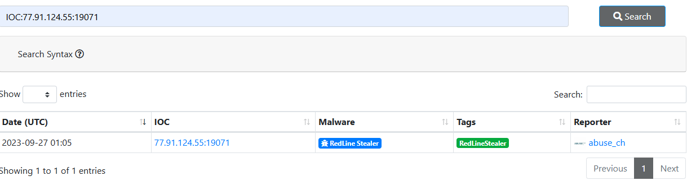

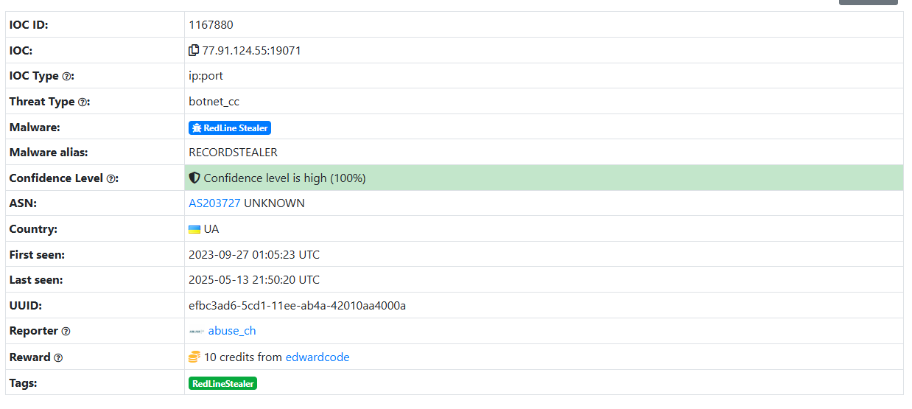

링크: https://threatfox.abuse.ch/ioc/1167880/

## Q9
By identifying the malware's imported DLLs, we can configure security tools to monitor for the loading or unusual usage of these specific DLLs. Can you provide the DLL utilized by the malware for privilege escalation?

맬웨어가 가져온 DLL을 식별하면 보안 도구를 구성하여 해당 DLL의 로딩이나 비정상적인 사용을 모니터링할 수 있습니다. 맬웨어가 권한 상승에 사용하는 DLL을 제공해 주시겠습니까?

## Answer
ADVAPI32.dll

### 분석
윈도우에서 권한에 관련된 API가 담겨있는 ADVAPI32.dll 파일이 해당 악성코드에서 확인됐다.

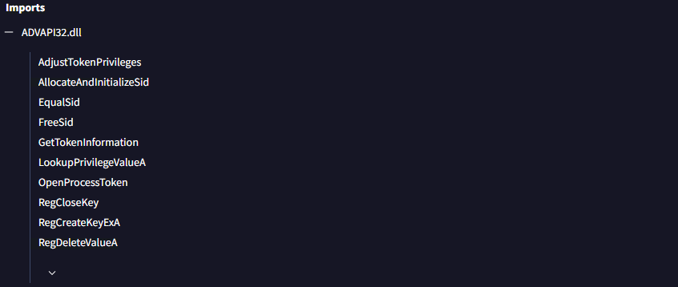

윈도우 권한에 대한 자세한 내용은 아래 링크 참고.

링크: https://roklcw.tistory.com/43

# 마무리
Virustotal, malwareBazarr, ThreatFox, Any.run, Malpedia 등의 웹 사이트를 이용해서 악성코드의 정보(이름, 패밀리, 기능, 네트워크 등)를 파악하는 과정의 중요성, 생각보다 얻을 수 있는 정보가 많다는 점도 학습할 수 있었다.