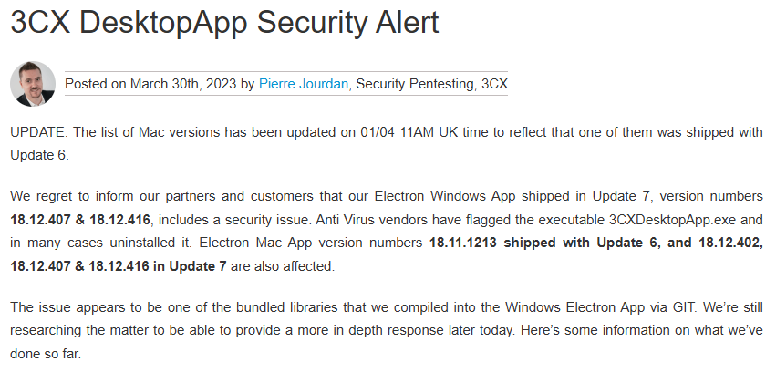
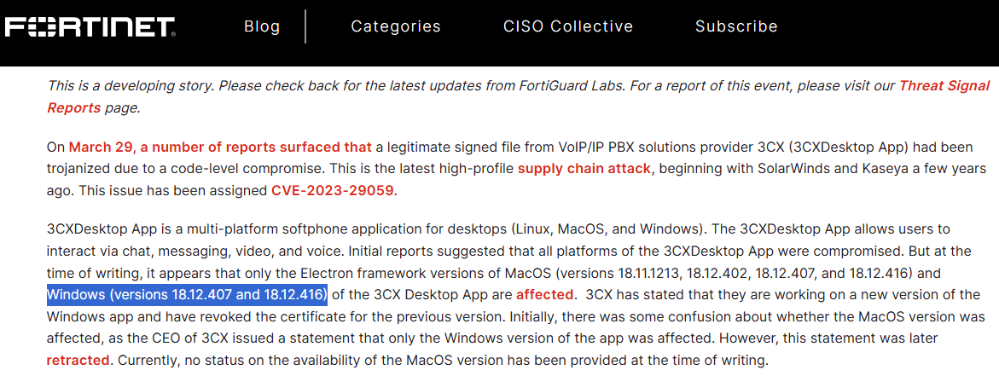
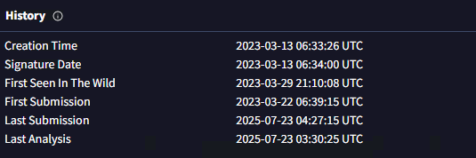
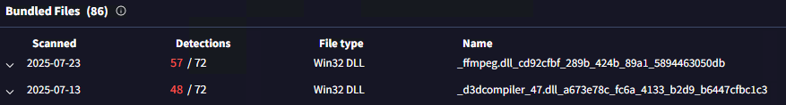
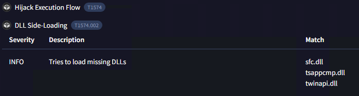
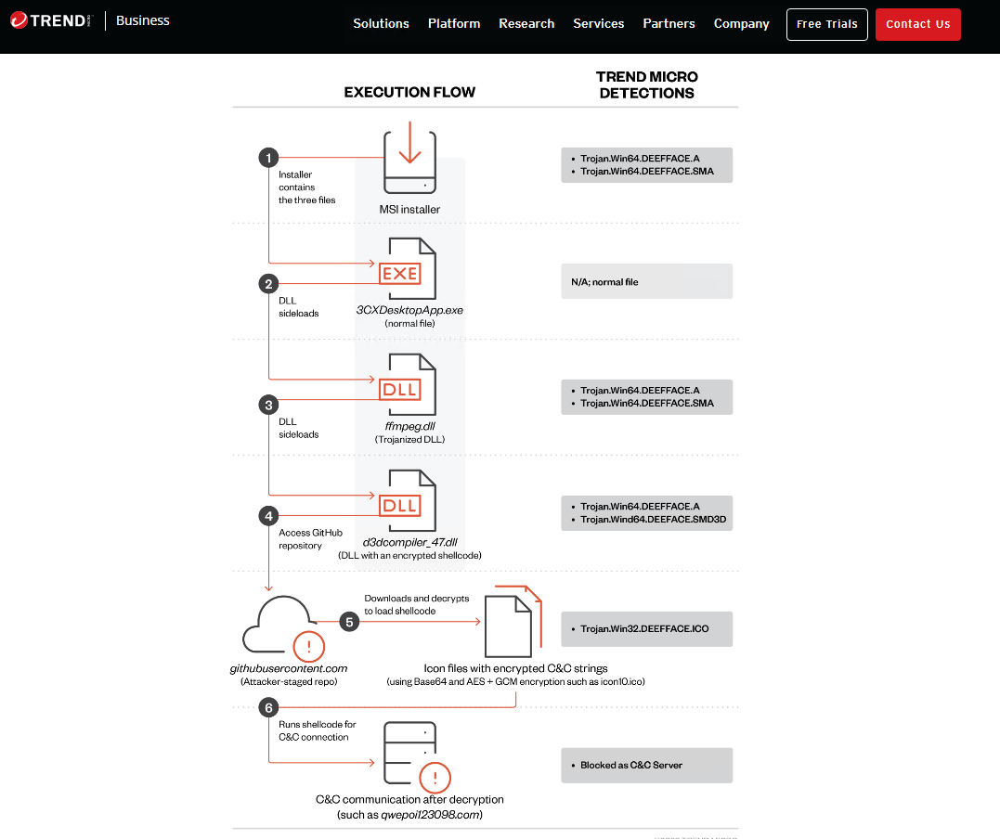
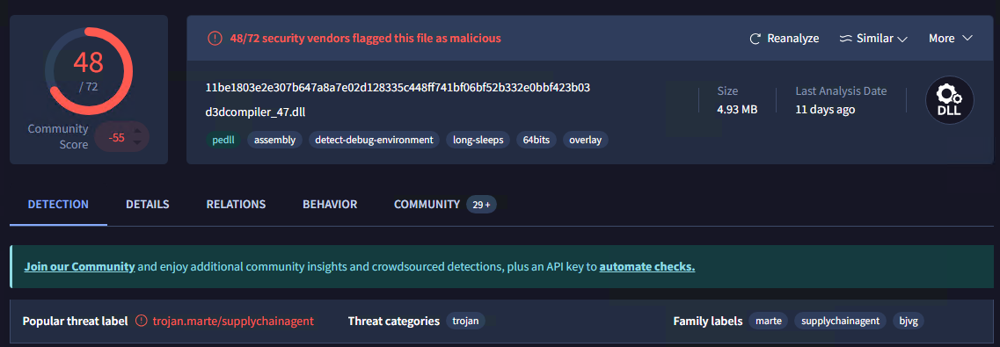
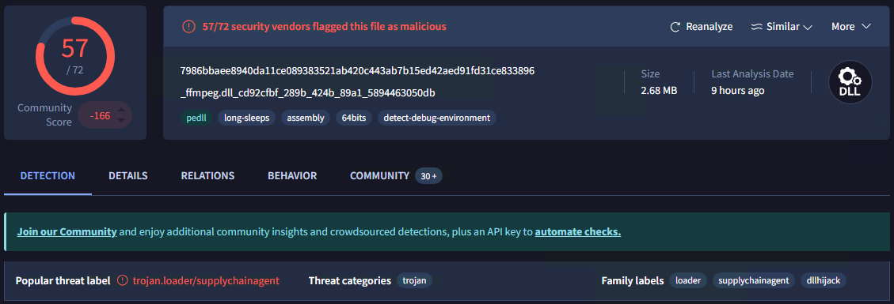

# 3CX Supply Chain

## 목차

[Questions 1](#q1)

[Questions 2](#q2)

[Questions 3](#q3)

[Questions 4](#q4)

[Questions 5](#q5)

[Questions 6](#q6)

[Questions 7](#q7)

[Questions 8](#q8)

[Questions 9](#q9)

# Scenario
A large multinational corporation heavily relies on the 3CX software for phone communication, making it a critical component of their business operations. After a recent update to the 3CX Desktop App, antivirus alerts flag sporadic instances of the software being wiped from some workstations while others remain unaffected. Dismissing this as a false positive, the IT team overlooks the alerts, only to notice degraded performance and strange network traffic to unknown servers. Employees report issues with the 3CX app, and the IT security team identifies unusual communication patterns linked to recent software updates.

As the threat intelligence analyst, it's your responsibility to examine this possible supply chain attack. Your objectives are to uncover how the attackers compromised the 3CX app, identify the potential threat actor involved, and assess the overall extent of the incident. 

한 대형 다국적 기업은 전화 통신에 3CX 소프트웨어를 크게 의존하고 있어 비즈니스 운영의 핵심 요소로 자리 잡았습니다. 최근 3CX 데스크톱 앱 업데이트 이후, 바이러스 백신 알림에서 일부 워크스테이션에서는 소프트웨어가 삭제되는 반면 다른 워크스테이션에서는 삭제되지 않는 현상이 산발적으로 나타납니다. IT 팀은 이를 오탐으로 간주하고 알림을 무시하다가 성능 저하와 알 수 없는 서버로의 비정상적인 네트워크 트래픽을 발견했습니다. 직원들은 3CX 앱 관련 문제를 보고했고, IT 보안 팀은 최근 소프트웨어 업데이트와 관련된 비정상적인 통신 패턴을 파악했습니다.

위협 인텔리전스 분석가는 이러한 공급망 공격 가능성을 조사할 책임이 있습니다. 공격자가 3CX 앱을 어떻게 침해했는지 파악하고, 잠재적인 위협 행위자를 식별하고, 사건의 전반적인 규모를 평가하는 것이 목표입니다.

# 문제 파일
msi 확장자의 윈도우 설치 프로그램이 하나 제공된다. 당황하지 말고 해시값을 확인한 후 VirustTotal에 검색해보자.

파일명: ``3CXDesktopApp-18.12.416.msi``

Hash (MD5): 0EEB1C0133EB4D571178B2D9D14CE3E9

# 개념 정리
서플라이 체인 공격

# Questions

## Q1
Understanding the scope of the attack and identifying which versions exhibit malicious behavior is crucial for making informed decisions if these compromised versions are present in the organization. How many versions of 3CX running on Windows have been flagged as malware?

공격 범위를 파악하고 어떤 버전이 악성 행위를 보이는지 파악하는 것은 조직 내에 이러한 감염된 버전이 존재하는 경우 정보에 기반한 의사 결정을 내리는 데 매우 중요합니다. Windows에서 실행되는 3CX 버전 중 몇 개가 맬웨어로 분류되었습니까?

### Answer
2

### 분석
시나리오와 VirusTotal에서 해당 악성코드의 정보를 획득한 뒤 관련해서 구글링을 진행하면 어떤 버전에서 취약점이 발견됐는지 확인할 수 있다.

취약점이 발견된 버전: Windows (versions 18.12.407 and 18.12.416) 

## Q2
Determining the age of the malware can help assess the extent of the compromise and track the evolution of malware families and variants. What's the UTC creation time of the .msi malware?

악성코드의 생성 시기를 확인하면 침해 정도를 평가하고 악성코드 계열 및 변종의 진화 과정을 추적하는 데 도움이 될 수 있습니다. .msi 악성코드의 UTC 생성 시간은 몇 시인가요?

### Answer
2023-03-13 06:33

### 분석
악성코드 생성시간: 2023-03-13 06:33:26 UTC

## Q3
Executable files (.exe) are frequently used as primary or secondary malware payloads, while dynamic link libraries (.dll) often load malicious code or enhance malware functionality. Analyzing files deposited by the Microsoft Software Installer (.msi) is crucial for identifying malicious files and investigating their full potential. Which malicious DLLs were dropped by the .msi file?

실행 파일(.exe)은 1차 또는 2차 맬웨어 페이로드로 자주 사용되는 반면, 동적 연결 라이브러리(.dll)는 악성 코드를 로드하거나 맬웨어 기능을 강화하는 경우가 많습니다. Microsoft 소프트웨어 설치 관리자(.msi)에서 생성된 파일을 분석하는 것은 악성 파일을 식별하고 그 잠재력을 최대한 조사하는 데 매우 중요합니다. .msi 파일에서 어떤 악성 DLL이 드롭되었습니까?

### Answer
ffmpeg.dll,d3dcompiler_47.dll

### 분석
msi 파일에서 드롭된 악성 dll은 ffmpeg.dll과 d3dcompiler.dll이 있다.

## Q4
Recognizing the persistence techniques used in this incident is essential for current mitigation strategies and future defense improvements. What is the MITRE Technique ID employed by the .msi files to load the malicious DLL?

이 사건에 사용된 지속성 기법을 파악하는 것은 현재의 완화 전략과 향후 방어력 향상에 필수적입니다. .msi 파일이 악성 DLL을 로드하는 데 사용하는 MITRE 기법 ID는 무엇입니까?

### Answer
T1574

### 분석
악성코드는 악성 DLL을 로드할 때 DLL-Side Loading 기법을 사용한다.

DLL-Side Loading 기법은 정상적인 응용 프로그램과 악성 DLL을 같은 경로에 저장하여 응용 프로그램이 실행 될 때 악성 DLL이 함께 동작하도록 하는 기법이다. 따라서 악성 DLL은 정상 프로그램이 참조하는 다른 경로에 위치한 정상 DLL 파일명과 동일하게 변경하여 악성 DLL이 먼저 실행 되도록 한다. (DLL을 로드하는 순서, 검색 순서를 악용하는 기법이다.)

링크: https://attack.mitre.org/techniques/T1574/001/

## Q5
Recognizing the malware type (threat category) is essential to your investigation, as it can offer valuable insight into the possible malicious actions you'll be examining. What is the threat category of the two malicious DLLs?

악성코드 유형(위협 범주)을 파악하는 것은 조사에 필수적입니다. 조사 대상 악성 행위에 대한 귀중한 통찰력을 제공할 수 있기 때문입니다. 두 악성 DLL의 위협 범주는 무엇입니까?

### Answer
trojan

### 분석
VirusTotal에서 카테고리를 확인할 수 있다.

# 마무리
참고한 보고서 리스트
- https://asec.ahnlab.com/ko/51915/
- https://www.fortinet.com/blog/threat-research/3cx-desktop-app-compromised
- https://www.trendmicro.com/en_us/research/23/c/information-on-attacks-involving-3cx-desktop-app.html