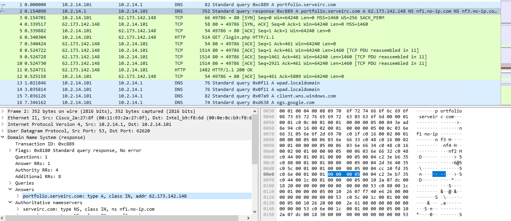

# 3CX Supply Chain

## 목차

[Questions 1](#q1)

[Questions 2](#q2)

[Questions 3](#q3)

[Questions 4](#q4)

[Questions 5](#q5)

[Questions 6](#q6)

# Scenario
The SOC team has detected suspicious activity in the network traffic, revealing that a machine has been compromised. Sensitive company information has been stolen. Your task is to use Network Capture (PCAP) files and Threat Intelligence to investigate the incident and determine how the breach occurred.

SOC 팀이 네트워크 트래픽에서 의심스러운 활동을 감지하여 시스템이 침해되었음을 확인했습니다. 민감한 회사 정보가 유출되었습니다. 여러분의 임무는 네트워크 캡처(PCAP) 파일과 위협 인텔리전스를 사용하여 사고를 조사하고 침해 발생 경위를 파악하는 것입니다.

# 문제 파일
pcap 파일이 주어진다.

# 개념 정리

# Questions

## Q1
Which IP address was used by the attacker during the initial access?

공격자는 초기 접근 시 어떤 IP 주소를 사용했습니까? (공격자가 접근한 IP 주소)

### Answer
62.173.142.148

### 분석
아예 감을 못 잡겠어서 힌트를 우선 힌트를 보면서 문제 풀이를 시작했다. 

# 마무리
이번 문제는 아예 접근을 못한 채로 힌트를 보며 문제 풀이 진행했다.