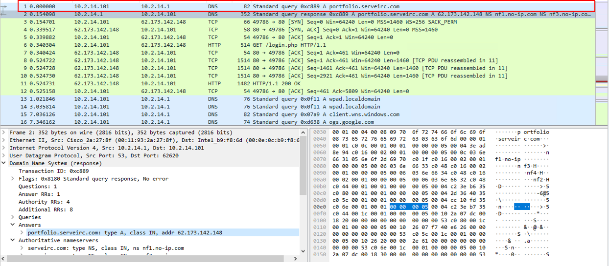

# 3CX Supply Chain

## 목차

[Questions 1](#q1)

[Questions 2](#q2)

[Questions 3](#q3)

[Questions 4](#q4)

[Questions 5](#q5)

[Questions 6](#q6)

# Scenario
The SOC team has detected suspicious activity in the network traffic, revealing that a machine has been compromised. Sensitive company information has been stolen. Your task is to use Network Capture (PCAP) files and Threat Intelligence to investigate the incident and determine how the breach occurred.

SOC 팀이 네트워크 트래픽에서 의심스러운 활동을 감지하여 시스템이 침해되었음을 확인했습니다. 민감한 회사 정보가 유출되었습니다. 여러분의 임무는 네트워크 캡처(PCAP) 파일과 위협 인텔리전스를 사용하여 사고를 조사하고 침해 발생 경위를 파악하는 것입니다.

# 문제 파일
pcap 파일이 주어진다.

# 개념 정리

# Questions

## Q1
Which IP address was used by the attacker during the initial access?

공격자는 초기 접근 시 어떤 IP 주소를 사용했습니까? 

### Answer
62.173.142.148

### 분석
아예 감을 못 잡겠어서 힌트를 우선 힌트를 보면서 문제 풀이를 시작했다. 

1번 문제는 공격자가 처음 접근한 IP 주소를 묻고 있다.

첫 번째 패킷을 분석해보면 클라이언트(10.2.14.101)가 DNS 서버에게 portfolio.serveirc.com 의 ip 주소를 요청하고 있다.

요청을 받은 서버는 62.173.142.148 주소를 응답한다.

그리고 TCP 3 way handshake 과정이 보인다.

그 후에 클라이언트(10.2.14.101)는 서버(62.173.142.148)로부터 login.php 페이지를 GET 요청을 보내고 서버는 클라이언트에게 200 OK 응답을 보낸다.

## Q2
What is the name of the malicious file used for initial access?

초기 접근에 사용된 악성 파일의 이름은 무엇입니까?

### Answer

### 분석
서버(62.173.142.148)가 클라이언트(10.2.14.101)에게 200 OK를 보내는 http 응답 패킷을 자세히 들여다 보면 클라이언트는 분명 php 파일을 요청했지만 응답을 통해 날라오는 파일은 allegato_708.js 였다. (URI는 /login.php)

실제 데이터를 확인해보면 난독화된 javascript 코드를 확인할 수 있다. (php 코드가 아니다)

# 마무리
이번 문제는 아예 접근을 못한 채로 힌트를 보며 문제 풀이 진행했다.