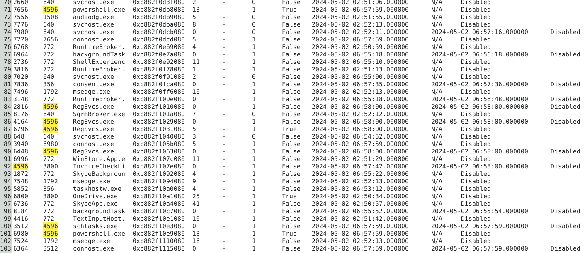
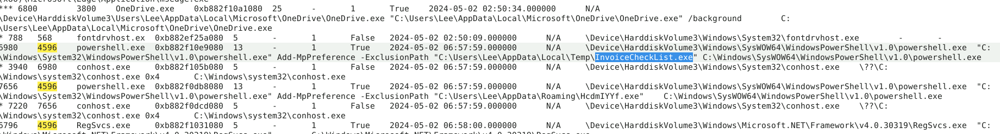
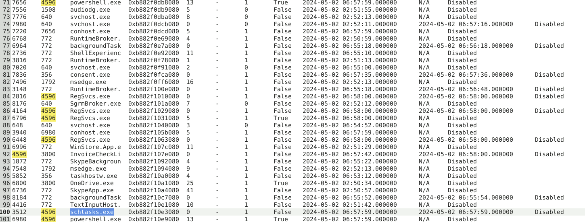
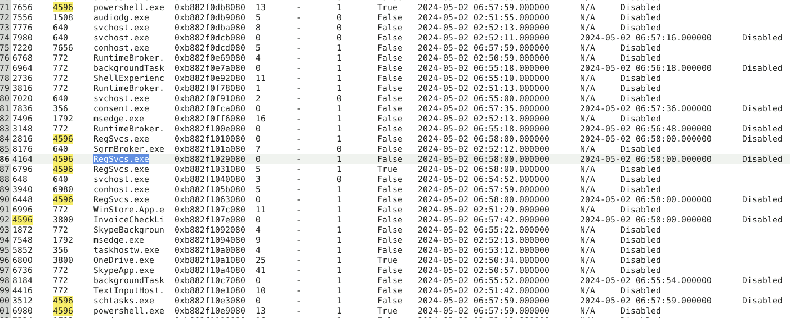
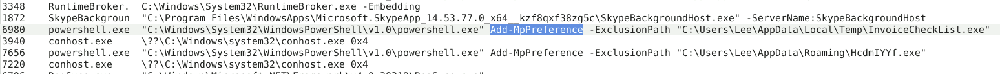
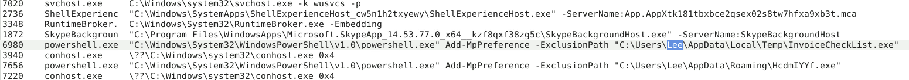

# DanaBot

## 목차

[Questions 1](#q1)

[Questions 2](#q2)

[Questions 3](#q3)

[Questions 4](#q4)

[Questions 5](#q5)

[Questions 6](#q6)

[Questions 7](#q7)

# Scenario

# 문제 파일
On May 2, 2024, a multinational corporation identified suspicious PowerShell processes on critical systems, indicating a potential malware infiltration. This activity poses a threat to sensitive data and operational integrity.

You have been provided with a memory dump (memory.dmp) from the affected system. Your task is to analyze the dump to trace the malware's actions, uncover its evasion techniques, and understand its persistence mechanisms.

2024년 5월 2일, 한 다국적 기업이 중요 시스템에서 의심스러운 PowerShell 프로세스를 발견하여 악성코드 침투 가능성을 시사했습니다. 이러한 활동은 민감한 데이터와 운영 무결성에 위협이 됩니다.

영향을 받은 시스템의 메모리 덤프(memory.dmp)를 제공받았습니다. 귀하의 임무는 덤프를 분석하여 악성코드의 동작을 추적하고, 우회 기법을 파악하고, 지속성 메커니즘을 이해하는 것입니다.

# 개념 정리

# Questions

## Q1
Identifying the parent process reveals the source and potential additional malicious activity. What is the name of the suspicious process that spawned two malicious PowerShell processes?

부모 프로세스를 식별하면 출처와 잠재적인 추가 악성 활동이 드러납니다. 두 개의 악성 PowerShell 프로세스를 생성한 의심스러운 프로세스의 이름은 무엇입니까?

### Answer
InvoiceCheckList.exe

### 분석
Volatility3 의 psscan 명령어의 결과를 확인해보면 2개의 powershell 프로세스를 확인할 수 있고, 해당 프로세스의 부모 프로세스 (PPID) 는 PID 4596의 "InvoiceCheckLi" 라고 확인할 수 있는데 뒤에 글자가 짤려있는 상태다.

psscan 명령어는 이미 종료, 비활성화된 프로세스도 확인할 수 있다.

짤린 글자는 pstree 명령어에서 채울 수 있었다. 실행된 파워쉘의 명령어를 보면 InvoiceCheckList.exe 풀네임을 확인할 수 있다. (혹은 cmdline 확인)

## Q2
By determining which executable is utilized by the malware to ensure its persistence, we can strategize for the eradication phase. Which executable is responsible for the malware's persistence?

악성코드가 지속성을 보장하기 위해 어떤 실행 파일을 사용하는지 파악함으로써, 제거 단계에 대한 전략을 수립할 수 있습니다. 어떤 실행 파일이 악성코드의 지속성을 담당할까요?

### Answer
schtasks.exe

### 분석
4596을 부모 프로세스로 둔 자식 프로세스 중에 윈도우 작업 스케줄러에 작업을 등록하고, 삭제하는 과정을 진행할 수 있는 프로그램은 schtasks.exe 이다. 해당 프로그램은 MS 정상 프로그램이다.

## Q3
Understanding child processes reveals potential malicious behavior in incidents. Aside from the PowerShell processes, what other active suspicious process, originating from the same parent process, is identified?

자식 프로세스를 이해하면 사고 발생 시 잠재적인 악의적 동작을 파악할 수 있습니다. PowerShell 프로세스 외에 동일한 부모 프로세스에서 발생하는 다른 활성 의심 프로세스는 무엇입니까?

### Answer
RegSvcs.exe

### 분석
powershell.exe와 schtasks.exe를 제외하면 RegSvcs.exe 라는 프로세스가 발생한 것을 확인할 수 있다. 해당RegSvcs.exe는 .Net 서비스 설치 도구인 MS 정상 프로그램이다.

## Q4
Analyzing malicious process parameters uncovers intentions like defense evasion for hidden, stealthy malware. What PowerShell cmdlet used by the malware for defense evasion?

악성 프로세스 매개변수를 분석하면 숨겨진 은밀한 악성코드에 대한 방어 회피와 같은 의도가 드러납니다. 악성코드가 방어 회피를 위해 사용하는 PowerShell cmdlet은 무엇입니까?

### Answer
Add-MpPreference

### 분석
파워쉘 코드를 보면 Microsoft Defender에 탐지 제외 항목을 추가하는 Add-MpPreference 명령어가 사용된다.

## Q5
Recognizing detection-evasive executables is crucial for monitoring their harmful and malicious system activities. Which two applications were excluded by the malware from the previously altered application's settings?

탐지 회피 실행 파일을 인식하는 것은 유해하고 악의적인 시스템 활동을 모니터링하는 데 매우 중요합니다. 이전에 변경된 애플리케이션 설정에서 맬웨어에 의해 제외된 두 애플리케이션은 무엇입니까?

### Answer
InvoiceCheckList.exe,HcdmIYYf.exe

### 분석
파워쉘 프로세스에서 Microsoft Defender 탐지 제외 항목에 추가되는 프로그램은 InvoiceCheckList.exe,HcdmIYYf.exe 이다.

## Q6
What is the specific MITRE sub-technique ID associated with PowerShell commands that aim to disable or modify antivirus settings to evade detection during incident analysis?

사고 분석 중에 감지되지 않도록 바이러스 백신 설정을 비활성화하거나 수정하는 것을 목표로 하는 PowerShell 명령과 관련된 특정 MITRE 하위 기술 ID는 무엇입니까?

### Answer
T1562.001

### 분석
Impair Defence > Disable or Modify Tools

링크: https://attack.mitre.org/techniques/T1562/001/

## Q7
Determining the user account offers valuable information about its privileges, whether it is domain-based or local, and its potential involvement in malicious activities. Which user account is linked to the malicious processes?

사용자 계정을 확인하면 해당 계정의 권한, 도메인 기반 계정인지 로컬 계정인지, 그리고 악성 활동에 연루되었을 가능성에 대한 귀중한 정보를 얻을 수 있습니다. 어떤 사용자 계정이 악성 프로세스와 연결되어 있습니까?

### Answer
Lee

### 분석
Lee 라는 사용자의 폴더에 악성코드가 저장되어 실행됐다.

