# Insider

## 목차

[Questions 1](#q1)

[Questions 2](#q2)

[Questions 3](#q3)

[Questions 4](#q4)

[Questions 5](#q5)

[Questions 6](#q6)

[Questions 7](#q7)

[Questions 8](#q8)

[Questions 9](#q9)

[Questions 10](#q10)

[Questions 11](#q11)

# Scenario
After Karen started working for 'TAAUSAI,' she began doing illegal activities inside the company. 'TAAUSAI' hired you as a soc analyst to kick off an investigation on this case.

You acquired a disk image and found that Karen uses Linux OS on her machine. Analyze the disk image of Karen's computer and answer the provided questions.

카렌은 'TAAUSAI'에서 일하기 시작한 후 회사 내에서 불법 행위를 하기 시작했습니다. 'TAAUSAI'는 이 사건에 대한 조사를 시작하기 위해 당신을 SOC 분석가로 고용했습니다.

당신은 디스크 이미지를 입수하여 카렌이 자신의 컴퓨터에서 리눅스 OS를 사용하고 있음을 확인했습니다. 카렌의 컴퓨터 디스크 이미지를 분석하고 제시된 질문에 답하십시오.

# 문제 파일
ad1 확장자를 가진 이미지 파일 제공

# 개념 정리

# Questions

## Q1
Which Linux distribution is being used on this machine?

이 컴퓨터에서는 어떤 Linux 배포판을 사용하고 있나요?

### Answer
kali

### 분석
boot 폴더에서 리눅스 배포판 정보를 확인할 수 있다.

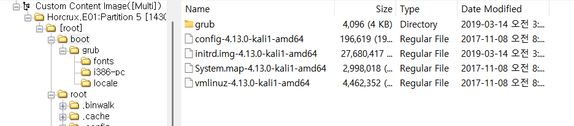

그리고 /root/var/log/installer 경로에 있는 syslog, satus 등의 파일에서도 관련 정보를 확인할 수 있다.

특히 syslog의 경우 시스템 시작 시 커널 버전과 빌드 메타데이터가 기록되므로 운영 체제 버전 및 배포판에 대한 정보를 확인할 수 있다.

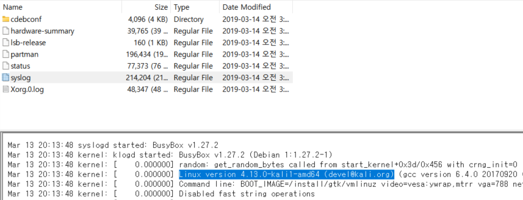

## Q2
What is the MD5 hash of the Apache access.log file?

Apache access.log 파일의 MD5 해시는 무엇입니까?

### Answer
d41d8cd98f00b204e9800998ecf8427e

### 분석
아파치 서버의 로그 파일은 /var/log/apache2 혹은 /var/log/httpd 안에서 확인할 수 있다.

접근해보니 내용이 모두 비어 있다.

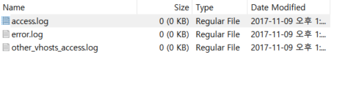

FTK Imager에서 우클릭을 한 후 Export file hash list를 클릭하면 해시값을 확인할 수 있고, 빈 파일의 해시값은 모두 동일하다.


MD5: d41d8cd98f00b204e9800998ecf8427e
SHA1: da39a3ee5e6b4b0d3255bfef95601890afd80709

## Q3
It is suspected that a credential dumping tool was downloaded. What is the name of the downloaded file?

자격 증명 유출 도구가 다운로드된 것으로 의심됩니다. 다운로드된 파일 이름은 무엇입니까?

### Answer
mimikatz_trunk.zip

### 분석
/root/Downloads 경로에 가면 mimikatz_trunk.zip 파일을 확인할 수 있다.

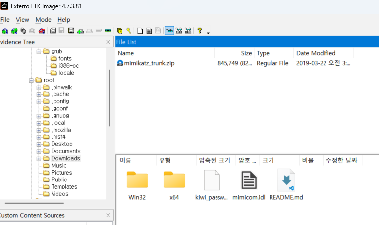

미미카츠는 자격 증명 정보를 추출하는 기능을 갖는 프로그램이다. 자격 증명 정보를 추출한다는 것은 공격자가 시스템에서 사용자 이름 및 비밀번호와 같은 로그인 자격 증명을 추출하는 데 사용하는 기법이라고 보면 된다. 

원본: https://github.com/ParrotSec/mimikatz

## Q4
A super-secret file was created. What is the absolute path to this file?

극비 파일이 생성되었습니다. 이 파일의 절대 경로는 무엇입니까?

### Answer
/root/Desktop/SuperSecretFile.txt

### 분석
.bash_history 파일을 Bash 쉘에서 사용자가 입력한 명령어 기록을 저장하는 파일이다. 해당 파일을 조사하면 사용자가 입력한 명령어들을 확인할 수 있다.

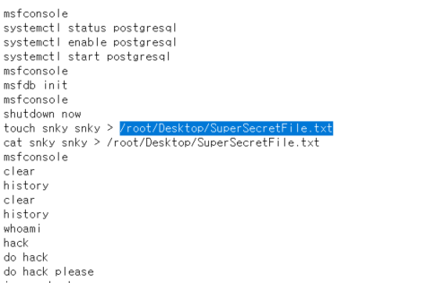

일반적으로 touch 명령어는 빈 파일을 만드는데 사용된다.

해당 파일을 확인해보면 사용자는 touch 명령어를 이용해 snky 라는 빈 파일을 만들고 /root/Desktop/ 경로에 SuperSecretFile.txt 라는 파일을 snky 라는 파일로 덮어씌우는 작업을 진행한 것으로 보인다.

## Q5
What program used the file didyouthinkwedmakeiteasy.jpg during its execution?

didyouthinkwedmakeiteasy.jpg 파일은 실행 중에 어떤 프로그램에 사용되었나요?

### Answer
binwalk

### 분석
.bash_history 파일의 하단을 보면 binwalk 프로그램에 didyouthinkwedmakeiteasy.jpg를 인자로 전달한 것을 확인할 수 있다.

binwalk는 인자로 전달된 파일의 내부에 어떤 데이터들로 구성되어 있는지 확인할 수 있는 도구로, 사진 내부에 파일을 숨겨놓는 스테가노그래피 기법등을 탐지하는데 사용될 수 있는 도구다.

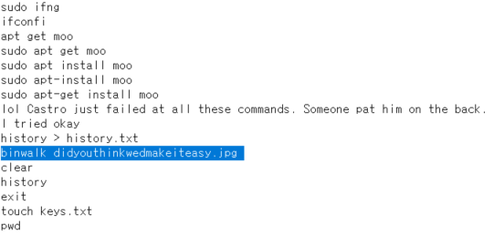

## Q6
What is the third goal from the checklist Karen created?

캐런이 만든 체크리스트의 세 번째 목표는 무엇입니까?

### Answer
Profit

### 분석
바탕화면을 확인해보면 Checklist 라는 폴더가 존재하고, 해당 파일 내부에 3번째 목표는 Profit으로 확인된다.

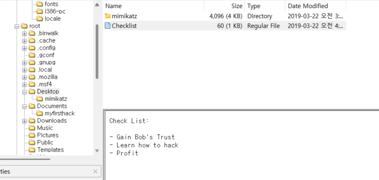

해당 내용을 해석해보면 아래와 같다.

```
체크리스트:

- 밥의 신뢰 얻기
- 해킹 방법 배우기
- 수익 창출
```

## Q7
How many times was Apache run?

Apache는 몇 번 실행되었나요?

### Answer
0

### 분석
내용이 비어있으므로 아파치는 한 번도 실행되지 않았다고 볼 수 있다. 혹은 공격자가 증거를 남기지 않기 위해 삭제했을 가능성도 존재한다 (처음엔 몇 번 실행됐냐길래 비어있는 로그가 어디 다른곳에 숨겨져있는줄 알았다;;;;). 


## Q8
This machine was used to launch an attack on another. Which file contains the evidence for this?

이 기계는 다른 기계를 공격하는 데 사용되었습니다. 이에 대한 증거는 어느 파일에 있습니까?

### Answer
irZLAohL.jpeg

### 분석
/root 경로를 확인해보면 irZLAohL.jpeg 사진파일이 있고, 현재 분석 중인 OS는 칼리 리눅스이지만 사진은 윈도우인 점을 봤을 때 해킹한 다른 PC의 스크린샷 사진으로 추정된다.

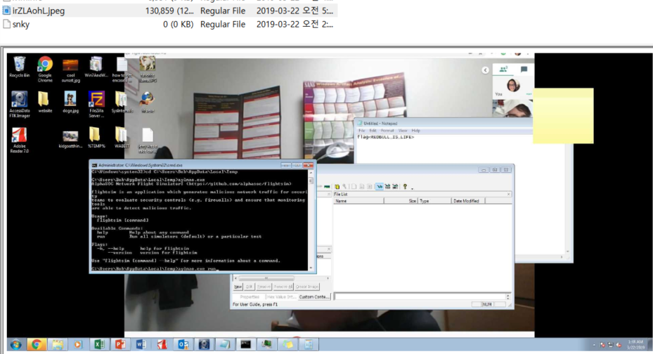

해당 사진의 터미널 창을 자세히 확인해보면 flightsim 이라는 프로그램이 사용된 것을 확인할 수 있다. 

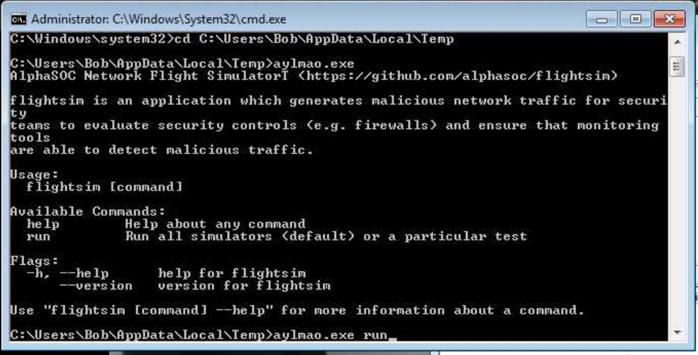

해당 프로그램은 악성 네트워크 트래픽을 생성하고 보안 팀이 보안 제어 및 네트워크 가시성을 평가(테스트)하는 데 사용되는 정상적인 프로그램이다. (포트 스캔, 브루트 포싱 공격, DNS 터널링 공격 등)

주요 목적은 방화벽 및 침입 탐지 시스템과 같은 보안 모니터링 시스템의 시뮬레이션된 위협 탐지 능력을 테스트, 평가하는 역할이지만 악의적인 용도로 사용될 가능성 또한 존재한다.

도구 링크: https://github.com/alphasoc/flightsim


## Q9
It is believed that Karen was taunting a fellow computer expert through a bash script within the Documents directory. Who was the expert that Karen was taunting?

카렌은 문서 디렉터리 내의 bash 스크립트를 통해 동료 컴퓨터 전문가를 조롱한 것으로 추정됩니다. 카렌이 조롱한 전문가는 누구였습니까?

### Answer
Young

### 분석
myfirsthack 디렉토리의 firstscript_fixed 파일을 확인해보면 공격에 사용된 명령어와 동료의 이름으로 추정되는 내용을 확인할 수 있다.

```
Heck yeah! I can write bash too Young
당연하지! 나도 bash 쓸 수 있어 Young
```

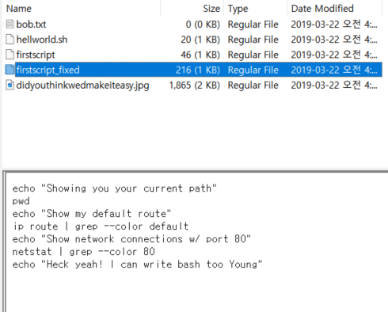

## Q10
A user executed the su command to gain root access multiple times at 11:26. Who was the user?

11시 26분에 한 사용자가 su  명령을 실행하여 루트 권한을 여러 번 획득했습니다. 해당 사용자는 누구였습니까?

### Answer
postgres

### 분석
/var/log/auth.log 를 보면 11시 26분에 발생한 su 로그를 확인할 수 있다. Successful su for postgres by root, KarenHacker 라는 사용자가 root 권한을 사용하여 postgres 사용자로 계정 전환에 성공한다.

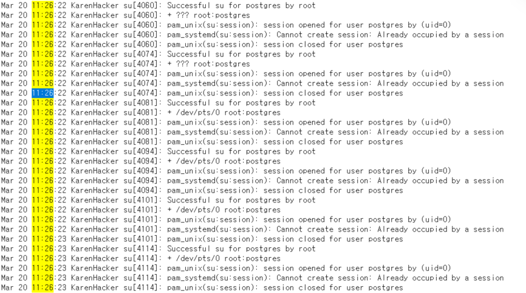

postgres 라는 사용자명은 PostgreSQL이라는 DBMS에서 사용되는 기본 사용자명으로 DB에 관련된 어떤 작업을 하려고 했을 가능성이 있다.

## Q11
Based on the bash history, what is the current working directory?

bash 기록을 기준으로 현재 작업 디렉토리는 무엇입니까?

### Answer
/root/Documents/myfirsthack/

### 분석
.bash_history 폴더에서 cd 명령어를 이용해 마지막으로 이동한 디렉토리는 /root/Documents/myfirsthack/ 이다.

# 마무리
이 문제는 문제만 풀어서는 뭘 학습하고자 하는지 목적을 잘 모르겠다.. Write-up을 읽어보자.

해당 문제에서 학습할 수 있는 내용은 파일 무결성 분석, 권한 상승 식별 및 잠재적 공격 발견이라고 한다.

Write-up을 본 결과 시나리오 자체에 큰 의미는 없고 그냥 각각의 학습을 위한 내용이었던 것 같다.