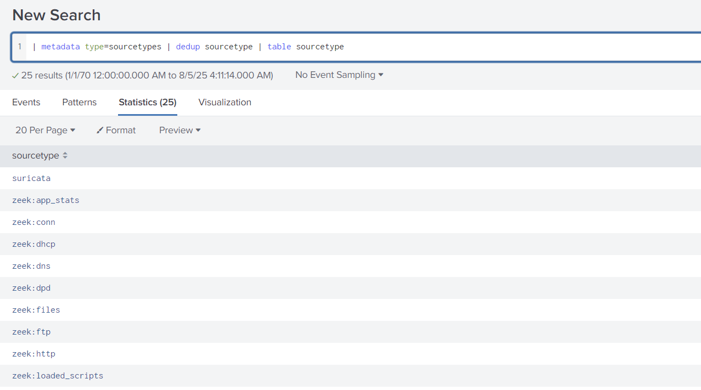
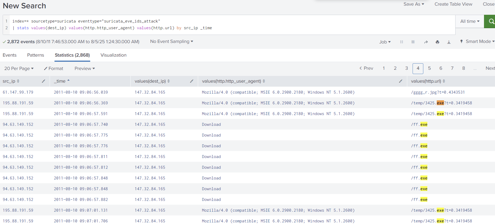

# NerisBot

## 목차

[Questions 1](#q1)

[Questions 2](#q2)

[Questions 3](#q3)

[Questions 4](#q4)

[Questions 5](#q5)

# Scenario
Unusual network activity has been detected within a university environment, indicating potential malicious intent. These anomalies, observed six hours ago, suggest the presence of command and control (C2) communications and other harmful behaviors within the network.

Your team has been tasked with analyzing recent network traffic logs to investigate the scope and impact of these activities. The investigation aims to identify command and control servers and uncover malicious interactions.

대학 환경에서 비정상적인 네트워크 활동이 감지되었으며, 이는 잠재적인 악의적 의도를 시사합니다. 6시간 전에 관찰된 이러한 이상 징후는 네트워크 내에서 명령 및 제어(C2) 통신 및 기타 유해 행위가 존재함을 시사합니다.

귀하의 팀은 최근 네트워크 트래픽 로그를 분석하여 이러한 활동의 범위와 영향을 조사하는 임무를 맡았습니다. 이 조사의 목표는 명령 및 제어 서버를 식별하고 악의적인 상호 작용을 적발하는 것입니다.

# 문제 파일
네트워크 트래픽을 모니터링하고 분석할 수 있는 수리카타(Suricata, IDS/IPS) 탐지 로그와 네트워크 트래픽 분석기인 지크(Zeek) 로그를 splunk 앱을 통해 볼 수 있는 머신이 주어진다. splunk 앱은 많은 데이터를 조금 더 쉽게 처리할 수 있도록 도와주는 앱으로 보인다.

해당 문제는 생소한 개념이 포함되어 있어 문제의 힌트를 참고하며 진행했다.

# 개념 정리
Suricata: 네트워크 트래픽을 모니터링하고 분석할 수 있는 도구
Zeek: 오픈소스 네트워크 분석 프레임워크로 패킷 감시 등이 가능한 도구
splunk: 많은 데이터를 조금 더 쉽게 처리할 수 있도록 도와주는 앱

# Questions

## Q1
During the investigation of network traffic, unusual patterns of activity were observed in Suricata logs, suggesting potential unauthorized access. One external IP address initiated access attempts and was later seen downloading a suspicious executable file. This activity strongly indicates the origin of the attack.

What is the IP address from which the initial unauthorized access originated?

네트워크 트래픽 조사 중 수리카타 로그에서 비정상적인 활동 패턴이 관찰되었으며, 이는 무단 접근 가능성을 시사합니다. 외부 IP 주소 하나에서 접근 시도가 시작되었고, 이후 의심스러운 실행 파일을 다운로드하는 것이 확인되었습니다. 이러한 활동은 공격의 발원지를 강력하게 시사합니다.

최초 무단 접근이 발생한 IP 주소는 무엇입니까?

### Answer
195.88.191.59

### 분석
우선 머신에 진입하면 sourcetype 카테고리를 확인한다. sourcetype 카테고리는 데이터의 종류를 식별할 수 있는 태그로 윈도우 이벤트 로그, 아파치 로그, json api 로그 등 각 로그를 식별할 수 있고 사용자가 sourcetype에 새로운 태그를 추가할 수도 있다.

현재 splunk에서 확인 가능한 sourcetype 중 눈에 띄는건 네트워크 트래픽을 모니터링할 수 있는 Suricata 태그이다.


혹은 sourcetype은 이렇게도 검색할 수 있다.

```
| metadata type=sourcetypes | dedup sourcetype | table sourcetype
```

- metadata type=sourcetypes: sourcetype 이라는 타입의 메타데이터들을 가져온다 
- dedup sourcetype: 중복 값을 제거
- table sourcetype: sourcetype 필드만 남긴다




검색 조건에 sourcetype=suricata 를 추가한다. 그리고 이벤트 타입을 확인해보면 suricata Documents에서 확인할 수 있는 event_type 이라는 값과 eventtype이라는 별도의 타입이 확인된다. 아마 사용자 정의(?) 형식으로 지정된 타입인가 싶은데 해당 타입을 확인해보면 하위에 6가지 분류가 확인된다. 


현재 문제의 목표는 외부 공격자에 대한 정보를 찾는 것이니 attack 이라는 단어가 들어간 suricata_eve_ids_attack 으로 검색을 진행해봤다. 

```
sourcetype=suricata eventtype="suricata_eve_ids_attack"
```

이렇게 필터링한 결과에서 우리에게 필요한 정보만 파싱하기 위해 파이프 라인('|')을 이용해보자. 필터링된 각각의 결과에는 하위에 수많은 이벤트가 존재한다.


공격자를 식별하기 위해 필요한 정보는 아래 문장에서 힌트를 얻을 수 있다.

```
외부 IP 주소 하나에서 접근 시도가 시작되었고, 이후 의심스러운 실행 파일을 다운로드하는 것이 확인되었습니다. 이러한 활동은 공격의 발원지를 강력하게 시사
```

외부에서 접근한 IP, 실행파일 다운로드 키워드를 통해 source_ip, http 관련된 이벤트를 필터링 해보면 된다는 힌트를 얻었다.

```
| stats values(dest_ip) values(http.http_user_agent) values(http.url) by src_ip
```

최종적으로 source ip 를 기준으로 destination ip, http의 user agent, URL 목록 필터링을 진행했다.


exe 파일을 4개나 다운로드 받은 의심스러운 흔적을 발견했다.


최초의 무단 접근이 발생한 ip를 찾아야 하므로 필터링 조건을 수정해서 아래 최종본으로 검색을 진행했다.

```
sourcetype=suricata eventtype="suricata_eve_ids_attack" 
| stats values(dest_ip) values(http.http_user_agent) values(http.url) by src_ip _time
```

최종적으로 의심스러운 파일을 다운로드 받은 외부 ip는 195.88.191.59로 확인됐다. (인줄 알았으나....)



해당 내용 전에 또 다른 exe 파일 다운로드 로그가 있었다. 


그런데 이건 그냥 suricata_eve_ids_attack 이벤트 타입을 봤을 때 그냥 탐지된 시간 혹은 경고 발생 시간을 나타내는 것 일수도 있어서 정확히 다운로드 받은 시간을 보려면 http를 이용해서 검색을 진행해볼 필요가 있다.

파일을 다운로드 받았다는 키워드를 통해 event_type을 http로 지정한 후 검색하는 방법을 사용해봤다.

```
sourcetype="suricata" event_type="http" AND http.url="*.exe*" 
| stats values(http.http_user_agent) as user_agents, values(http.url) as urls, values(src_ip) as server, values(event_type) as event_type by dest_ip _time
```


여기서 _time 을 제거하면 dest_ip 별로 묶여서 나온다.


## Q2
Investigating the attacker’s domain helps identify the infrastructure used for the attack, assess its connections to other threats, and take measures to mitigate future attacks. What is the domain name of the attacker server?

공격자의 도메인을 조사하면 공격에 사용된 인프라를 파악하고, 다른 위협과의 연관성을 평가하며, 향후 공격을 완화하기 위한 조치를 취하는 데 도움이 됩니다. 공격자 서버의 도메인 이름은 무엇입니까?

### Answer
nocomcom.com

### 분석
의심되는 ip 주소의 hostname을 확인해보면 nocomcom.com 도메인 이름을 확인할 수 있다.

```
sourcetype=suricata src_ip="195.88.191.59" 
| stats values(http.hostname)
```


## Q3
Knowing the IP address of the targeted system helps focus remediation efforts and assess the extent of the compromise. What is the IP address of the system that was targeted in this breach?

대상 시스템의 IP 주소를 알면 복구 작업에 집중하고 침해 정도를 평가하는 데 도움이 됩니다. 이 침해 사고의 표적이 된 시스템의 IP 주소는 무엇입니까?

### Answer
147.32.84.165

### 분석
의심되는 ip 주소 (src_ip)의 dest_ip를 확인해본 결과 147.32.84.165가 확인됐다.

```
sourcetype="suricata" src_ip="195.88.191.59" 
| stats values(dest_ip)
```


조금 더 정확히 확인하기 위해 http를 이용해서 피해자(서버)가 공격자로부터 파일 다운로드가 진행되는 과정을 필터링해봤다.

```
sourcetype="suricata" event_type="http" AND http.url="*.exe*" 
| stats values(http.http_user_agent) as user_agents, values(http.url) as urls, values(src_ip) as server by dest_ip
```

의심되는 ip 주소 195.88.191.59, 60.190.223.75, 94.63.149.152 들은 모두 147.32.84.165에서 접근한 흔적이 발견됐다.


또 검증을 위해 DNS 로그 분석을 진행해보면 공격자가 사용한 도메인인 nocomcom.com과 함께 id_orgi_h(요청을 시작한 originator host) 주소가 147.32.84.165로 확인된다.

```
sourcetype="zeek:dns" AND "195.88.191.59"
```

따라서 표적이 된 시스템의 IP 주소는 147.32.84.165 다.

## Q4
Identify all the unique files downloaded to the compromised host. How many of these files could potentially be malicious?

손상된 호스트에 다운로드된 모든 고유 파일을 식별하세요. 이 중 잠재적으로 악성일 수 있는 파일은 몇 개나 됩니까?

### Answer
5

### 분석
이전에 다운로드 받은 exe 파일 리스트를 확인해보자.

```
sourcetype="suricata" event_type="http" AND http.url="*.exe*" 
| stats values(http.http_user_agent) as user_agents, values(http.url) as urls, values(src_ip) as server, values(event_type) as event_type by dest_ip 
```


악성코드 여부를 판단하기 위해 각각 파일의 해시값을 검색해봐야 할 것 같다.

sourcetype을 보면 zeek:files 라는 타입이 존재한다. Zeek는 네트워크 트래픽에서 콘텐츠를 추출하여 저장할 수 있는 기능이 있으며 zeek:files를 통해 파일 크기, 해시값 등 확인이 가능하며 필요에 따라 추출도 가능하다.

검색을 진행해보자.

```
sourcetype="zeek:files" AND tx_hosts IN ("195.88.191.59", "60.190.223.75", "94.63.149.152") 
| table filename, md5 
| dedup md5
```

- tx_hosts IN ("195.88.191.59", "60.190.223.75", "94.63.149.152"): ip 주소 필터링
- table filename, md5: filenae, md5 테이블 출력
- | dedup md5: 중복 제거


- 확보된 해시 값
    - 42d00e295e1c3715acd51a0fc54bad87 (악성)
    - 8ed68a129b3634320780719abf6635cc (악성)
    - 7c8d12f776b17da6576c6469d8ad5a2b (악성)
    - a7d0e9196d472dbaa6948fdeb33045a0 (악성)
    - b5f3729e5418905ad2b21ce186b1c01d (정상)
    - 564048b35da9d447f2e861d5896d908d (악성)

Virustotal에 해시값 검색을 해보면 한 개를 제외하고 모두 악성코드로 출력된다. 따라서 악성 파일은 5개다.

## Q5
What is the SHA256 hash of the malicious file disguised as a .txt file?

.txt 파일로 위장한 악성 파일의 SHA256 해시는 무엇입니까?

### Answer
6fbc4d506f4d4e0a64ca09fd826408d3103c1a258c370553583a07a4cb9a6530

### 분석
악성코드로 확인된 3개의 ip 중 txt 파일을 함께 다운로드 받은 ip는 195.88.191.59 이며 파일명은 kx4.txt이다.

```
sourcetype="suricata" event_type="http" AND dest_ip IN ("195.88.191.59", "60.190.223.75", "94.63.149.152") 
| stats values(http.http_user_agent) as user_agents, values(http.url) as urls, values(src_ip) as server, values(event_type) as event_type by dest_ip
```


아쉽게도 zeek:files 를 이용해 검색하면 파일명과 sha256 해시값을 확인할 수 없다. 하지만 seen_bytes라는 파일 크기값으로 추정되는 값이 있으니 활용해보자. 

suricata 로그에서 url명과 파일명을 확인할 수 있다.

/kx4 문자가 들어가는 url명 검색

```
sourcetype="suricata" event_type="http" AND dest_ip  IN ("195.88.191.59", "60.190.223.75", "94.63.149.152")  dest_ip="195.88.191.59" AND http.url="*kx4*"
```


37376이 확인된다.

/kx4 문자가 들어가는 파일명 검색

```
sourcetype=suricata eventtype="suricata_eve_ids_attack"   src_ip="195.88.191.59" AND files{}.filename="*kx4*" 
| stats values(dest_ip) values(http.http_user_agent) values(http.url) values(bytes) by src_ip _time
```


결과가 다 다르다... 흠 무슨 차이지;;

어쨋든 zeek:files 데이터의 total_bytes 값과 비교해보면 32376으로 bytes 크기가 동일한 값이 있다.

```
sourcetype="zeek:files" AND tx_hosts IN ("195.88.191.59", "60.190.223.75", "94.63.149.152") 
| table filename, md5, total_bytes
| dedup md5
```

md5 해시값: 564048b35da9d447f2e861d5896d908d

virustotal 에서 sha256 확인.

정답: 6fbc4d506f4d4e0a64ca09fd826408d3103c1a258c370553583a07a4cb9a6530

### 마무리
굉장히 어려웠다. 단순히 명령어로 필터링하는 문제였지만 처음 접하기도 하고 필터링 규칙을 모르다보니 힌트에 많이 의존하고 나중에 write-up을 보고 뒤늦게 수정, 추가한 내용들도 많다. 

아무튼 좋은 경험이었고 추후 비슷한 문제가 나왔을땐 더 익숙해질 수 있도록 노력해야겠다. 

Suricata, Zeek와 splunk의 조합을 경험할 수 있는 것도 좋은 기회였다.