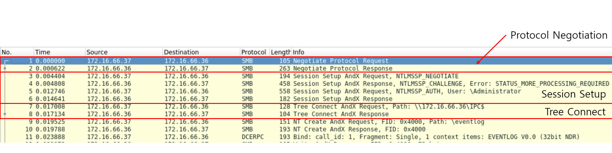

# PacketDetective

## 목차

[## File: Traffic-1.pcapng](#file-traffic-1pcapng)

[## File: Traffic-2.pcapng](#file-traffic-2pcapng)

[## File: Traffic-3.pcapng](#file-traffic-3pcapng)

# Scenario
In September 2020, your SOC detected suspicious activity from a user device, flagged by unusual SMB protocol usage. Initial analysis indicates a possible compromise of a privileged account and remote access tool usage by an attacker.

Your task is to examine network traffic in the provided PCAP files to identify key indicators of compromise (IOCs) and gain insights into the attacker’s methods, persistence tactics, and goals. Construct a timeline to better understand the progression of the attack by addressing the following questions.

2020년 9월, 귀사의 SOC는 사용자 기기에서 비정상적인 SMB 프로토콜 사용으로 의심스러운 활동을 감지했습니다. 초기 분석 결과, 공격자가 권한 있는 계정을 침해하고 원격 액세스 도구를 사용했을 가능성이 있는 것으로 나타났습니다.

귀하의 임무는 제공된 PCAP 파일의 네트워크 트래픽을 분석하여 핵심 침해 지표(IOC)를 파악하고 공격자의 수법, 지속성 전술 및 목표에 대한 통찰력을 얻는 것입니다. 다음 질문에 답하여 공격 진행 상황을 더 잘 이해할 수 있는 타임라인을 작성하십시오.

# 문제 파일
pcap 파일 3개 있는 머신이 주어진다.

# 개념 정리

## SMB
SMB는 네트워크를 통해 파일, 프린터, 직렬 포트와 같은 자원을 공유하는 데 사용되는 클라이언트-서버 통신 프로토콜이다. 

smb는 연결 설정, 인증(NTLM, Kerberos 등), 요청과 응답(Tree Connect) 작업이 순차적으로 이루어진다.




- 연결 설정
    - Negotiate Protocol Request
        - 클라이언트(172.16.66.37) → 서버(172.16.66.36)
        - 클라이언트가 서버에게 SMB 프로토콜 통신을 요청하는 Negotiate Protocol Request를 전송한다.
    - Negotiate Protocol Response
        - 서버(172.16.66.36) → 클라이언트(172.16.66.37)
        - 서버는 Negotiate Protocol Response로 응답한다
- 인증 (NTLM, Kereros 등)
    - Session Setup AndX Request, NTLMSSP_NEGOTIATE
        - 클라이언트(172.16.66.37) → 서버(172.16.66.36)
        - 클라이언트는 NTLM 인증을 진행하기 위해 NTLMSSP 프로토콜을 이용하여 인증을 진행할 것을 서버에게 요청한다
    - Session Setup AndX Response, NTLMSSP_CHALLENGE, Error: STATUS_MORE_PROCESSING_REQUIRED
        - 서버(172.16.66.36) → 클라이언트(172.16.66.37)
        - 서버는 클라이언트에게 사용자 인증을 위한 Challenge(무작위로 생성된 값)를 보낸다.
        - STATUS_MORE_PROCESSING_REQUIRED 오류는 아직 인증절차가 완료되지 않았으며, 다음 단계가 필요하다는 것을 의미한다.
    - Session Setup AndX Request, NTLMSSP_AUTH, User: \Administrator
        - 클라이언트(172.16.66.37) → 서버(172.16.66.36)
        - 클라이언트는 서버가 보낸 Challenge(무작위로 생성된 값)를 자신의 비밀번호 해시와 조합하여 응답을 생성한 후 사용자 이름과 함께 서버에 다시 전송한다.
        - 본인의 신원 증명을 위한 과정으로 서버는 이 응답을 자체적으로 계산한 값과 비교하여 인증 성공 여부를 결정한다. 인증 성공시 클라이언트는 서버에 접근할 수 있게된다.
    - Session Setup AndX Response
        - 서버(172.16.66.36) → 클라이언트(172.16.66.37)
        - 클라이언트가 보낸 인증 정보(NTLMSSP_AUTH)를 서버가 성공적으로 검증했음을 알리는 응답으로, 클라이언트와 서버간 세션(Session)이 설정되어 접근할 수 있는 리소스에 대한 요청, 응답이 오고가게 된다.
- 요청과 응답 (Tree Connect)
    - Tree Connect AndX Request, Path: \172.16.66.36\IPC$
        - 클라이언트(172.16.66.37) → 서버(172.16.66.36)
        - 클라이언트가 서버의 특정 공유 자원에 연결하기 위해 전송하는 요청으로, 해당 요청에서는 IPC$ 공유 폴더에 접근할 것을 요청하고 있다.
    - Tree Connect AndX Response
        - 서버(172.16.66.36) → 클라이언트(172.16.66.37)
        - 서버가 클라이언트의 요청에 응답하는 메세지로, 요청된 공유 자원에 대한 연결을 승인하거나 거부한다. 성공적으로 연결되면 클라이언트는 해당 공유 자원에 접근할 수 있는 Tree ID(TID)를 부여 받는다.
        - Tree ID(TID)는 클라이언트에게 제공되는 고유 식별자로, 해당 자원에 대한 모든 통신이 TID를 통해 이루어지게 한다.
        - 해당 예시에서 서버는 IPC$ 공유 폴더에 연결 가능 여부를 클라이언트에게 전송하게 된다.

## RPC (Remote Procedure Call)
- 원격 프로시저 호출은 한 컴퓨터에서 실행 중인 프로그램이 다른 컴퓨터(원격 컴퓨터)에 있는 서브루틴(프로시저 또는 함수)을 마치 자신의 로컬 환경에 있는 것처럼 호출할 수 있게 해주는 기술이다.
- 클라이언트가 분산 컴퓨팅 환경에서 원격서버에 접속해 뭔가를 하기 위해서는 RPC를 사용하게 된다.

# Questions

## File: Traffic-1.pcapng

### Q1
The attacker’s activity showed extensive SMB protocol usage, indicating a potential pattern of significant data transfer or file access.
What is the total number of bytes of the SMB protocol?

공격자의 활동은 광범위한 SMB 프로토콜 사용을 보여주었으며, 이는 상당한 양의 데이터 전송 또는 파일 접근이 있었을 가능성을 시사합니다.
SMB 프로토콜의 총 바이트 수는 얼마입니까?

#### Answer

#### 분석
wireshark에서 statics → Protocol Hierarchy 메뉴를 클릭하면 캡쳐된 모든 패킷의 프로토콜을 트리 형태로 보여주고 각 프로토콜의 정보를 확인할 수 있다.

링크: https://www.wireshark.org/docs/wsug_html_chunked/ChStatHierarchy.html


SMB 프로토콜의 총 바이트 수는 4406 bytes로 확인된다.

### Q2
Authentication through SMB was a critical step in gaining access to the targeted system. Identifying the username used for this authentication will help determine if a privileged account was compromised.
Which username was utilized for authentication via SMB?

SMB를 통한 인증은 대상 시스템에 접근하는 데 중요한 단계였습니다. 이 인증에 사용된 사용자 이름을 식별하면 권한이 있는 계정이 손상되었는지 확인하는 데 도움이 됩니다.
SMB를 통한 인증에 사용된 사용자 이름은 무엇입니까?

#### Answer
Administrator

#### 분석
패킷을 분석해보면 SMB 프로토콜을 확인할 수 있다.


클라이언트는 Administrator 라는 이름의 사용자로 인증을 시도했고, 서버는 해당 인증 요청에 대해 인증 성공으로 응답했다.


공격자 클라이언트 ip: 172.16.66.37
서버 ip: 172.16.66.36

### Q3
During the attack, the adversary accessed certain files. Identifying which files were accessed can reveal the attacker's intent.
What is the name of the file that was opened by the attacker?

공격 중에 공격자는 특정 파일에 접근했습니다. 어떤 파일에 접근했는지 파악하면 공격자의 의도를 파악할 수 있습니다.
공격자가 연 파일의 이름은 무엇입니까?

#### Answer
eventlog

#### 분석
공격자(클라이언트)는 SMB 인증에 성공한 후 IPC$ 공유 폴더에 접근했고, 해당 폴더에서 logfile 이라는 파일에 접근한 것이 확인됐다.


### Q4
Clearing event logs is a common tactic to hide malicious actions and evade detection. Pinpointing the timestamp of this action is essential for building a timeline of the attacker’s behavior.
What is the timestamp of the attempt to clear the event log? (24-hour UTC format)

이벤트 로그를 삭제하는 것은 악의적인 행위를 숨기고 탐지를 피하기 위한 일반적인 전략입니다. 이 행위의 타임스탬프를 정확히 파악하는 것은 공격자의 행위에 대한 타임라인을 구축하는 데 필수적입니다.
이벤트 로그를 삭제하려는 시도의 타임스탬프는 무엇입니까? (24시간 UTC 형식)

#### Answer
2020-09-23 16:50:16

#### 분석
사진 속 패킷 최상단을 보면 DCERPC 프로토콜이 보인다. DCERPC는 원격 프로시저 호출(RPC)을 수행하기 위한 프로토콜이다. 

RPC는 다른 컴퓨터에 있는 함수를 호출할 수 있다. 공격자는 OpenEventLogW와 ClearEventLogW를 순차적으로 실행하면서 해당 PC에 있는 EventLog 삭제를 시도했다.


## File: Traffic-2.pcapng

### Q1
The attacker used "named pipes" for communication, suggesting they may have utilized Remote Procedure Calls (RPC) for lateral movement across the network. RPC allows one program to request services from another remotely, which could grant the attacker unauthorized access or control.
What is the name of the service that communicated using this named pipe?

공격자는 통신에 "명명된 파이프"를 사용했는데, 이는 네트워크 전반의 lateral movement(수평 이동)을 위해 원격 프로시저 호출(RPC)을 활용했을 가능성을 시사합니다. RPC는 한 프로그램이 다른 프로그램에 원격으로 서비스를 요청할 수 있도록 허용하며, 이는 공격자에게 무단 접근이나 제어권을 부여할 수 있습니다.
이 명명된 파이프를 사용하여 통신한 서비스의 이름은 무엇입니까?

#### Answer
atsvc

#### 분석
RPC와 관련된 패킷들이 아래 보인다.


ISystemActivator 프로토콜의 RemoteCreateInstance response 패킷을 확인해보면 "named pipes" 인 atsvc를 확인할 수 있다. (서버: 172.16.66.36 → 클라이언트: 172.16.66.1)


atsvc는 윈도우에서 원격으로 작업(Task)을 예약하고 관리하는 기능을 제공한다.

### Q2
Measuring the duration of suspicious communication can reveal how long the attacker maintained unauthorized access, providing insights into the scope and persistence of the attack.
What was the duration of communication between the identified addresses 172.16.66.1 and 172.16.66.36?

의심스러운 통신의 지속 시간을 측정하면 공격자가 무단 접근을 유지한 시간을 파악할 수 있으며, 이를 통해 공격의 범위와 지속성에 대한 통찰력을 얻을 수 있습니다.
식별된 주소 172.16.66.1과 172.16.66.36 간의 통신 지속 시간은 얼마였습니까?

#### Answer
11.7247

#### 분석
wireshark의 Statistics → Conversations 탭으로 가면 통신 지속시간 확인이 가능하다.


## File: Traffic-3.pcapng

### Q1
The attacker used a non-standard username to set up requests, indicating an attempt to maintain covert access. Identifying this username is essential for understanding how persistence was established.
Which username was used to set up these potentially suspicious requests?

공격자는 비표준 사용자 이름을 사용하여 요청을 설정했는데, 이는 은밀한 접근을 유지하려는 시도였음을 나타냅니다. 이 사용자 이름을 식별하는 것은 지속성 구축 방식을 이해하는 데 필수적입니다.
이러한 의심스러운 요청을 설정하는 데 사용된 사용자 이름은 무엇입니까?

#### Answer
backdoor

#### 분석
클라이언트는 서버가 보낸 Challenge(무작위로 생성된 값)를 자신의 비밀번호 해시와 조합하여 응답을 생성한 후 사용자 이름 backdoor와 함께 서버에 다시 전송한다.


### Q2
The attacker leveraged a specific executable file to execute processes remotely on the compromised system. Recognizing this file name can assist in pinpointing the tools used in the attack.
What is the name of the executable file utilized to execute processes remotely?

공격자는 특정 실행 파일을 이용하여 손상된 시스템에서 원격으로 프로세스를 실행했습니다. 이 파일 이름을 파악하면 공격에 사용된 도구를 정확히 파악하는 데 도움이 될 수 있습니다.
원격으로 프로세스를 실행하는 데 사용된 실행 파일의 이름은 무엇입니까?

#### Answer
PSEXESVC.exe

#### 분석
SMB2 프로토콜로 PSEXESVC.exe 파일 생성 요청을 하는 패킷을 확인할 수 있다.


아래는 smb2 프로토콜에서 ".exe" 문자열이 포함된 파일명을 찾아내는 필터링 방법이다.
```
smb2.filename contains ".exe"
```

### 마무리
RPC의 개념에 대해 학습, 정리해볼 필요가 있을 것 같다.

키워드: RPC, 파이프, named pipe, atsvc, DCOM, COM.

그리고 필터링과 도구의 기능을 습득하고 잘 사용하는게 매우 중요해보인다.

참고할만한 자료들?
```
https://hackyboiz.github.io/2021/10/22/poosic/rpc/


https://i.blackhat.com/eu-18/Thu-Dec-6/eu-18-Warner-Sirr-Network-Defender-Archeology-An-NSM-Case-Study-In-Lateral-Movement-With-DCOM.pdf

https://jacobfilipp.com/MSJ/dcom.html

https://www.sentinelone.com/labs/relaying-potatoes-another-unexpected-privilege-escalation-vulnerability-in-windows-rpc-protocol/
```
