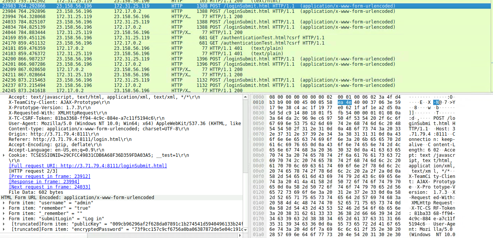
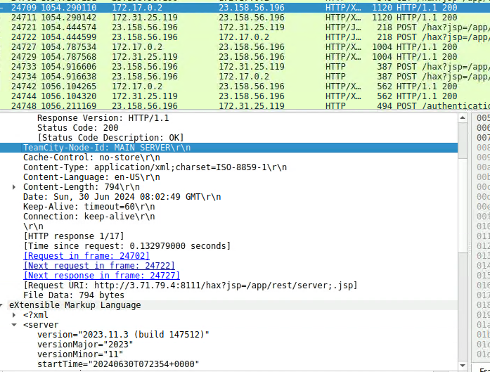
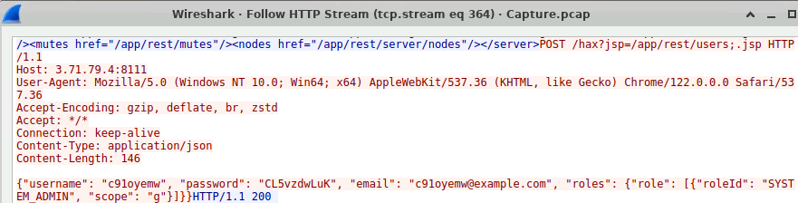
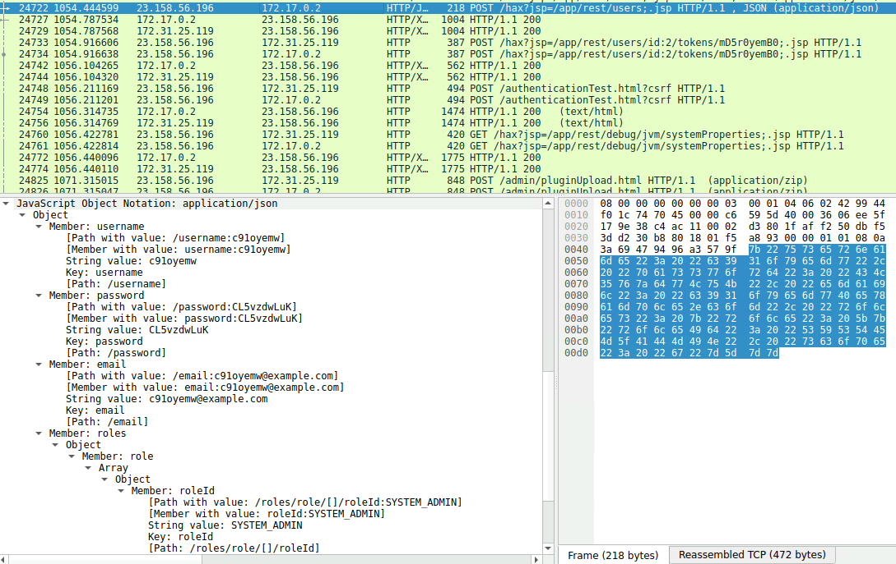
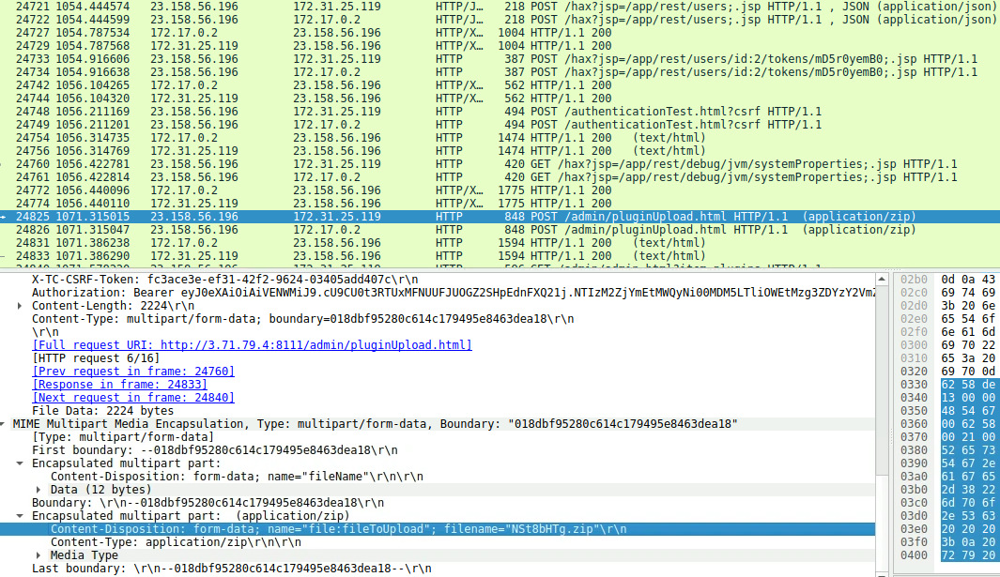
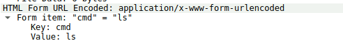
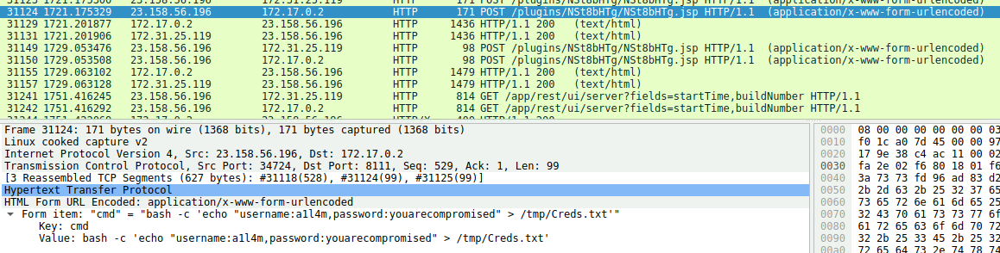
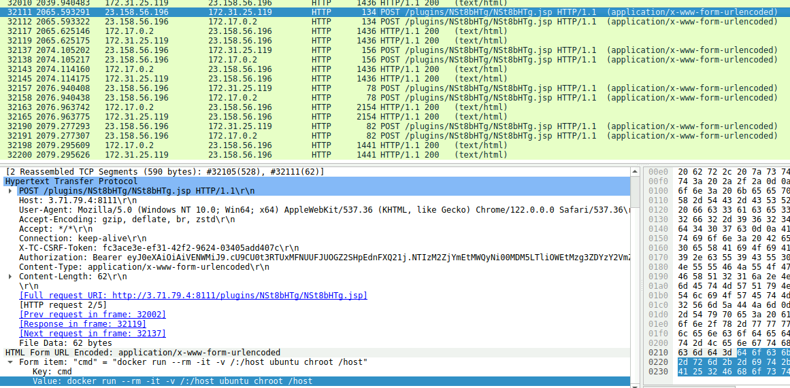

# JetBrains

## 목차

[Questions 1](#q1)

[Questions 2](#q2)

[Questions 3](#q3)

[Questions 4](#q4)

[Questions 5](#q5)

[Questions 6](#q6)

[Questions 7](#q7)

[Questions 8](#q8)

[Questions 9](#q9)

# Scenario
During a recent security incident, an attacker successfully exploited a vulnerability in our web server, allowing them to upload webshells and gain full control over the system. The attacker utilized the compromised web server as a launch point for further malicious activities, including data manipulation. 

As part of the investigation, You are provided with a packet capture (PCAP) of the network traffic during the attack to piece together the attack timeline and identify the methods used by the attacker. The goal is to determine the initial entry point, the attacker's tools and techniques, and the compromise's extent.

최근 보안 사고에서 공격자가 웹 서버의 취약점을 악용하여 웹셸을 업로드하고 시스템을 완전히 장악했습니다. 공격자는 손상된 웹 서버를 데이터 조작을 포함한 추가 악성 활동의 시작점으로 활용했습니다.

조사의 일환으로, 공격 중 네트워크 트래픽의 패킷 캡처(PCAP)를 제공하여 공격 타임라인을 분석하고 공격자가 사용한 방법을 파악합니다. 이 조사의 목표는 초기 진입 지점, 공격자의 도구 및 기법, 그리고 침해 범위를 파악하는 것입니다.

# 문제 파일

# 개념 정리

# Questions

## Q1
Identifying the attacker's IP address helps trace the source and stop further attacks. What is the attacker's IP address?

공격자의 IP 주소를 파악하면 출처를 추적하고 추가 공격을 차단하는 데 도움이 됩니다. 공격자의 IP 주소는 무엇입니까?

### Answers
23.158.56.196

### 분석
admin 계정으로 로그인을 시도하는 패킷을 확인했다.

## Q2
To identify potential vulnerability exploitation, what version of our web server service is running?

잠재적인 취약성 악용을 파악하기 위해, 어떤 버전의 웹 서버 서비스가 실행되고 있습니까?

### Answers
2023.11.3

### 분석
공격자가 인증 우회 취약점을 이용해 GET 요청을 보낸 패킷에 대한 응답을 확인해보면 사용된 웹 서비스와 버전을 확인할 수 있다.

사용된 필터링: `http and ip.addr == 23.158.56.196`

## Q3
After identifying the version of our web server service, what CVE number corresponds to the vulnerability the attacker exploited?

웹 서버 서비스의 버전을 식별한 후, 공격자가 악용한 취약점에 해당하는 CVE 번호는 무엇입니까?

### Answers
CVE-2024-27198

### 분석
해당 cve는 JetBrains가 개발한 TeamCity 서버에서 발생한 인증 우회 취약점이다.

참고 링크 1: `https://www.rapid7.com/blog/post/2024/03/04/etr-cve-2024-27198-and-cve-2024-27199-jetbrains-teamcity-multiple-authentication-bypass-vulnerabilities-fixed/`

참고 링크 2: `https://www.igloo.co.kr/security-information/jetbrainsteamcity-%EC%9D%B8%EC%A6%9D-%EC%9A%B0%ED%9A%8C-%EC%B7%A8%EC%95%BD%EC%A0%90-cve-2024-27198%EB%B6%84%EC%84%9D-%EB%B0%8F-%EB%8C%80%EC%9D%91%EB%B0%A9%EC%95%88/`

## Q4
The attacker exploited the vulnerability to create a user account. What credentials did he set up?

공격자는 이 취약점을 악용하여 사용자 계정을 생성했습니다. 그는 어떤 자격 증명을 설정했습니까?

### Answers
c91oyemw:CL5vzdwLuK

### 분석
패킷을 우클릭한 후 Follow → HTTP Stream을 클릭하면 해당 패킷의 스트림을 확인할 수 있다.

패킷의 세부 정보에서도 확인할 수 있다.

## Q5
The attacker uploaded a webshell to ensure his access to the system. What is the name of the file that the attacker uploaded?

공격자는 시스템 접근을 확보하기 위해 웹셸을 업로드했습니다. 공격자가 업로드한 파일 이름은 무엇입니까?

### Answers
NSt8bHTg.zip

### 분석
공격자가 사용자 계정을 생성한 후 액세스 토큰 생성을 진행했다. 이후 악성 플러그인 업로드가 진행된다.

## Q6
When did the attacker execute their first command via the web shell?

공격자가 웹 셸을 통해 첫 번째 명령을 실행한 것은 언제였습니까?

### Answers
2024-06-30 08:03

### 분석
웹 셸 첫 번째 실행 시점은 2024-06-30 08:03:57, 사용된 명령어는 ls로 확인됐다.

## Q7
The attacker tampered with a text file that contained the credentials of the admin user of the webserver. What new username and password did the attacker write in the file?

공격자는 웹 서버 관리자의 자격 증명이 포함된 텍스트 파일을 조작했습니다. 공격자는 파일에 어떤 새 사용자 이름과 비밀번호를 입력했습니까?

### Answers
a1l4m:youarecompromised

### 분석
/tmp/Creds.txt 파일에 접근해서 username과 password를 입력한 내용이 패킷에서 확인됐다.

## Q8
What is the MITRE Technique ID for the attacker's action in the previous question (Q7) when tampering with the text file?

이전 질문(Q7)에서 공격자가 텍스트 파일을 변조할 때 사용한 MITRE 기술 ID는 무엇입니까?

### Answers
T1565.001

### 분석
MITRE Technique에서 Impact → Data Manipulation → Stored Data Manipulation 탭을 확인해보면 데이터 조작과 관련된 MITRE Technique를 확인할 수 있다.

링크: https://attack.mitre.org/techniques/T1565/001/

## Q9
The attacker tried to escape from the container but he didn’t succeed, What is the command that he used for that?

공격자는 컨테이너에서 탈출을 시도했지만 성공하지 못했습니다. 그가 탈출할 때 사용한 명령은 무엇입니까?

### Answers
docker run --rm -it -v /:/host ubuntu chroot /host

### 분석
해당 서버가 도커 컨테이너에서 동작하고 있었던 것 같고, 컨테이너에서 탈출하기 위해 여러 명령어를 입력해서 탈출을 시도해봤던 것으로 보인다.

사용된 명령어들은 다음과 같다.

1. `"cmd" = "docker run --rm -it --privileged ubuntu"`
2. `"cmd" = "docker run --rm -it -v /:/host ubuntu chroot /host"`
3. `"cmd" = "docker run -v /var/run/docker.sock:/var/run/docker.sock -it ubuntu"`