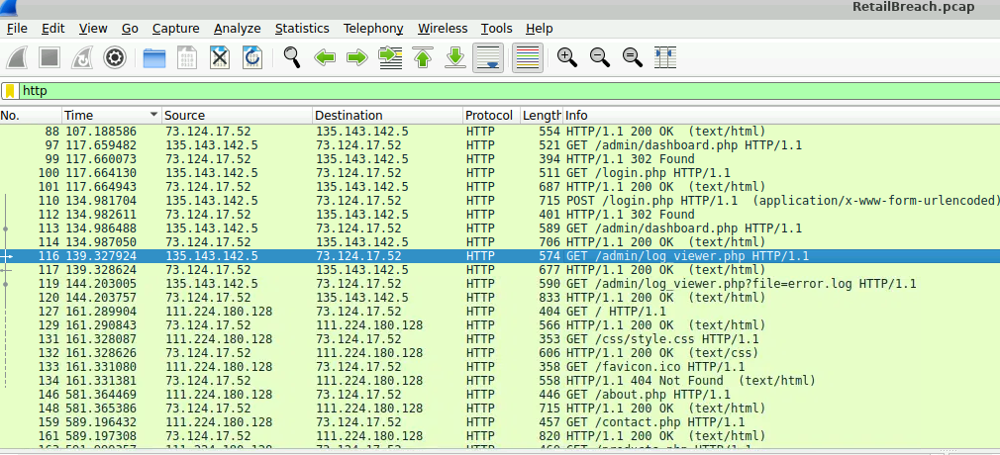
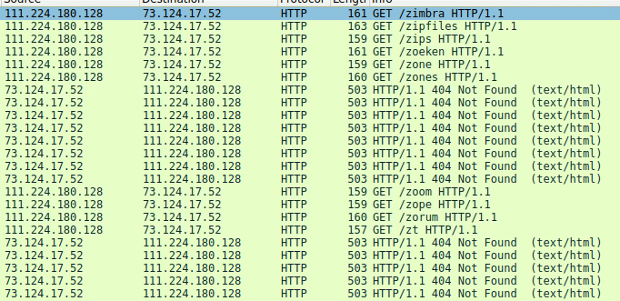
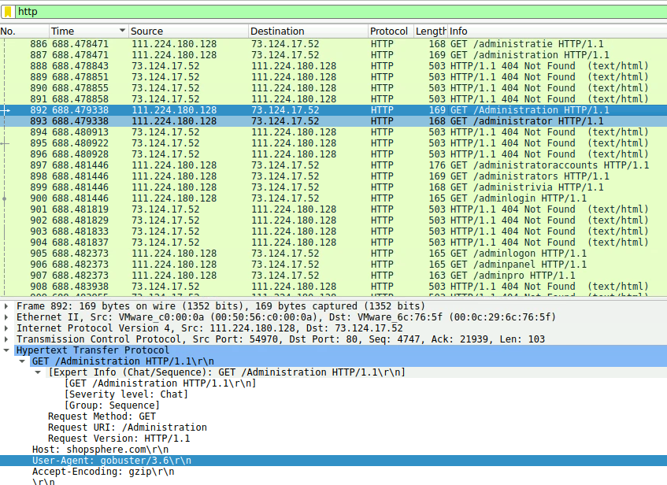
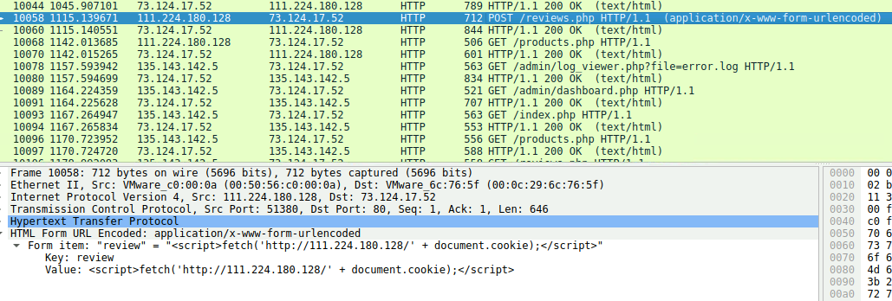
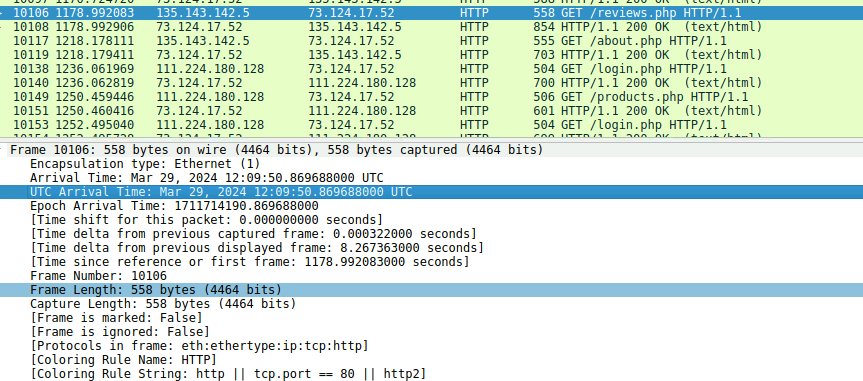
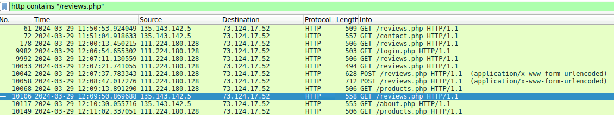
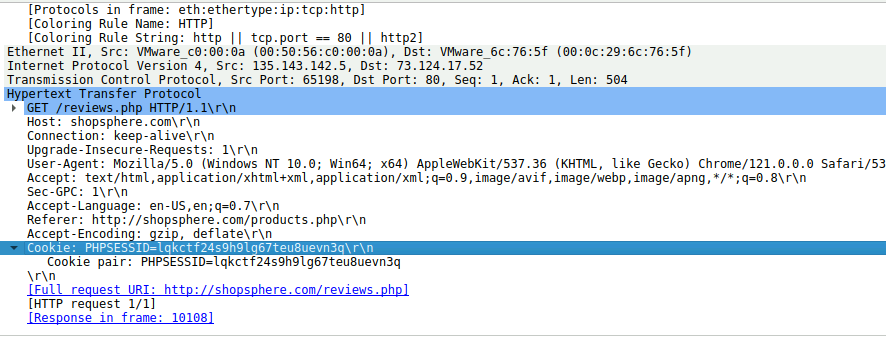
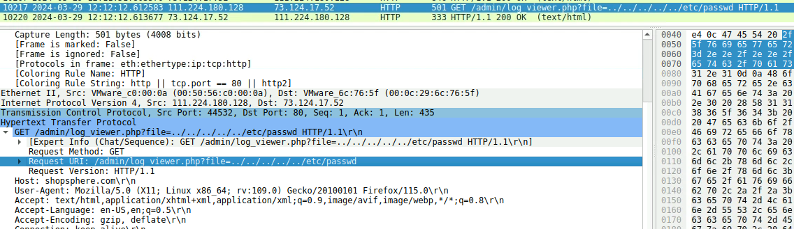

# RetailBreach

## 목차

[Questions 1](#q1)

[Questions 2](#q2)

[Questions 3](#q3)

[Questions 4](#q4)

[Questions 5](#q5)

[Questions 6](#q6)

[Questions 7](#q7)

# Scenario
In recent days, ShopSphere, a prominent online retail platform, has experienced unusual administrative login activity during late-night hours. These logins coincide with an influx of customer complaints about unexplained account anomalies, raising concerns about a potential security breach. Initial observations suggest unauthorized access to administrative accounts, potentially indicating deeper system compromise.

Your mission is to investigate the captured network traffic to determine the nature and source of the breach. Identifying how the attackers infiltrated the system and pinpointing their methods will be critical to understanding the attack's scope and mitigating its impact.

최근 유명 온라인 소매 플랫폼인 ShopSphere에서 심야 시간대에 비정상적인 관리자 로그인 활동이 발생했습니다. 이러한 로그인 활동은 설명할 수 없는 계정 이상 현상에 대한 고객 불만이 급증하는 상황과 맞물려 잠재적인 보안 침해에 대한 우려를 불러일으켰습니다. 초기 관찰 결과 관리자 계정에 대한 무단 접근이 감지되었으며, 이는 시스템 손상의 심각성을 시사하는 것으로 보입니다.

귀하의 임무는 캡처된 네트워크 트래픽을 조사하여 침해의 본질과 출처를 파악하는 것입니다. 공격자가 시스템에 어떻게 침투했는지 파악하고 그 방법을 정확히 파악하는 것은 공격의 범위를 파악하고 그 영향을 완화하는 데 매우 중요합니다.

# 문제 파일
머신과 pcap 파일이 제공된다.

# 개념 정리

# Questions

## Q1
Identifying an attacker's IP address is crucial for mapping the attack's extent and planning an effective response. What is the attacker's IP address?

공격자의 IP 주소를 파악하는 것은 공격 범위를 파악하고 효과적인 대응 계획을 세우는 데 매우 중요합니다. 공격자의 IP 주소는 무엇입니까?

### Answers
111.224.180.128

### 분석
처음엔 admib, login 관련 키워드가 들어가는 주소에 접근하는 것을 보고 ip 135.143.142.5가 공격자인가 생각했다. 그래서 입력하러 갔는데 입력 양식과 달라서 다시 살펴봤다.

디렉터리 스캐닝 공격으로 추정되는 패킷들이 보였다.

따라서 공격자 IP는 111.224.180.128이다.

## Q2
The attacker used a directory brute-forcing tool to discover hidden paths. Which tool did the attacker use to perform the brute-forcing?

공격자는 디렉터리 무차별 대입 공격 도구를 사용하여 숨겨진 경로를 찾아냈습니다. 공격자는 무차별 대입 공격을 수행하는 데 어떤 도구를 사용했습니까?

### Answers
gobuster

### 분석
패킷의 user-agent를 보면 gobuster 라는 도구가 사용됐음을 알 수 있다.

## Q3
Cross-Site Scripting (XSS) allows attackers to inject malicious scripts into web pages viewed by users. Can you specify the XSS payload that the attacker used to compromise the integrity of the web application?

크로스 사이트 스크립팅(XSS)은 공격자가 사용자가 보는 웹 페이지에 악성 스크립트를 삽입할 수 있도록 합니다. 공격자가 웹 애플리케이션의 무결성을 손상시키는 데 사용한 XSS 페이로드를 명시할 수 있습니까?

### Answers
``

### 분석
/reviews.php 에서 XSS를 시도했다.

해당 스크립트는 사이트에 접속한 사용자의 쿠키 정보를 문자열 형태로 `http://111.224.180.128` 주소로 전송하게 된다. fetch 함수는 특정 URL로 네트워크 요청을 보내는 역할을 한다.

## Q4
Pinpointing the exact moment an admin user encounters the injected malicious script is crucial for understanding the timeline of a security breach. Can you provide the UTC timestamp when the admin user first visited the page containing the injected malicious script?

관리자가 삽입된 악성 스크립트를 접하는 정확한 순간을 파악하는 것은 보안 침해의 타임라인을 이해하는 데 매우 중요합니다. 관리자가 삽입된 악성 스크립트가 포함된 페이지를 처음 방문한 시점의 UTC 타임스탬프를 제공해 주시겠습니까?

### Answers
2024-03-29T12:09

### 분석
공격자 ip 주소: `111.224.180.128`
관리자 ip 주소: `135.143.142.5`
서버 ip 주소: `73.124.17.52`

공격자의 XSS 이후 2024년 3월 29일 12:09에 관리자의 접속이 확인됐다.

근데 분명 정답인데 인증이 안돼서 discord 커뮤니티에서 찾아보니 양식이 깨져있다고 `2024-03-29T12:09` 이런 양식으로 집어넣으라고 해서 인증에 성공했다.

## Q5
The theft of a session token through XSS is a serious security breach that allows unauthorized access. Can you provide the session token that the attacker acquired and used for this unauthorized access?

XSS를 통한 세션 토큰 도용은 무단 접근을 허용하는 심각한 보안 침해입니다. 공격자가 이 무단 접근에 사용하여 획득한 세션 토큰을 제공해 주시겠습니까?

### Answers
lqkctf24s9h9lg67teu8uevn3q

### 분석
XSS 스크립트가 작성된 /reviews.php 페이지에 접속한 사용자의 리스트를 확인하기 위해 `http contains "/reviews.php"` 필터링을 진행했다.

확인해보니 해당 페이지에 접속한 사용자 ip는 관리자인 135.143.142.5 밖에 없었다. 따라서 해당 ip의 세션 토큰이 이번 문제의 답이다.

`PHPSESSID=lqkctf24s9h9lg67teu8uevn3q`

## Q6
Identifying which scripts have been exploited is crucial for mitigating vulnerabilities in a web application. What is the name of the script that was exploited by the attacker?

어떤 스크립트가 악용되었는지 파악하는 것은 웹 애플리케이션의 취약점을 완화하는 데 매우 중요합니다. 공격자가 악용한 스크립트의 이름은 무엇입니까?

### Answers
log_viwer.php

### 분석
공격자는 탈취한 관리자의 세션 토큰값을 이용해서 여러 페이지를 돌아가며 접속을 시도해본다. review_manager.php, dashboard.php 에 접속해봤으나 별 소득이 없었던 것 같다. 하지만 log_viewer.php 페이지에서 파라미터 값에 file 이라는 key가 들어가는 것을 확인했고, 이 값을 이용해 원하는 폴더에 접근하는 취약점을 이용하고 있다.

이 취약점을 Path Traversal 취약점이라고 부른다.

## Q7
Exploiting vulnerabilities to access sensitive system files is a common tactic used by attackers. Can you identify the specific payload the attacker used to access a sensitive system file?

민감한 시스템 파일에 접근하기 위해 취약점을 악용하는 것은 공격자들이 흔히 사용하는 전술입니다. 공격자가 민감한 시스템 파일에 접근하는 데 사용한 특정 페이로드를 식별할 수 있습니까?

### Answers
../../../../../etc/passwd

### 분석
Path Traversal 취약점이다.

