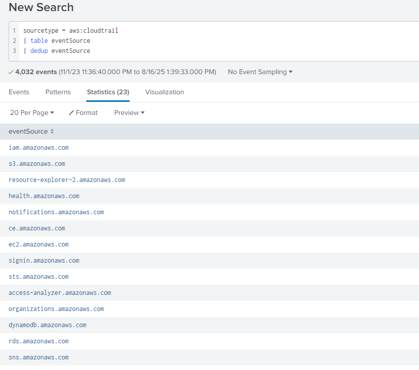
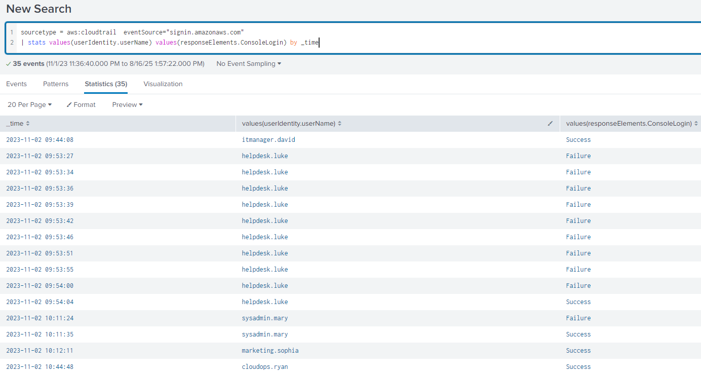

# AWSRaid Lab

## 목차

[Questions 1](#q1)

[Questions 2](#q2)

[Questions 3](#q3)

[Questions 4](#q4)

[Questions 5](#q5)

[Questions 6](#q6)

# Scenario
Your organization utilizes AWS to host critical data and applications. An incident has been reported that involves unauthorized access to data and potential exfiltration. The security team has detected unusual activities and needs to investigate the incident to determine the scope of the attack.

귀사에서는 AWS를 활용하여 중요 데이터와 애플리케이션을 호스팅하고 있습니다. 데이터 무단 접근 및 유출 가능성이 있는 사고가 보고되었습니다. 보안팀에서 비정상적인 활동을 감지했으며, 공격 범위를 파악하기 위해 사고를 조사해야 합니다.

# 문제 파일
splunk에 AWS 로그가 있는 머신이 주어진다.

# 개념 정리

# Questions

## Q1
Knowing which user account was compromised is essential for understanding the attacker's initial entry point into the environment. What is the username of the compromised user?

어떤 사용자 계정이 침해되었는지 아는 것은 공격자의 초기 환경 진입 지점을 이해하는 데 필수적입니다. 침해된 사용자의 사용자 이름은 무엇입니까?

### Answers
helpdesk.luke

### 분석
splunk에서 sourcetype 은 aws.cloudtrail 1개만 존재한다. aws cloudtrail은 AWS 계정에서 수행되는 작업을 기록하고 모니터링하는 서비스이다.

공격에 사용된 사용자 계정을 파악하기 위해선 로그인 기록을 확인해 볼 필요가 있을 것 같다. 이벤트와 관련된 필드를 확인하면 될 것 같았고 `eventsource` 필드에서 로그인과 관련되어 보이는 `signin.amazonaws.com`을 확인했다.

```
sourcetype = aws:cloudtrail
| table eventSource
| dedup eventSourceS
```



`signin.amazonaws.com` 값을 가지고 있는 데이터 중 필요한 정보를 선별해본다. 사용자 명, 시간 데이터, 로그인 실패/성공 여부가 필요할 것 같다.

사용자명은 `userIdentity.userName`, 시간 데이터는 `_time`, 로그인 실패/성공은 `responseElements.ConsoleLogin`. 해당 이벤트들로 필터링을 진행해보자.

```
sourcetype = aws:cloudtrail  eventSource="signin.amazonaws.com"
| stats values(userIdentity.userName) values(responseElements.ConsoleLogin) by _time
```

대부분 로그인에 실패를 해도 2번 이내로 실패했으나 1개의 사용자가 9번의 실패 후 로그인에 성공한 로그가 눈에 들어온다.



비정상적인 활동으로 해당 사용자가 침해된 사용자 (공격자)로 추정할 수 있다.

We must investigate the events following the initial compromise to understand the attacker's motives. What is the timestamp for the first access to an S3 object by the attacker?## Q2

공격자의 동기를 파악하기 위해서는 초기 침해 이후 발생한 사건을 조사해야 합니다. 공격자가 S3 객체에 처음 접근한 타임스탬프는 무엇입니까?

### Answers


### 분석