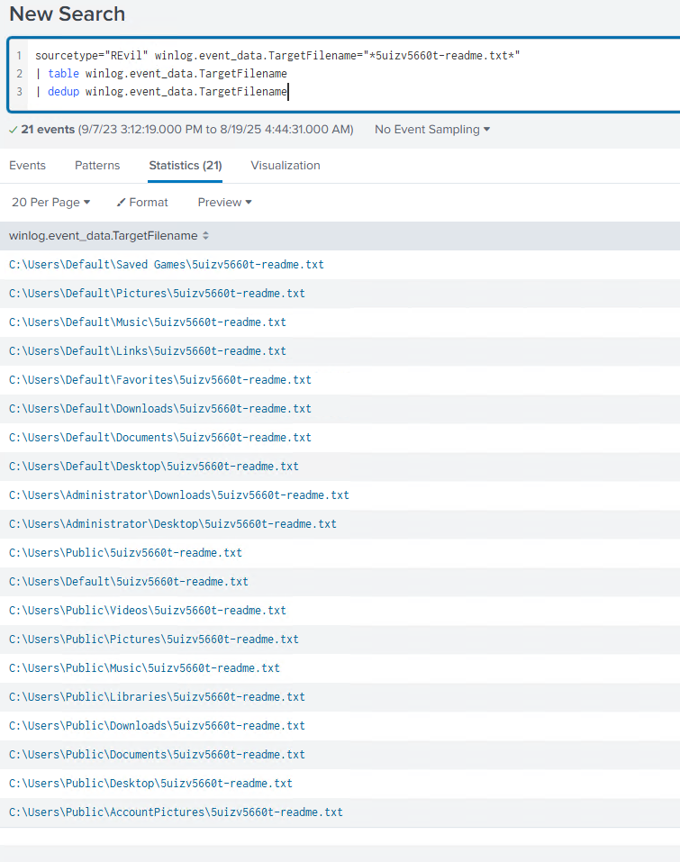
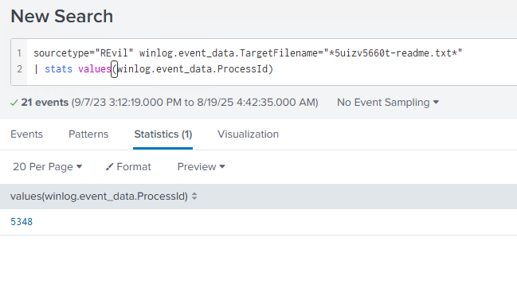
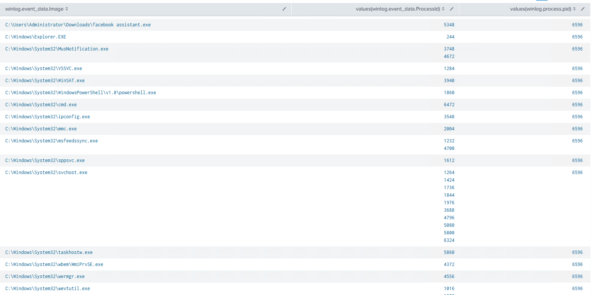
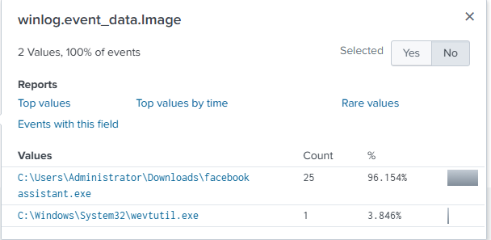
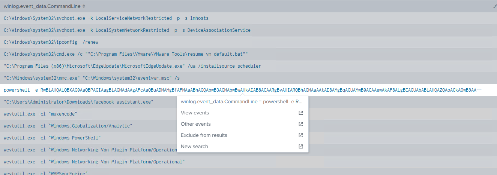
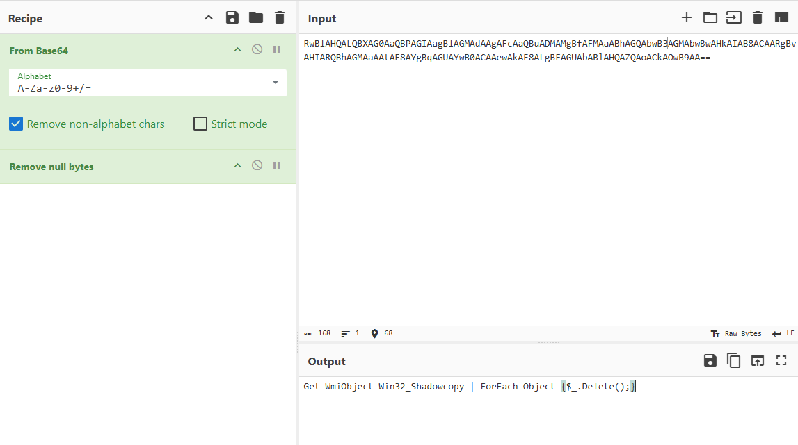
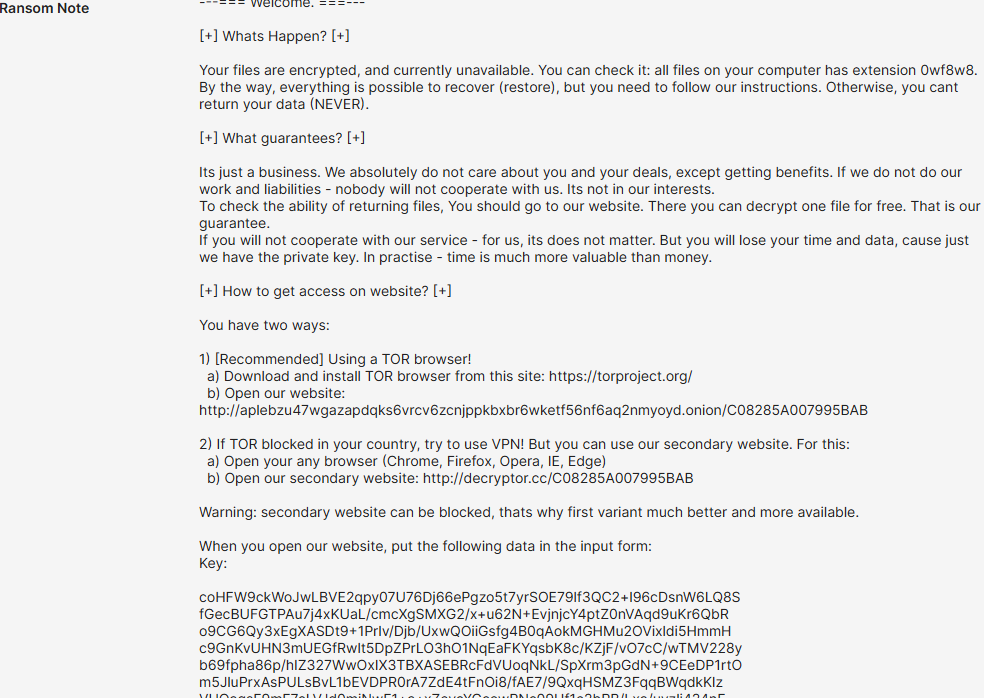

# Revil

## 목차

[Questions 1](#q1)

[Questions 2](#q2)

[Questions 3](#q3)

[Questions 4](#q4)

[Questions 5](#q5)

[Questions 6](#q6)

# Scenario
You are a Threat Hunter working for a cybersecurity consulting firm. One of your clients has been recently affected by a ransomware attack that caused the encryption of multiple of their employees' machines. The affected users have reported encountering a ransom note on their desktop and a changed desktop background. You are tasked with using Splunk SIEM containing Sysmon event logs of one of the encrypted machines to extract as much information as possible.

사이버 보안 컨설팅 회사에서 근무하는 위협 사냥꾼입니다. 고객사 중 한 곳이 최근 랜섬웨어 공격을 받아 직원 여러 대의 컴퓨터가 암호화되었습니다. 피해를 입은 사용자들은 데스크톱에 랜섬 노트가 표시되고 데스크톱 배경이 변경되었다고 보고했습니다. 당신은 암호화된 컴퓨터 중 하나의 Sysmon 이벤트 로그가 포함된 Splunk SIEM을 사용하여 최대한 많은 정보를 추출해야 합니다.

# 문제 파일

# 개념 정리

# Questions

## Q1
To begin your investigation, can you identify the filename of the note that the ransomware left behind?

조사를 시작하기 위해, 랜섬웨어가 남긴 메모의 파일 이름을 알아낼 수 있나요?

### Answers
5uizv5660t-readme.txt

### 분석
table winlog.event_data.TargetFilename 이벤트에서 `5uizv5660t-readme.txt` 라는 이름의 여러 텍스트파일이 생성된 것을 확인했다.

사용한 필터링
```
sourcetype="REvil" winlog.event_data.TargetFilename="*5uizv5660t-readme.txt*"
| table winlog.event_data.TargetFilename
| dedup winlog.event_data.TargetFilename
```



## Q2
After identifying the ransom note, the next step is to pinpoint the source. What's the process ID of the ransomware that's likely involved

랜섬웨어 메시지를 확인한 후 다음 단계는 출처를 파악하는 것입니다. 관련되었을 가능성이 있는 랜섬웨어의 프로세스 ID는 무엇입니까?

### Answers
5348

### 분석
위에서 확인한 `5uizv5660t-readme.txt` 텍스트 파일을 생성한 프로세스의 ID는 `5348`이다.

```
sourcetype="REvil" winlog.event_data.TargetFilename="*5uizv5660t-readme.txt*"
| stats values(winlog.event_data.ProcessId)
```



여기서 `winlog.event_data.ProcessId`, `winlog.process.pid` 두 개의 값 모두 PID 라서 헷갈렸는데 전자가 부모 프로세스의 개념으로도 포함될 수 있는 것 같다. 근데 `winlog.event_data.ParentProcessId`라는 값이 있....



결과적으로 둘 중 `winlog.event_data.ProcessId`를 선택하게 된 이유는 `winlog.process.pid` 값이 너무 여러 프로세스에서 동일하게 발견됐다.

## Q3
Having determined the ransomware's process ID, the next logical step is to locate its origin. Where can we find the ransomware's executable file?

랜섬웨어의 프로세스 ID를 확인했다면, 다음 단계는 출처를 찾는 것입니다. 랜섬웨어의 실행 파일은 어디에서 찾을 수 있을까요?

### Answers
C:\Users\Administrator\Downloads\facebook assistant.exe

### 분석
`sourcetype="REvil" winlog.event_data.ProcessId="5348"`로 필터링을 진행했을 때 `winlog.event_data.Image` 이벤트에 있는 값이 악성코드의 원본 실행파일이었다.



## Q4
Now that you've pinpointed the ransomware's executable location, let's dig deeper. It's a common tactic for ransomware to disrupt system recovery methods. Can you identify the command that was used for this purpose?

랜섬웨어의 실행 파일 위치를 파악했으니 이제 더 자세히 알아보겠습니다. 이는 랜섬웨어가 시스템 복구 방법을 방해하는 일반적인 수법입니다. 이 목적으로 사용된 명령어를 알 수 있을까요?

### Answers
Get-WmiObject Win32_Shadowcopy | ForEach-Object {$_.Delete();}

### 분석
cmd 로그를 보면 파워쉘로 실행한 아주 이상한 코드가 하나 보인다.

```
sourcetype="REvil"
| table winlog.event_data.CommandLine
| dedup winlog.event_data.CommandLine
```



base64 코드를 디코딩 해보면 아래 명령어가 나온다.

```
Get-WmiObject Win32_Shadowcopy | ForEach-Object {$_.Delete();}
```



해당 명령은 볼륨 섀도우 카피본을 삭제하는 명령어로 시스템 복구가 불가능 하도록 만드는 명령이다.

## Q5
As we trace the ransomware's steps, a deeper verification is needed. Can you provide the sha256 hash of the ransomware's executable to cross-check with known malicious signatures?

랜섬웨어의 실행 경로를 추적함에 따라 더욱 심층적인 검증이 필요합니다. 알려진 악성 시그니처와 교차 검증할 수 있도록 랜섬웨어 실행 파일의 sha256 해시값을 제공해 주시겠습니까?

### Answers
B8D7FB4488C0556385498271AB9FFFDF0EB38BB2A330265D9852E3A6288092AA

### 분석
악성코드의 파일명인 `facebook assistant.exe` 를 이용해서 필터링을 진행했다.

```
sourcetype="REvil" winlog.event_data.Image="*facebook*"
| stats values(winlog.event_data.Hashes)
```

결과는 아래와 같다.
```
SHA1=E5D8D5EECF7957996485CBC1CDBEAD9221672A1A
MD5=4D84641B65D8BB6C3EF03BF59434242D
SHA256=B8D7FB4488C0556385498271AB9FFFDF0EB38BB2A330265D9852E3A6288092AA
IMPHASH=C686E5B9F7A178EB79F1CF16460B6A18
```

## Q6
One crucial piece remains: identifying the attacker's communication channel. Can you leverage threat intelligence and known Indicators of Compromise (IoCs) to pinpoint the ransomware author's onion domain?

중요한 한 가지가 남아 있습니다. 바로 공격자의 통신 채널을 파악하는 것입니다. 위협 인텔리전스와 알려진 침해 지표(IoC)를 활용하여 랜섬웨어 작성자의 어니언 도메인을 정확히 찾아낼 수 있을까요?

### Answers
aplebzu47wgazapdqks6vrcv6zcnjppkbxbr6wketf56nf6aq2nmyoyd.onion

### 분석
tria.ge 에서 해시값을 검색하면 랜섬노트 `0wf8w8-readme.txt` 내용을 확인할 수 있으며, 내용을 확인해보면 어니언 도메인이 적혀있다.

