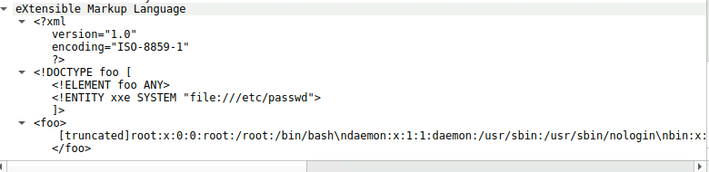

# XXE Infiltration

## 목차

[Questions 1](#q1)

[Questions 2](#q2)

[Questions 3](#q3)

[Questions 4](#q4)

[Questions 5](#q5)

[Questions 6](#q6)

[Questions 7](#q7)

# Scenario
An automated alert has detected unusual XML data being processed by the server, which suggests a potential XXE (XML External Entity) Injection attack. This raises concerns about the integrity of the company's customer data and internal systems, prompting an immediate investigation.

Analyze the provided PCAP file using the network analysis tools available to you. Your goal is to identify how the attacker gained access and what actions they took.

서버에서 비정상적인 XML 데이터가 처리되고 있다는 자동 알림이 감지되었습니다. 이는 XXE(XML 외부 개체) 주입 공격 가능성을 시사합니다. 이는 회사 고객 데이터 및 내부 시스템의 무결성에 대한 우려를 불러일으키며, 즉각적인 조사가 필요합니다.

제공된 PCAP 파일을 네트워크 분석 도구를 사용하여 분석하십시오. 목표는 공격자가 어떻게 접근했는지, 그리고 어떤 조치를 취했는지 파악하는 것입니다.

# 문제 파일

# 개념 정리
XXE 취약점: XML 데이터를 제대로 검증하지 않아 공격자가 XML 데이터를 가져올 때 시스템 중요 파일 조회 등이 가능한 취약점

# Questions

## Q1
Identifying the open ports discovered by an attacker helps us understand which services are exposed and potentially vulnerable. Can you identify the highest-numbered port that is open on the victim's web server?

공격자가 발견한 열린 포트를 파악하면 어떤 서비스가 노출되어 있고 잠재적으로 취약한지 파악하는 데 도움이 됩니다. 피해자 웹 서버에서 열려 있는 가장 높은 번호의 포트를 파악할 수 있습니까?

### Answers
3306

### 분석
ip `210.106.114.183` 에서 포트 스캐닝을 진행하고 있는 것 같다. 서버의 ip는 `50.239.151.185`로 보인다.

포트가 닫혀있는 경우 SYN 이후 바로 RST, ACK 응답이 날라왔던 반면, 3306 포트는 초반 스캐닝 과정에서 SYN 이후 서버의 SYN, ACK 응답이 날라왔고 이후 스캐닝 도구에서 바로 RST 패킷을 날려 접속을 끊었다. 

필터링: `tcp.port == 3306`

이후 80, 3306 포트가 공격 대상이 된 것으로 보인다.

3306은 MySQL 기본 포트이다.

## Q2
By identifying the vulnerable PHP script, security teams can directly address and mitigate the vulnerability. What's the complete URI of the PHP script vulnerable to XXE Injection?

취약한 PHP 스크립트를 식별함으로써 보안팀은 취약점을 직접 해결하고 완화할 수 있습니다. XXE 주입에 취약한 PHP 스크립트의 전체 URI는 무엇입니까?

### Answers
/review/upload.php

### 분석
디렉토리 스캐닝 공격이 진행됐다.

그리고 공격자는 `/review/upload.php`에 접근해서 XXE 취약점 공격을 진행했다.

세부 내용은 다음과 같다.

## Q3
To construct the attack timeline and determine the initial point of compromise. What's the name of the first malicious XML file uploaded by the attacker?

공격 타임라인을 구성하고 초기 침해 지점을 파악합니다. 공격자가 업로드한 첫 번째 악성 XML 파일의 이름은 무엇입니까?

### Answers
TheGreatGatsby.xml

### 분석
첫 번째로 업로드한 파일의 이름은 `TheGreatGatsby.xml`이다.

## Q4
Understanding which sensitive files were accessed helps evaluate the breach's potential impact. What's the name of the web app configuration file the attacker read?

어떤 중요 파일에 접근했는지 파악하면 침해의 잠재적 영향을 평가하는 데 도움이 됩니다. 공격자가 읽은 웹 앱 구성 파일의 이름은 무엇입니까?

### Answers
config.php

### 분석
공격자는 첫 번째 업로드를 통해 `/etc/passwd` 파일의 내용을 읽었다. (TheGreatGatsby.xml)

두 번째 업로드를 통해 `/var/www/html/index.php` 파일의 내용을 읽었다. (1984.xml)

세 번째 업로드를 통해 `/var/www/html/config.php` 파일의 내용을 읽었다. (ToKillaMockingbird.xml)

네 번째 업로드는 단순히 읽는 내용이 아니고 웹 쉘을 업로드한 것으로 보인다. (PrideandPrejudice.xml)

## Q5
To assess the scope of the breach, what is the password for the compromised database user?

침해 범위를 평가하기 위해, 손상된 데이터베이스 사용자의 비밀번호는 무엇입니까?

### Answers
Winter2024

### 분석
`config.php`에서 계정 정보들이 유출됐다.

## Q6
Following the database user compromise. What is the timestamp of the attacker's initial connection to the MySQL server using the compromised credentials after the exposure?

데이터베이스 사용자 침해 이후, 공격자가 침해된 자격 증명을 사용하여 MySQL 서버에 처음 연결한 타임스탬프는 무엇입니까?

### Answers
2024-05-31 12:08

### 분석
공격자 ip: `210.106.114.183`

mysql 서버에 접근할 계정 정보를 얻기 전 이미 3306 포트의 존재를 확인한 뒤 접근을 시도했었다.

계정 정보를 획득한건 2024년 5월 31일 12:03:12 이었고, 이후 mysql 접근 기록은 2개가 확인됐다.

계정 정보를 획득한 이후 최초의 mysql 접근은 2024년 5월 31일 12:08:49이다.

그 이전에 접근했던 기록 중 가장 최초 타임스탬프는 2024년 5월 31일 11:47:24 이다.

## Q7
To eliminate the threat and prevent further unauthorized access, can you identify the name of the web shell that the attacker uploaded for remote code execution and persistence?

위협을 제거하고 추가적인 무단 접근을 방지하기 위해, 공격자가 원격 코드 실행 및 지속성을 위해 업로드한 웹 셸의 이름을 식별할 수 있습니까?

### Answers
booking.php

### 분석
웹 쉘을 업로드할 때 패킷을 확인해보면 된다.

### 마무리
XXE 공격, MySQL 접속 방식 (패킷), 핸드쉐이크 (패킷) 학습 필요