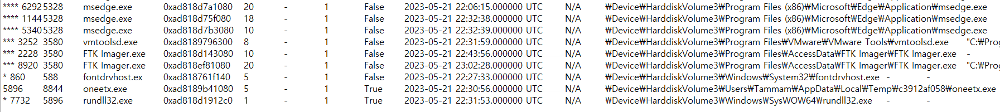
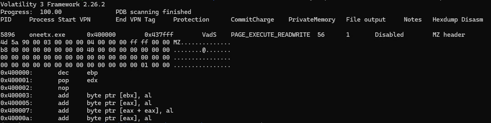
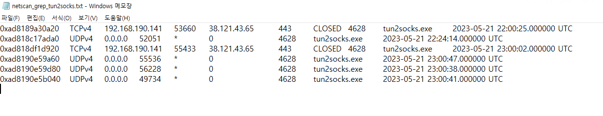

# RedLine

Category: `Endpoint Forensics`

Tactics: `Privilege Escalation`, `Defense Evasion`, `Command and Control`

Tools: `Volatility`, `Strings`

## 목차

[Questions 1](#q1)

[Questions 2](#q2)

[Questions 3](#q3)

[Questions 4](#q4)

[Questions 5](#q5)

[Questions 6](#q6)

[Questions 7](#q7)

# Scenario
As a member of the Security Blue team, your assignment is to analyze a memory dump using Redline and Volatility tools. Your goal is to trace the steps taken by the attacker on the compromised machine and determine how they managed to bypass the Network Intrusion Detection System (NIDS). Your investigation will identify the specific malware family employed in the attack and its characteristics. Additionally, your task is to identify and mitigate any traces or footprints left by the attacker.

Security Blue 팀의 일원으로서, Redline 및 Volatility 도구를 사용하여 메모리 덤프를 분석하는 것이 여러분의 임무입니다. 여러분의 목표는 공격자가 감염된 컴퓨터에서 수행한 단계를 추적하고 네트워크 침입 탐지 시스템(NIDS)을 어떻게 우회했는지 확인하는 것입니다. 조사를 통해 공격에 사용된 특정 악성코드군과 그 특징을 파악합니다. 또한, 공격자가 남긴 흔적이나 흔적을 파악하고 완화하는 것이 여러분의 임무입니다.

# 문제 파일
메모리 덤프파일 1개가 주어진다.

# 개념 정리

# Questions

## Q1
What is the name of the suspicious process?

의심스러운 과정의 이름은 무엇입니까?

### Answers
oneetx.exe

### 분석
볼라틸리티 `pstree` 명령어를 이용하여 프로세스를 탐색했다.

`vol -f MemoryDump.mem windows.pstree > pstree.txt`

결과 하위에서 경로가 사용자 폴더 Temp 디렉토리인 의심되는 프로세스를 발견했다.

## Q2
What is the child process name of the suspicious process?

의심스러운 프로세스의 자식 프로세스 이름은 무엇입니까?

### Answers
rundll32.exe

### 분석
의심되는 프로세스 `oneetx.exe`의 자식 프로세스는 `rundll32.exe`이다.

## Q3
What is the memory protection applied to the suspicious process memory region?

의심스러운 프로세스 메모리 영역에 적용되는 메모리 보호는 무엇입니까?

### Answers
PAGE_EXECUTE_READWRITE

### 분석
힌트를 참고했고 볼라틸리티 `malfind` 플러그인을 사용하라고 한다.

`malfind`는 프로세스 메모리 영역에 숨겨진 악성 코드를 찾을 수 있는 플러그인으로, 실행중인 프로세스의 가상 메모리 영역을 검사하거나 PE 헤더 없는 코드 블록 탐지 등을 진행할 수 있다.

볼라틸리티 명령어: `vol -f MemoryDump.mem windows.malware.malfind --pid 5896`

결과창에서 사용된 메모리 보호 속성(`Protection =  PAGE_EXECUTE_READWRITE`) 확인할 수 있다.

메모리 보호 속성 `PAGE_EXECUTE_READWRITE`는 지정된 메모리 영역에 대해 읽기, 쓰기, 실행 권한을 모두 갖는 보호 속성으로 일반적으로 메모리 영역은 실행 권한과 쓰기 권한을 동시에 갖지 않도록 설정되지만 악성코드는 해당 권한을 이용하여 메모리 영역에 코드를 삽입하고 실행할 수 있도록 만들기 때문에 위험한 보호 속성 중 하나이다.

## Q4
What is the name of the process responsible for the VPN connection?

VPN 연결을 담당하는 프로세스의 이름은 무엇입니까?

### Answers
Outline.exe

### 분석
https 암호화 통신을 할때 사용하며 VPN에서도 사용하는 포트인 443 포트 연결이 발견된 프로세스 리스트는 다음과 같다.

svchost.exe, tun2socks.exe, SearchApp.exe, SkypeApp.exe, explorer.exe

VPN과 가장 연관성 있어보이는 프로세스는 `tun2socks.exe`로 

### 마무리
볼라틸리티 플러그인 malfind 학습하기

링크 1: https://github.com/f-block/volatility-plugins
링크 2: https://insinuator.net/2021/12/release-of-pte-analysis-plugins-for-volatility-3/
링크 3: https://insinuator.net/2022/09/some-experiments-with-process-hollowing/

그리고 tun2Socks가 뭔지도 학습해볼것 + VPN 개념