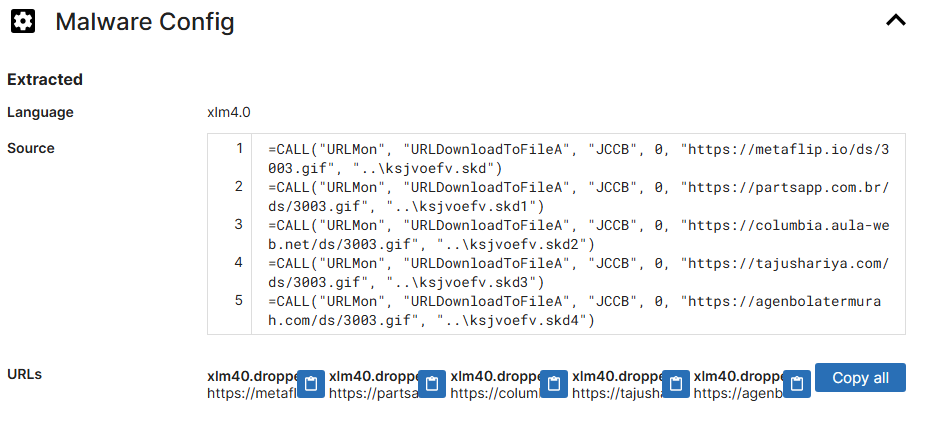

# IcedID

Category: `Threat Intel`

Tools: `VirusTotal`, `Malpedia`, `X`, `Tria.ge`, `ANY.RUN`

## 목차

[Questions 1](#q1)

[Questions 2](#q2)

[Questions 3](#q3)

[Questions 4](#q4)

[Questions 5](#q5)

[Questions 6](#q6)

# Scenario
A cyber threat group was identified for initiating widespread phishing campaigns to distribute further malicious payloads. The most frequently encountered payloads were IcedID. You have been given a hash of an IcedID sample to analyze and monitor the activities of this advanced persistent threat (APT) group.

추가 악성 페이로드를 배포하기 위해 광범위한 피싱 캠페인을 시작한 사이버 위협 그룹이 발견되었습니다. 가장 자주 발견된 페이로드는 IcedID였습니다. 이 지능형 지속 위협(APT) 그룹의 활동을 분석하고 모니터링하기 위해 IcedID 샘플 해시 정보가 제공되었습니다.

# 문제 파일
해시값이 적혀있는 텍스트 파일이 주어진다.

```
191eda0c539d284b29efe556abb05cd75a9077a0


Use this hash on online threat intel platforms (e.g., VirusTotal, Hybrid Analysis) to complete the lab analysis.
```

# 개념 정리

# Questions

## Q1
What is the name of the file associated with the given hash?

주어진 해시와 관련된 파일의 이름은 무엇입니까?

### Answers
document-1982481273.xlsm

### 분석
주어진 해시값을 VirustTotal에 검색해보면 해당 악성코드의 파일명으로 사용된 문자열을 확인할 수 있다.


## Q2
Can you identify the filename of the GIF file that was deployed?

배포된 GIF 파일의 파일 이름을 알 수 있나요?

### Answers
3003.gif

### 분석
접속한 URL을 확인해보면 3003.gif 라는 이름의 URL 경로를 확인할 수 있다.


GIF 파일은 위장한 DLL 파일인 것 같다.


## Q3
How many domains does the malware look to download the additional payload file in Q2?

맬웨어는 Q2의 추가 페이로드 파일을 다운로드하기 위해 몇 개의 도메인을 검색합니까?

### Answers
5

### 분석
총 5개의 도메인에서 3003.gif 다운로드를 위해 접속하는 것으로 보인다.


Tria.ge 에서도 파일 다운로드에 사용된 URL을 확인할 수 있다.



## Q4
From the domains mentioned in Q3, a DNS registrar was predominantly used by the threat actor to host their harmful content, enabling the malware's functionality. Can you specify the Registrar INC?

Q3에 언급된 도메인 중, 위협 행위자는 주로 DNS 등록 기관을 사용하여 악성코드 기능을 활성화하고 유해 콘텐츠를 호스팅했습니다. 등록 기관의 INC를 구체적으로 명시해 주시겠습니까?

### Answers
NameCheap

### 분석
악성코드에 사용된 URL의 도메인 등록 대행 업체로 확인된 곳은 Launchpad와 NameCheap 이다.


## Q5
Could you specify the threat actor linked to the sample provided?

제공된 샘플과 관련된 위협 행위자를 구체적으로 설명해 주시겠습니까?

### Answers
GOLD CABIN

### 분석
해시값을 이용해 서칭해보면 악성코드를 IcedID라는 이름으로 명명하고 있는 것을 확인할 수 있다.

링크: https://www.trendmicro.com/en_us/research/21/d/a-spike-in-bazarcall-and-icedid-activity.html

IcedID 악성코드를 처음 개발한 위협 행위자는 `LUNAR SPIDER`이고 `GOLD CABIN`에서도 해당 악성코드를 사용하는 것으로 보인다.

링크: https://malpedia.caad.fkie.fraunhofer.de/details/win.icedid

## Q6
In the Execution phase, what function does the malware employ to fetch extra payloads onto the system?

실행 단계에서 맬웨어는 어떤 기능을 사용하여 시스템에 추가 페이로드를 가져오나요?

### Answers
URLDownloadToFileA

### 분석
URLDownloadToFileA 함수를 이용해 추가적으로 파일을 다운로드 받는다.


다운로드 받은 해당 파일은 GIF 파일로 위장한 DLL 파일이다.

