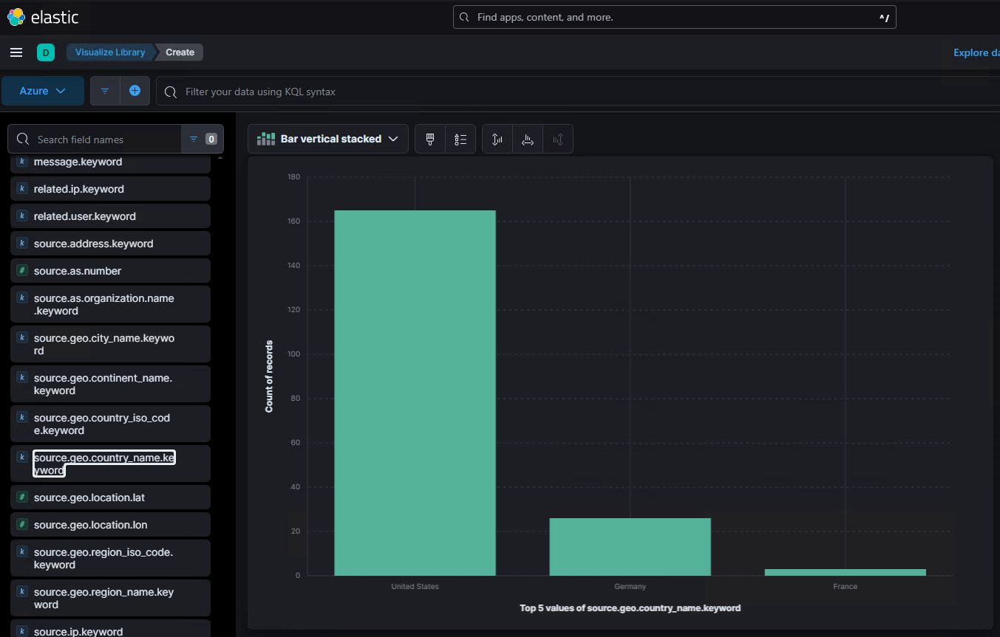
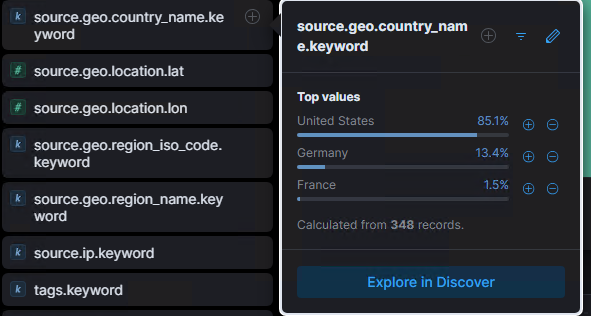
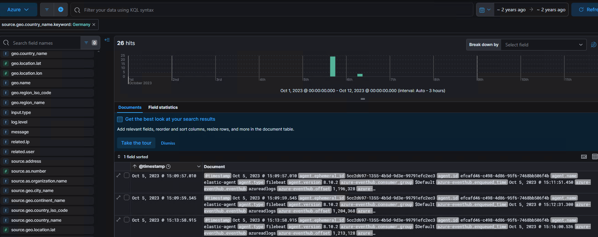
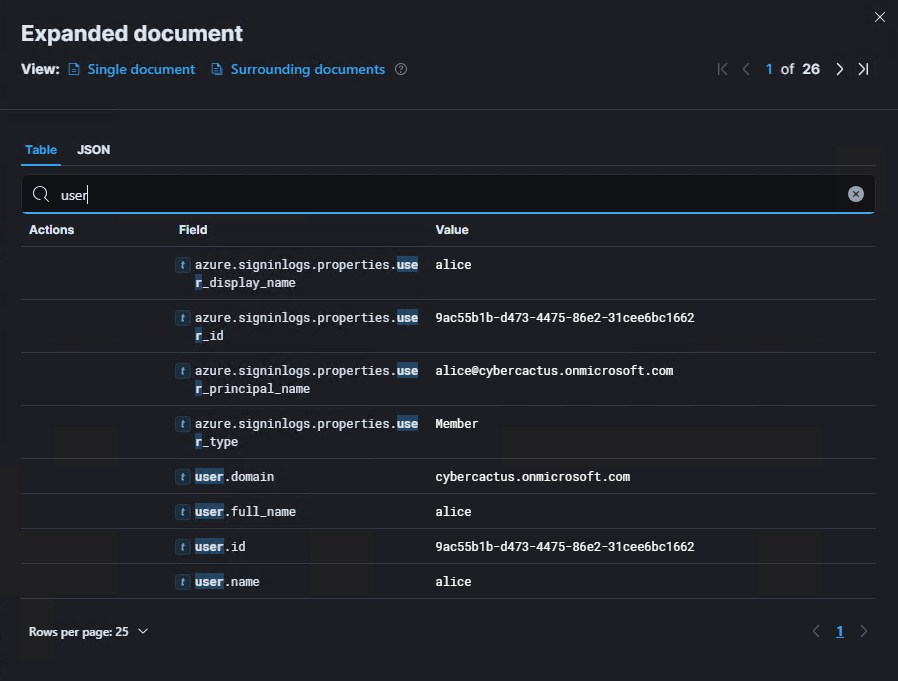

# AzureHunt

Category: `Cloud Forensics`

Tactics: `Persistence`, `Privilege Escalation`, `Collection`

Tool: `ELK`

## 목차

[Questions 1](#q1)

[Questions 2](#q2)

[Questions 3](#q3)

[Questions 4](#q4)

[Questions 5](#q5)

[Questions 6](#q6)

[Questions 7](#q7)

[Questions 8](#q8)

[Questions 9](#q9)

[Questions 10](#q10)

[Questions 11](#q11)

# Scenario
A finance company's Azure environment has flagged multiple failed login attempts from an unfamiliar geographic location, followed by a successful authentication. Shortly after, logs indicate access to sensitive Blob Storage files and a virtual machine start action. Investigate authentication logs, storage access patterns, and VM activity to determine the scope of the compromise.

한 금융 회사의 Azure 환경에서 낯선 지리적 위치에서 여러 차례 로그인 시도가 실패한 후, 인증이 성공적으로 이루어졌습니다. 그 직후, 로그에 중요한 Blob Storage 파일에 대한 접근과 가상 머신 시작 작업이 기록되었습니다. 인증 로그, 스토리지 접근 패턴, VM 활동을 조사하여 침해 범위를 파악하십시오.

# 문제 파일
Azure 로그와 ELK 도구를 사용할 수 있는 머신이 주어진다.

# 개념 정리
Azure: 클라우드 컴퓨팅 플랫폼

Azure blob stroage: 대규모 비정형 데이터(이미지, 동영상, 로그 등)를 저장하고 관리할 수 있는 Azure 객체 스토리지 서비스.

ELK: ElasticSearch(분석 + 저장), Logstash(수집), Kibana(시각화), 총 3개의 기능이 포함된 로그 및 데이터 분석 도구

# Questions

## Q1
As a US-based company, the security team has observed significant suspicious activity from an unusual country. What is the name of the country from which the attack originated?

미국에 본사를 둔 저희 보안팀은 특이한 국가에서 발생한 심각한 의심스러운 활동을 감지했습니다. 공격이 발생한 국가명은 무엇입니까?

### Answers
germany

### 분석
`미국`에 본사를 둔 회사이므로 주로 미국에서 접속한 로그가 남아있어야 하지만 국가가 독일로 찍힌 로그가 대다수 발견됐다.

`source.geo.country_name` 필드에서 해당 내용을 확인할 수 있다.

Home 아래 Analytics에서 Visualize Library를 선택하면 아래처럼 결과를 시각화해서 확인할 수 있다.

혹은 필드 선택창에서 임의로도 확인 가능하다.

사실 germany가 답일줄은 알았지만 로그인 성공, 실패 로그를 통해 찾아보려고 했는데 독일 관련 로그에선 로그인 실패 로그가 확인이 안돼서 많이 헤맸다. 어디서 계정을 확보했다면 실패 로그 없이 한번에 접속할 수 있다는 시나리오도 작성해볼 수 있으니 일단 쭉 풀어보자.

## Q2
To establish an accurate incident timeline, what is the timestamp of the initial activity originating from the country?

정확한 사고 타임라인을 수립하려면 해당 국가에서 발생한 초기 활동의 타임스탬프는 무엇입니까?

### Answers
2023-10-05 15:09

### 분석
`source.geo.country_name` 필드를 독일로 필터링을 진행하면 관련된 로그들을 확인할 수 있고, 그 중 가장 먼저 발생한 로그는 2023년 10월 5일 15:09:01에 발생했다.

## Q3
To assess the scope of compromise, we must determine the attacker's entry point. What is the display name of the compromised user account?

침해 범위를 평가하려면 공격자의 진입점을 파악해야 합니다. 침해된 사용자 계정의 표시 이름은 무엇입니까?

### Answers
alice

### 분석
field name 중 user가 들어가는 필드명을 찾아보면 `azure.signinlogs.properties.user_display_name` 이라는 필드를 통해 사용자 계정의 display name을 확인할 수 있다. 아마 display name은 사용자, 개체 또는 콘텐츠를 다른 사람에게 보여줄 때 사용되는 이름을 뜻하는 것 같다.

## Q4
To gain insights into the attacker's tactics and enumeration strategy, what is the name of the script file the attacker accessed within blob storage?

공격자의 전술과 열거 전략에 대한 통찰력을 얻기 위해, 공격자가 Blob 저장소 내에서 액세스한 스크립트 파일의 이름은 무엇입니까?

### Answers

### 분석
